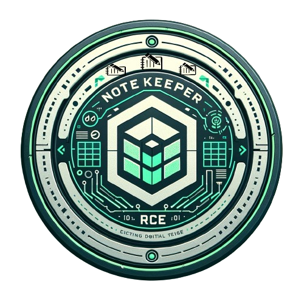

## Introduction
Welcome to the NoteKeeper Application, where users can create and encode short notes. However, lurking within the app is a critical buffer overflow vulnerability. Your mission is to uncover this vulnerability and exploit it to achieve remote code execution.

## Objective
Exploit the buffer overflow vulnerability and achieve Remote Code Execution (RCE).

## Skills Required
Proficiency in understanding and exploiting buffer overflows.
Familiarity with debugging Android applications.

```java
public final class MainActivity extends AppCompatActivity {
    ...
    public final native String parse(String Title);
    ...
    static {
        System.loadLibrary("notekeeper");
    }
}
```

```java
public static final void showDialogue$lambda$1(EditText $ed_title, EditText $ed_content, MainActivity this$0, Dialog dialog, View it) {
    Intrinsics.checkNotNullParameter(this$0, "this$0");
    Intrinsics.checkNotNullParameter(dialog, "$dialog");
    String title_ = $ed_title.getText().toString();
    String note_con = $ed_content.getText().toString();
    if (title_.length() > 0) {
        if (note_con.length() > 0) {
            String cap_title = this$0.parse(title_);
            note_data dataElement = new note_data(cap_title, note_con, "Number of characters : " + note_con.length());
            this$0.notes.add(dataElement);
            Note_Adapter note_Adapter = this$0.notes_adp;
            if (note_Adapter == null) {
                Intrinsics.throwUninitializedPropertyAccessException("notes_adp");
                note_Adapter = null;
            }
            note_Adapter.notifyDataSetChanged();
            dialog.dismiss();
            return;
        }
    }
    Toast.makeText(this$0, "Don't leave the title or note field empty", 0).show();
}
```

https://gnutoolchains.com/android/

```
adb push gdbserver /data/local/tmp
```

```
plaintext@archlinux ~/D/mobilehackinglabs> adb shell ps | grep com.mobilehackinglab.notekeeper
u0_a451      29500  1034 5258252 100468 0                   0 S com.mobilehackinglab.notekeeper
```

```c
undefined8 Java_com_mobilehackinglab_notekeeper_MainActivity_parse(_JNIEnv *param_1,undefined8 param_2,_jstring *param_3){
  int local_2a8;
  char local_2a4 [100];
  char acStack_240 [500];
  int local_4c;
  ushort *local_48;
  _jstring *local_40;
  undefined8 local_38;
  _JNIEnv *local_30;
  undefined8 local_28;
  
  local_40 = param_3;
  local_38 = param_2;
  local_30 = param_1;
  local_48 = (ushort *)_JNIEnv::GetStringChars(param_1,param_3,(uchar *)0x0);
  local_4c = _JNIEnv::GetStringLength(local_30,local_40);
  memcpy(acStack_240,"Log \"Note added at $(date)\"",500);
  if (local_48 == (ushort *)0x0) {
    local_28 = 0;
  }
  else {
    local_2a4[0] = FUN_00100bf4(*local_48 & 0xff);
    for (local_2a8 = 1; local_2a8 < local_4c; local_2a8 = local_2a8 + 1) {
      local_2a4[local_2a8] = (char)local_48[local_2a8];
    }
    system(acStack_240);
    local_2a4[local_2a8] = '\0';
    local_28 = _JNIEnv::NewStringUTF(local_30,local_2a4);
  }
  return local_28;
}
```