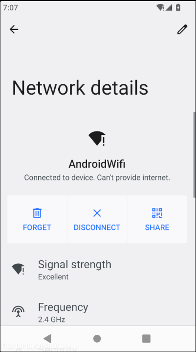
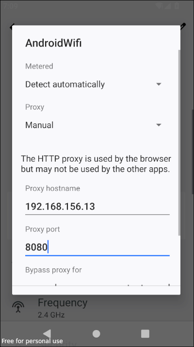
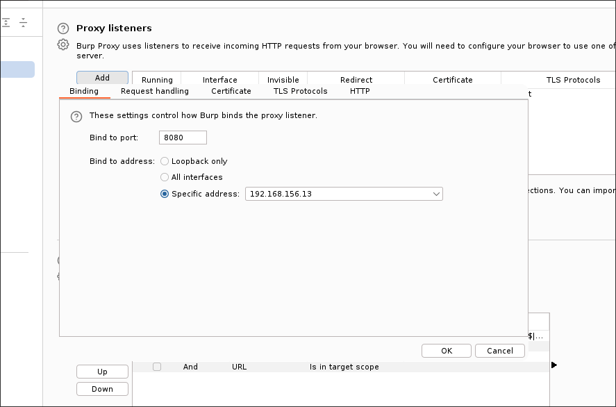
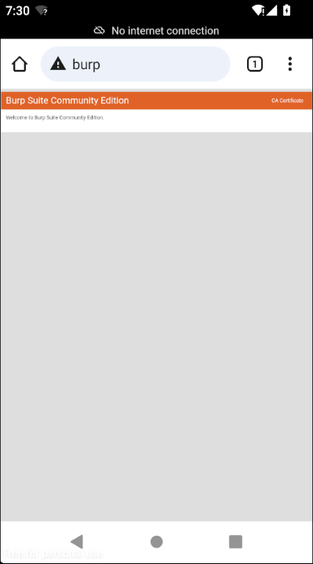
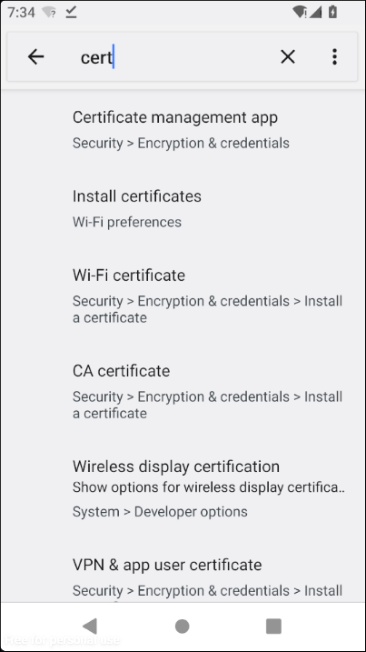
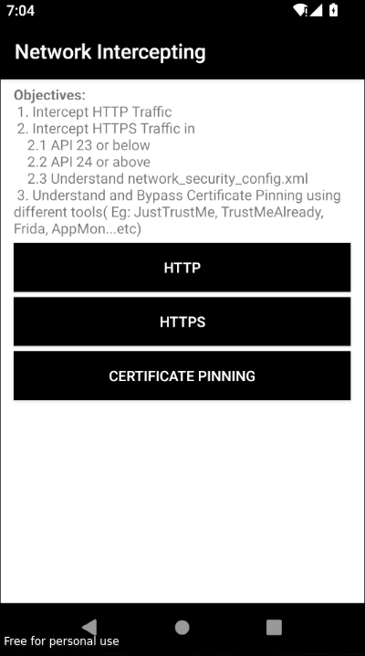
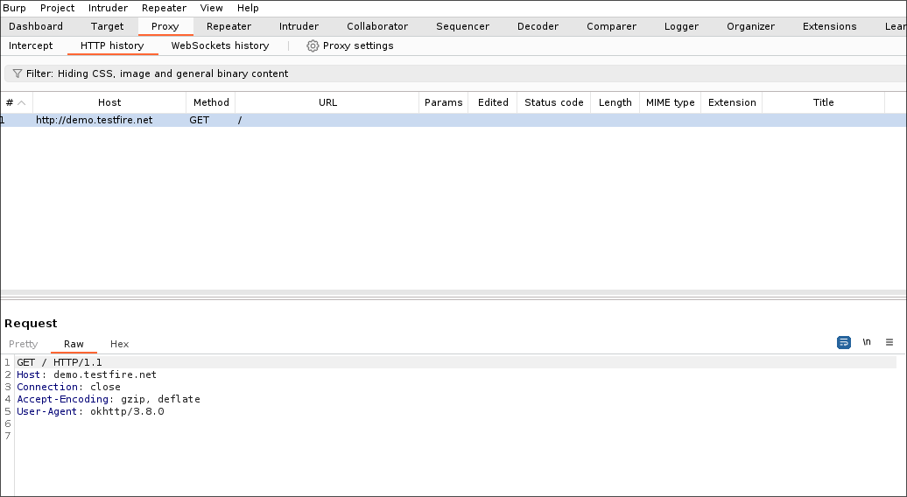

## Intercepting network traffic
Many android apps communicate with servers and so we need to intercept the traffic to further test the security of the api. This can be accomplished with burpsuite which acts as a proxy and allows us to manipulate the request before it reaches ths server. To intercept the https traffic we need to configure burp certificate in our device. Let's move to Settings -> Network & Internet -> Internet. Then click on the Android wifi

Click the pen on the top right corner. Under proxy select manual then set the ip address of the host machine and port 8080.Click save to save the changes

Open burp suite and navigate to the proxy settings and set the ipaddress and the port to match the ones on the device.

Next open a browser in your device and browse http://burp. To download the certificate click on CA Certificate button

Move to downloads or the location of the file and rename it to cacert.cer

Move to settings and search for certificate and move to install certificates

Click on install certificate and install your cacert.cer and give it a name. Now we can intercept https network traffic. Click on http on androgoat

check the http history in burp.

We have successfully intercepted http request. The http request can be intercepted without any certificate by any proxy. The reason we were setting up the certificate was to intercept https traffic in the next blog and bypass ssl pinning