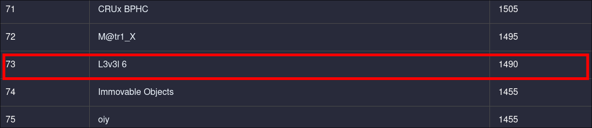
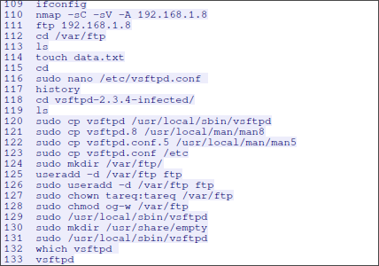
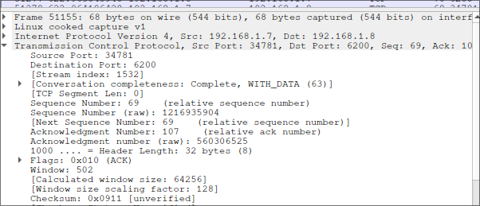
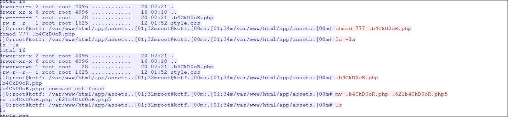
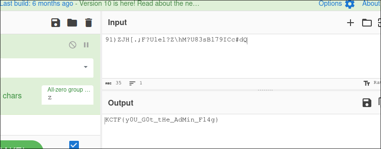
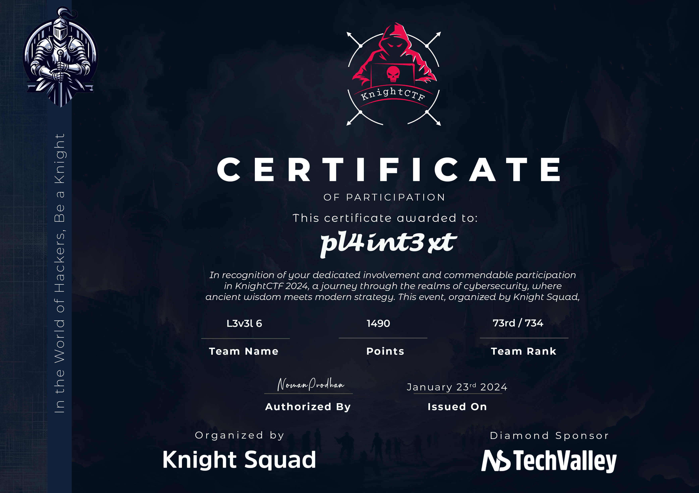

## Networking
### Vulnerable service
> What service was vulnerable to the main server?
>
> Author: 0xt4req

The attacker did alot of crazy directory bruteforcing.I ignored all the packets and went direct to where he first got the initial foothold. From bash history we can see the attacker performed an internal nmap scan and found a vulnerable ftp `vsftpd-2.3.4` in the main server



### CVE ID
> What's the CVE id for the vulnerable service?
>
> Author: 0xt4req

A simple google search displayed The CVE ID from exploit database `CVE-2011-2523`
[CVE-2011-2523](https://www.exploit-db.com/exploits/49757)

### PORT
> What was the port number of the reverse shell of the server?
>
> Author: 0xt4req

i just checked the code from [CVE-2011-2523](https://www.exploit-db.com/exploits/49757) and i found that the exploit is leveraged on port `6200`

```python
tn2=Telnet(host, 6200)
print('Success, shell opened')
print('Send `exit` to quit shell')
tn2.interact()
```

We can also see from wireshark we have the destination port `6200` from the packets where the attacker got the initial foothold



### Famous tool

> The attacker used a popular tool to gain access of the server. Can you name it?
> Author: 0xt4req

Since the exploit was a public CVE `metasploit` is the tool that the attacker used

> DISCLAIMER. The challenges were arranged in a specific order and the next challenge was only unlocked after you solved the current one. I got stuck at the hidden file challenge. After the ctf all challenges were unlocked. I realised i had some other flags for the other challenges which i could not reach. Enough talk let's continue with the other unreachable challenges which i solved but could'nt submit the flags since they were locked by the dragons

### Confidential
> There's something confidential. Can you find it?
>
> Author: pmsiam0

There was a file `maybeconfidential.zip`. Extracting the file we notice it was a .docx file. Since i don't trust docx files i decided to extract the file and open `document.xml` to see the contents manually. An easier way was to use google docs and let google deal with the virus incase their was one.

```xml
<w:r w:rsidRPr="0090220E">
    <w:rPr>
        <w:noProof/>
            <w:color w:val="FFFFFF" w:themeColor="background1"/>
    </w:rPr>
    <w:t xml:space="preserve">KCTF{Y0U_Ar3_N3tW0rk_M1n3r} </w:t>
</w:r>
    </w:p>
<w:sectPr w:rsidR="00DC62B3" w:rsidRPr="0090220E">
```

### BackDoor
> What is the backdoor file name?
>
> Author: 0xt4req

The file name in cleartext since the connection is not encrypted



### Admin Flag

> Can you find the Admin Flag of the web server.?
>
> Author: 0xt4req

Their was a file named `app.zip` after extracting it we find `dashboard.php` with this code

```php
<?php
    if (isset($_COOKIE['role'])) {
        if ($_COOKIE['role'] == 'root') {
          echo '<span id="msg">91)ZJH[.;F?Ulel?Z\hM?U83sBl79ICc#dQ</span>';
        }
    }
?>
```

We decode the msg with cyberchef and get the flag



### DB Details

> What is the database username & databasename?
>
> Author: 0xt4req

From the app.zip we have a `db.php` with this code

```php
$server_name = "localhost";
$user_name = "root";
$password = "";
$db_name = "kctf2024";
```
### API KEY
> What's the API Key?
>
> Author: 0xt4req

`db.php` has the api key

```php
$_A_p_1_k_3_Y_ = "6eea9135-2801-4560-b44c-f297b5f46f2f";
```

